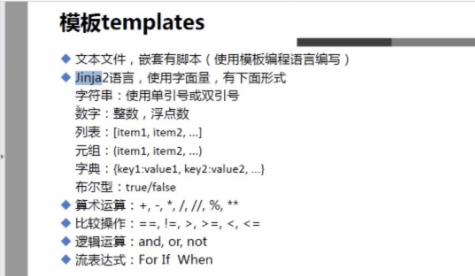

1、配置文件：
1、Ansible配置文件的优先级顺序如下：
• ANSIBLE_CFG：首先，Ansible命令会先检查环境变量，及这个环境变量将指向的配置文件；
• ./ansible.cfg：其次，将会检查当前目录下的ansible.cfg配置文件；
• ~/.ansible.cfg：再次，将会检查当前用户home目录下的.ansible.cfg配置文件；
• /etc/ansible/ansible.cfg：最后，将会检查在安装Ansible时自动生产的配置文件。

2、配置文件详解
• privilege_escalation配置
• 

| 配置项                  | 说明                                                         | 默认值                 |
| ----------------------- | ------------------------------------------------------------ | ---------------------- |
| inventory               | ansible inventory文件路径                                    | /etc/ansible/hosts     |
| library                 | ansible模块文件路径                                          | /usr/share/my_modules/ |
| remote_tmp              | ansible远程主机脚本临时存放目录                              | ~/.ansible/tmp         |
| local_tmp               | ansible管理节点脚本临时存放目录                              | ~/.ansible/tmp         |
| forks                   | ansible执行并发数                                            | 5                      |
| poll_interval           | ansible异步任务查询间隔                                      | 15                     |
| sudo_user               | ansible sudo用户                                             | root                   |
| ask_sudo_pass           | 运行ansible是否提示输入sudo密码                              | True                   |
| ask_pass                | 运行ansible是否提示输入密码                                  | True                   |
| transport               | ansible远程传输模式                                          | smart                  |
| remote_port             | 远程主机SSH端口                                              | 22                     |
| module_lang             | ansible模块运行默认语言环境                                  | C                      |
| gathering               | facts信息收集开关定义                                        | smart                  |
| roles_path              | ansible role存放路径                                         | /etc/ansible/roles     |
| timeout                 | ansible SSH连接超时时间                                      | 10                     |
| remote_user             | ansible远程认证用户                                          | root                   |
| log_path                | ansible日志记录文件                                          | /var/log/ansible.log   |
| module_name             | ansible默认执行模块                                          | command                |
| executable              | ansible命令执行shell                                         | /bin/sh                |
| hash_behaviour          | ansible主机变量重复处理方式                                  | replace                |
| private_role_vars       | 默认情况下，角色中的变量将在全局变量范围中可见。 为了防止这种情况，可以启用以下选项，只有tasks的任务和handlers得任务可以看到角色变量 | yes                    |
| vault_password_file     | 指定vault密码文件路径                                        | 无                     |
| ansible_managed         | 定义的一个Jinja2变量，可以插入到Ansible配置模版系统生成的文件中 | Ansible managed        |
| display_skipped_hosts   | 开启显示跳过的主机                                           | True                   |
| error_on_undefined_vars | 开启错误，或者没有定义的变量                                 | False                  |
| action_plugins          | ansible action插件路径                                       | 无                     |
| cache_plugins           | ansible cache插件路径                                        | 无                     |
| callback_plugins        | ansible callback插件路径                                     | 无                     |
| connection_plugins      | ansible connection插件路径                                   | 无                     |
| lookup_plugins          | ansible lookup插件路径                                       | 无                     |
| inventory_plugins       | ansible inventory插件路径                                    | 无                     |
| vars_plugins            | ansible vars插件路径                                         | 无                     |
| filter_plugins          | ansible filter插件路径                                       | 无                     |
| terminal_plugins        | ansible terminal插件路径                                     | 无                     |
| strategy_plugins        | ansible strategy插件路径                                     | 无                     |
| fact_caching            | 定义ansible facts缓存方式                                    | memory                 |
| fact_caching_connection | 定义ansible facts缓存路径                                    | 无                     |

• privilege_escalation配置

| 配置项          | 说明                   | 默认值 |
| --------------- | ---------------------- | ------ |
| become          | 是否开启become模式     | True   |
| become_method   | 定义become方式         | sudo   |
| become_user     | 定义become方式         | root   |
| become_ask_pass | 是否定义become提示密码 | False  |

3、动态inventory 
    ansible.cfg文件中inventory的定义值改成一个执行脚本;可以从CMDB系统和Zabbix监控系统拉取所有的主机信息，然后使用Ansible进行管理

 4、变量

 5、模板

6、听课笔记

 模块化：调用特定的模块，完成特定任务
 有Paramiko:PyYAML，Jinja2（模板语言）三个关键模块
 基于python
 支持playbook编排任务
 YAML格式

 相关文件：

 /etc/ansible/ansible.cfg
 etc/ansible/hosts 主机清单
 etc/ansible/roles 存放角色的目录

 /usr/bin/ansible-doc 配置文档
 /usr/bin/ansible-galaxy 优秀代码或roles模块平台

 hosts:
 [web-server]
 192.168.1.[1:3]
 192.168.1.9:3022

ssh免key:	 
ssh-keygen
ssh-copy-id ip

 7、ansible使用和模块化深入解析

ansible 帮助
ansible-doc -l：列出可用模块
			 -a:列出所有模块
			 -s,--snippet显示指定模块的playbook片段

ansible-doc ping  查看指定模块帮助用法；-s	

用法：
ansible <host-pattern> [-m module-name]	[-a args]

ansible all	--list-hosts -i hosts #查看所有主机
ansible all -m command -a 'ls /root' -u dcos -k -b -K

​	-m module 指定模块，默认为command
​	-v 详细过程
​	--list-hosts 显示主机列表
​	-k ,--ask-pass 提示输入连接密码
​	-K，--ask-become-pass 提示输入sudo时的口令
​	-C，--check 检查，并不执行
​	-T,--timeout=TIMEOUT 执行命令超时时间，默认为10s
​	-u,--user=REMOTE_USER 执行远程执行的用户
​	-b,--become 代替旧版的sudo 切换

	ansible web1:web2 -m ping #同时控制2组机器
	ansible "web1:&web2" --list #支持正则表达式
执行：
ansible 命令执行过程：
	1、加载配置文件
	2、加载对应的模块文件，例如command
	3、通过ansible将模块或命令生成对应的临时py文件，并将文件传送至远程服务器对应用户下的某目录
	4、给文件+x权限
	5、执行并返回结果
	6、删除临时py文件，sleep0退出

​	可通过 ansible web -m ping -i hosts -vvv# 查看详细过程

执行状态：
	绿色：执行成功并且不需要做改变的操作
	黄色：执行成功并且对目标主机做变更
	红色：执行失败

ansible常见模块：（ansible-doc -s command# 查看command的帮助文档）

​	command(默认模块):常用命令模块，不支持$,&,;,&,|,> 等符号；

​	shell： command增强版支持以上符号； 

​	script：ansible  web -m script -a '/root/test.sh' -i hosts

​	copy 