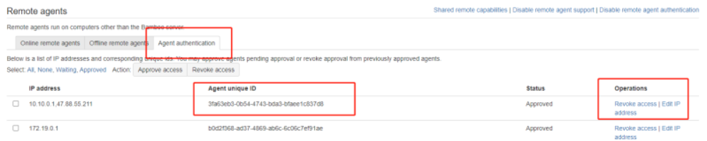
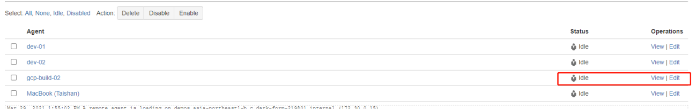

###   安装bamboo remote agent

1、配置JDK环境
​    tar xf jdk-8u251-linux-x64.tar.gz
​    mv jdk1.8.0_251/ /usr/local/
​    vim /etc/profile
​    export JAVA_HOME=/usr/local/jdk1.8.0_251
​    export PATH=$PATH:/usr/local/jdk1.8.0_251/bin
​    source /etc/profile
[root@dev01 ~]# java -version #测试jdk环境是否正确配置    
2、启动
​    java -jar atlassian-bamboo-agent-installer-6.2.1.jar http://bamboo.bianjie.ai/agentServer/
3、通过验证
   
4、配置名称及属性

选择新添加的agent

5、添加安装工具
例如安装kubectl ,根据部署脚本进行添加kubeconfig文件