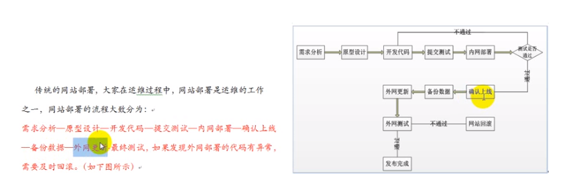
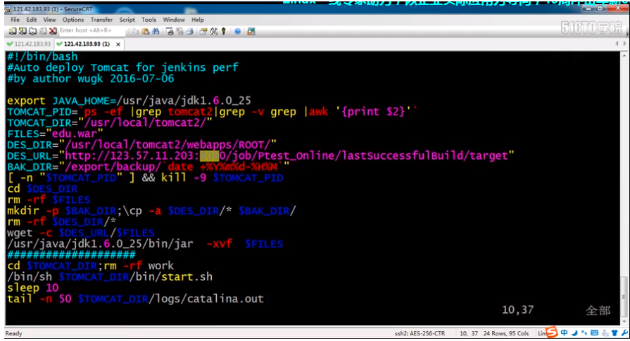
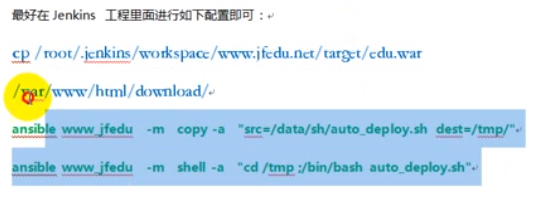

### 安装Jenkins Master 

以Linux CentOS安装Jenkins Master为例 
登录待安装机器，命令行输入: 
wget -O /etc/yum.repos.d/jenkins.repo http://pkg.jenkins-ci.org/redhat/jenkins.repo   
rpm --import http://pkg.jenkins-ci.org/redhat/jenkins-ci.org.key
yum install jenkins
vi /etc/sysconfig/jenkins 设置 JENKINS_HOME 亦可改端口 
启动 /sbin/service jenkins start|stop|restart 
访问 ：localhost:8080/ 
API：localhost:8080/api 

### 设置防火墙 

CentOS->系统->管理->防火墙->（导航）其他端口->添加->用户自定义：8080/tcp 保存 
或者在root用户下，或修改 /etc/sysconfig/iptables 
service iptables restart 
再配置好账户信息。 
企业实战持续集成-Jenkins视频教程
传统网站部署及发布流程：

jenkins+maven ：
1、安装jdk+tomcat
2、搭建配置jenkins
3、安装maven
jenkins构建步骤：
jenkins配置：
系统管理->全局工具配置
配置jdk路径及maven路径
构建任务：
名称、描述、源码（svn（注意账号密码）|git）、增加构建步骤及构建后操作（可跳过）
构建
部署
在远程主机

插件管理
邮件设置
配置从节点
jenkins整合ansible实现批量发布
