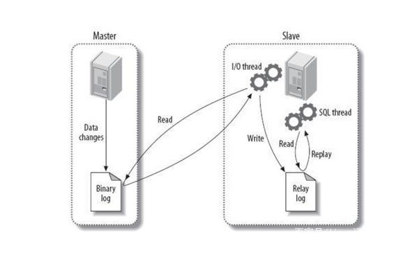

### binlog 简介

binlog是一个二进制格式的文件，用于记录用户对数据库增量操作的SQL语句信息，例如更改数据库表和更改内容的SQL语句都会记录到binlog里，但是对库表等内容的查询不会记录。
默认情况下，binlog日志是二进制格式的，不能使用查看文本工具的命令（比如，cat，vi等）查看，而使用mysqlbinlog解析查看；

binlog原理


**binlog的作用：**
    1、数据备份及恢复
    2、做主从同步
    
**关于binlog在my.conf的配置**
log_bin                 = /var/lib/mysql/mysql-bin.log   #默认路径可修改
expire_logs_days        = 7                              #日志过期时间，设置为0则永不过期
binlog_format           = ROW          #复制模式
max_binlog_size         = 100M         #超过max_binlog_size或超过6小时会切换到下一序号文件
binlog_cache_size       = 16M           
\#二进制日志缓冲大小,通过show status like 'binlog_%';查看调整写入磁盘的次数，写入磁盘为0最好
max_binlog_cache_size   = 256M
relay_log_recovery      = 1            
\#当slave从库宕机后，假如relay-log损坏了，
\#导致一部分中继日志没有处理，则自动放弃所有未执行的relay-log，
\#并且重新从master上获取日志，这样就保证了relay-log的完整性。

sync_binlog             = 1            #二进制日志（binary log）同步到磁盘的频率
innodb_flush_log_at_trx_commit = 1     #每次事务提交将日志缓冲区写入log file，并同时flush到磁盘。

**以下2个参数可以减少网络问题导致的主从数据同步延迟**
slave_net_timeout    = 5     #当slave从主数据库读取log数据失败后，等待多久重新建立连接并获取数据,默认3600秒
\#此选项为从库 change master to 的参数
master-connect-retry   = 60    #当重新建立主从连接时，如果连接建立失败，间隔多久后重试

**binlog的格式也有三种：STATEMENT、ROW、MIXED** ；

1、STATMENT模式：基于SQL语句的复制(statement-based replication, SBR)，每一条会修改数据的sql语句会记录到binlog中。

优点：不需要记录每一条SQL语句与每行的数据变化，这样子binlog的日志也会比较少，减少了磁盘IO，提高性能。

缺点：在某些情况下会导致master-slave中的数据不一致(如sleep()函数， last_insert_id()，以及user-defined functions(udf)等会出现问题)

2、基于行的复制(row-based replication, RBR)：不记录每一条SQL语句的上下文信息，仅需记录哪条数据被修改了，修改成了什么样子了。

优点：不会出现某些特定情况下的存储过程、或function、或trigger的调用和触发无法被正确复制的问题。

缺点：会产生大量的日志，尤其是alter table的时候会让日志暴涨。

3、混合模式复制(mixed-based replication, MBR)：以上两种模式的混合使用，一般的复制使用STATEMENT模式保存binlog，对于STATEMENT模式无法复制的操作使用ROW模式保存binlog，MySQL会根据执行的SQL语句选择日志保存方式。

**sync_binlog=0**
当事务提交之后，MySQL不做fsync之类的磁盘同步指令刷新binlog_cache中的信息到磁盘，而让Filesystem自行决定什么时候来做同步，或者cache满了之后才同步到磁盘。这个是性能最好的。

**sync_binlog=1**
当每进行1次事务提交之后，MySQL将进行一次fsync之类的磁盘同步指令来将binlog_cache中的数据强制写入磁盘。

**sync_binlog=n**
当每进行n次事务提交之后，MySQL将进行一次fsync之类的磁盘同步指令来将binlog_cache中的数据强制写入磁盘。

注：大多数情况下，对数据的一致性并没有很严格的要求，所以并不会把 sync_binlog 配置成 1. 为了追求高并发，提升性能，可以设置为 100 或直接用 0，而对于支付服务这样的应用，还是比较推荐 sync_binlog = 1.

**innodb_flush_log_at_trx_commit=0**
设置为0，该模式速度最快，但不太安全，mysqld进程的崩溃会导致上一秒钟所有事务数据的丢失。log buffer将每秒一次地写入log file中，并且log file的flush(刷到磁盘)操作同时进行。该模式下在事务提交的时候，不会主动触发写入磁盘的操作。

**innodb_flush_log_at_trx_commit=1**
当设置为1，该模式是最安全的，但也是最慢的一种方式。在mysqld 服务崩溃或者服务器主机crash的情况下，binary log 只有可能丢失最多一个语句或者一个事务。每次事务提交时MySQL都会把log buffer的数据写入log file，并且flush(刷到磁盘)中去，该模式为系统默认。

**innodb_flush_log_at_trx_commit=2**
当设置为2，该模式速度较快，也比0安全，只有在操作系统崩溃或者系统断电的情况下，上一秒钟所有事务数据才可能丢失。每次事务提交时MySQL都会把log buffer的数据写入log file，但是flush(刷到磁盘)操作并不会同时进行。该模式下，MySQL会每秒执行一次 flush(刷到磁盘)操作。

**其他**
binlog最好跟数据目录设置到不同的磁盘分区，可以降低io等待，提升性能；并且在磁盘故障的时候可以利用mysql-binlog恢复数据。
查看binlog日志是否开启
mysql> show variables like 'log_%';
查看所有binlog日志列表，及日志大小
mysql> show master logs;
查看master状态，即最后(最新)一个binlog日志的编号名称，及其最后一个操作事件pos结束点(Position)值
mysql> show master status;
flush刷新log日志，自此刻开始产生一个新编号的binlog日志文件
mysql> flush logs;
重置(清空)所有binlog日志
mysql> reset master;
删除binlog,删除mysql-bin.000009之前的日志
mysql>purge master logs to 'mysql-bin.000009';
 将 binlog 文件删除至此日期前
 mysq>purge master logs before '2014-11-18 00:00:00'; 
 查看看从库读 binlog 到了哪里
mysql>show slave status\G
也可以从主库看
mysql>show master status;
删除slave的中继日志
mysql> reset slave;     


##### 主从同步延迟排查思路：


##### 重新做主从

```
>stop slave;
>change master to master_host='172.18.255.140', master_user='replicator', master_password='rootPassword', master_log_file='mysql-bin.000169', master_log_pos=503274270;
>start slave;
```

