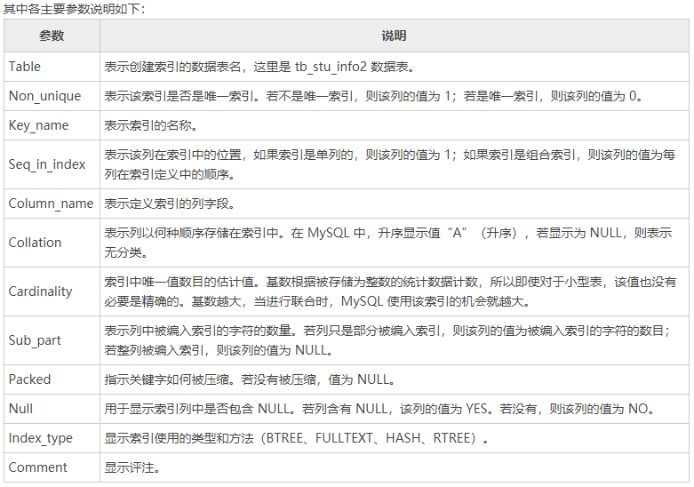

## 1、查看

表的所有信息
    使用show create table table_name来进行查询，因为索引都是依托表而建立的，所以这样可以把表的所有索引信息显示出来

## 2、索引类型

主要的几种索引类型
普通索引
唯一索引
主键索引
组合索引
全文索引

​    show index from table_name；

##     3、索引方法

    BTREE
    FULLTEXT
    HASH
    RTREE