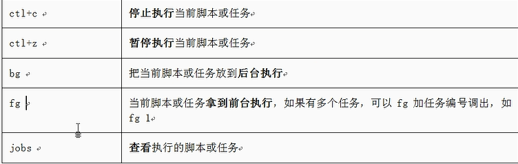

### 1、/dev/null 

0：标准输入
1：标准输出（默认输出到屏幕）
2：错误输出（默认输出到屏幕）

2>/dev/nul l：把错误输出到黑洞
\>/dev/null 2>&1 ：把标准输出和错误输出都进黑洞
2>&1 >/dev/null ：标准错误会输出到屏幕，标准输出会到黑洞

2、查看出口ip
    curl ipinfo.io
    curl ip.cn
    curl cip.cc
    curl myip.ipip.net
    Curl https://haoip.cn/

3、常用键

4、查看用户登录记录
who /var/log/wtmp 

5、查看tcp连接数及最大来源
netstat -a | grep ESTABLISHED | awk '{print $5}' | awk -F ':' '{print $1}' | sort |uniq -c|sort -rn

6、tomcat 重启
[[ -x /etc/init.d/tomcat8 ]]  && (/etc/init.d/tomcat8 stop ;/etc/init.d/tomcat8 start) || (/etc/init.d/tomcat7 stop ;/etc/init.d/tomcat7 start)

7、查看机器的连接状态
 netstat -nat |awk '{print $6}' |sort|uniq -c|sort -rn

8、查看tomcat打开的文件个数
ll /proc/$(pgrep -f 'tomcat8.*.Bootstrap start')/fd  |wc -l

9、清理已删除的文件
 lsof |grep delete
 ls -l /proc/$PID/fd/$FD
\>/proc/9439/fd/7

 \#$PID第2列
 \#$FD第4列

10、快速查看一些服务的配置文件
grep -v "#" redis.conf|sed "/^$/d