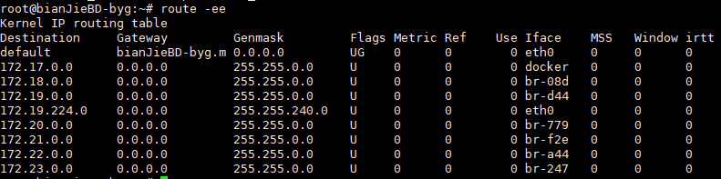

要实现两个不同的子网之间的通信，需要一台连接两个网络的路由器，或者同时位于两个网络的网关来实现。在Linux系统中，设置路由通常是为了解决以下问题：该Linux系统在一个局域网中，局域网中有一个网关，能够让机器访问Internet，那么就需要将这台机器的IP地址设置为 Linux机器的默认路由

相关参数

```
route [-n/-ee]
参数：
-n ：不要使用通讯协定或主机名称，直接使用 IP 或 port number；
-ee ：使用更详细的资讯来显示
-c  显示更多信息
-n  不解析名字
-v  显示详细的处理信息
-F  显示发送信息
```

显示内容说明：

```
Destination   目标网段或者主机(本机的数据要发送的目的地：子网或主机)，与Genmask组成一个网段
Gateway       网关地址 (如果是默认网关，网关的地址必须和自己的主机上的其中一块网卡在同一子网），* 表示目标是本主机所属的网络，不需要路由
Genmask       网络掩码(如果目标网络的的子网掩码为255.255.255.255,说明目标是一台主机；如果子网掩码为’0.0.0.0’ 说明该路由是默认路由)
Flags         标记; 
				U: 路由是活动的;
				H: 目标是一个主机 (IP) 而非网段;
				G: 路由指向网关(需要透过外部的主机 (gateway) 来转递封包(该行有gw));
				R: 恢复动态路由产生的表项;
				D: 由路由的后台程序动态地安装(已经由服务或转 port 功能设定为动态路由 );
				M: 由路由的后台程序修改;
				!: 拒绝路由(用来抵挡不安全的网域！)
Metric        路由距离，到达指定网络所需的中转数
Ref           恒为0，路由项引用次数
Use           此路由项被路由软件查找的次数
Iface         该路由表项对应的输出接口，即eth0,eth1等网络接口名
```

例：



注意：

1、Gateway是0.0.0.0或者*表示目标是本主机所属的网络,不需要路由

2、在命令行下执行route命令来添加路由，不会永久保存，当网卡重启或者机器重启之后，该路由就失效了；要想永久保存，有如下方法：

1.在/etc/rc.local里添加

2.在/etc/sysconfig/network里添加到末尾

3./etc/sysconfig/static-router :

any net x.x.x.x/24 gw y.y.y.y

常用：

添加到网络的路由

```shell
route add -net 192.168.55.0 netmask 255.255.255.0 eth3
route add -net 192.168.55.0/24 eth3
route add -net 192.168.0.0/22  gw 192.168.150.36

```

删除到网络的路由

```shell
route del -net 192.168.55.0 netmask 255.255.255.0 eth3
route del -net 192.168.0.0 netmask 255.255.255.0  gw 0.0.0.0
route del -net 192.168.55.0/24 eth3
route del -net 192.168.0.0/22  gw 192.168.150.36
```