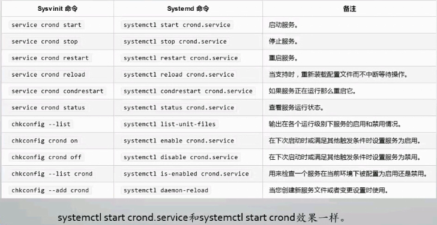

​         linux7之后服务管理是systemctl

运行级别：
    查看运行级别：systemctl get-default
存放目录： ls -l /usr/lib/systemd/systemd/runlevel*.target

​    第三方服务：/usr/lib/systemd/system
​    系统服务：/etc/systemd/system/(优先级更高)

选项：
    systemctl status cron -l :显示详细信息

systemctl daemon-reload