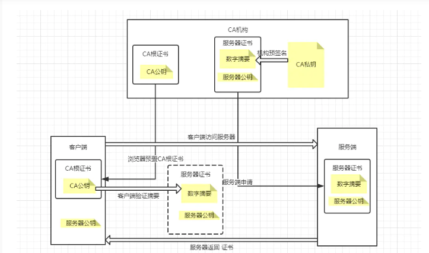
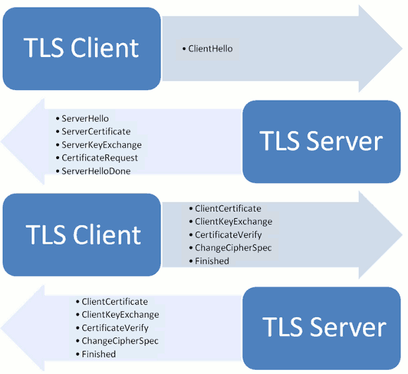
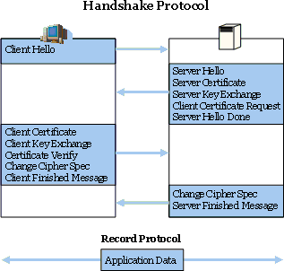

## 1、原理




**1、证书的签发过程**
a、服务方 S 向第三方机构CA提交公钥、组织信息、个人信息(域名)等信息并申请认证；
b、CA 通过线上、线下等多种手段验证申请者提供信息的真实性，如组织是否存在、企业是否合法，是否拥有域名的所有权等；
c、如信息审核通过，CA 会向申请者签发认证文件-证书。
证书包含以下信息：申请者公钥、申请者的组织信息和个人信息、签发机构 CA 的信息、有效时间、证书序列号等信息的明文，同时包含一个签名；
  签名的产生算法：首先，使用散列函数计算公开的明文信息的信息摘要，然后，采用 CA 的私钥对信息摘要进行加密，密文即签名；

#### 2、客户端关于CA根证书的内置

a、客户端会内置信任 CA 的证书信息(包含公钥)，如果CA不被信任，则找不到对应 CA 的证书，证书也会被判定非法;
b、内置 CA 对应的证书称为根证书，颁发者和使用者相同，自己为自己签名，即自签名证书；
c、证书=公钥+申请者与颁发者信息+签名；

**3、访问过程**
简化版：
a、客户端 C 向服务器 S 发出请求，S 返回证书文件；
b、客户端 C 读取证书中的相关的明文信息，采用相同的散列函数计算得到信息摘要，然后，利用对应 CA 的公钥解密签名数据，对比证书的信息摘要，如果一致，则可以确认证书的合法性，即公钥合法；
c、客户端然后验证证书相关的域名信息、有效时间等信息；
d、然后生成对话密钥，双方就可以对话了；

详细版：
SSL/TLS协议的基本过程是这样的：
（1） 客户端向服务器端索要并验证公钥。
（2） 双方协商生成"对话密钥"。
（3） 双方采用"对话密钥"进行加密通信。
上面过程的前两步，又称为"握手阶段"（handshake）。
四、握手阶段的详细过程

"握手阶段"涉及四次通信，我们一个个来看。需要注意的是，"握手阶段"的所有通信都是明文的。
4.1 客户端发出请求（ClientHello）
首先，客户端（通常是浏览器）先向服务器发出加密通信的请求，这被叫做ClientHello请求。
在这一步，客户端主要向服务器提供以下信息。
（1） 支持的协议版本，比如TLS 1.0版。
（2） 一个客户端生成的随机数，稍后用于生成"对话密钥"。
（3） 支持的加密方法，比如RSA公钥加密。
（4） 支持的压缩方法。
这里需要注意的是，客户端发送的信息之中不包括服务器的域名。也就是说，理论上服务器只能包含一个网站，否则会分不清应该向客户端提供哪一个网站的数字证书。这就是为什么通常一台服务器只能有一张数字证书的原因。
对于虚拟主机的用户来说，这当然很不方便。2006年，TLS协议加入了一个[Server Name Indication扩展](http://tools.ietf.org/html/rfc4366)，允许客户端向服务器提供它所请求的域名。
4.2 服务器回应（SeverHello）
服务器收到客户端请求后，向客户端发出回应，这叫做SeverHello。服务器的回应包含以下内容。
（1） 确认使用的加密通信协议版本，比如TLS 1.0版本。如果浏览器与服务器支持的版本不一致，服务器关闭加密通信。
（2） 一个服务器生成的随机数，稍后用于生成"对话密钥"。
（3） 确认使用的加密方法，比如RSA公钥加密。
（4） 服务器证书。
除了上面这些信息，如果服务器需要确认客户端的身份，就会再包含一项请求，要求客户端提供"客户端证书"。比如，金融机构往往只允许认证客户连入自己的网络，就会向正式客户提供USB密钥，里面就包含了一张客户端证书。
4.3 客户端回应
客户端收到服务器回应以后，首先验证服务器证书。如果证书不是可信机构颁布、或者证书中的域名与实际域名不一致、或者证书已经过期，就会向访问者显示一个警告，由其选择是否还要继续通信。
如果证书没有问题，客户端就会从证书中取出服务器的公钥。然后，向服务器发送下面三项信息。
（1） 一个随机数。该随机数用服务器公钥加密，防止被窃听。
（2） 编码改变通知，表示随后的信息都将用双方商定的加密方法和密钥发送。
（3） 客户端握手结束通知，表示客户端的握手阶段已经结束。这一项同时也是前面发送的所有内容的hash值，用来供服务器校验。
上面第一项的随机数，是整个握手阶段出现的第三个随机数，又称"pre-master key"。有了它以后，客户端和服务器就同时有了三个随机数，接着双方就用事先商定的加密方法，各自生成本次会话所用的同一把"会话密钥"。
至于为什么一定要用三个随机数，来生成"会话密钥"，[dog250](http://blog.csdn.net/dog250/article/details/5717162)解释得很好：
"不管是客户端还是服务器，都需要随机数，这样生成的密钥才不会每次都一样。由于SSL协议中证书是静态的，因此十分有必要引入一种随机因素来保证协商出来的密钥的随机性。
对于RSA密钥交换算法来说，pre-master-key本身就是一个随机数，再加上hello消息中的随机，三个随机数通过一个密钥导出器最终导出一个对称密钥。
pre master的存在在于SSL协议不信任每个主机都能产生完全随机的随机数，如果随机数不随机，那么pre master secret就有可能被猜出来，那么仅适用pre master secret作为密钥就不合适了，因此必须引入新的随机因素，那么客户端和服务器加上pre master secret三个随机数一同生成的密钥就不容易被猜出了，一个伪随机可能完全不随机，可是是三个伪随机就十分接近随机了，每增加一个自由度，随机性增加的可不是一。"
此外，如果前一步，服务器要求客户端证书，客户端会在这一步发送证书及相关信息。

4.4 服务器的最后回应
服务器收到客户端的第三个随机数pre-master key之后，计算生成本次会话所用的"会话密钥"。然后，向客户端最后发送下面信息。
（1）编码改变通知，表示随后的信息都将用双方商定的加密方法和密钥发送。
（2）服务器握手结束通知，表示服务器的握手阶段已经结束。这一项同时也是前面发送的所有内容的hash值，用来供客户端校验。
至此，整个握手阶段全部结束。接下来，客户端与服务器进入加密通信，就完全是使用普通的HTTP协议，只不过用"会话密钥"加密内容。



## 2、文件


不同格式的证书下载解压后可能包含以下文件：
• .key 文件是证书私钥文件，如果申请证书时没有选择系统创建CSR，则没有该文件。请您保存好该私钥文件。
• .crt 文件是证书文件，一般包含两段内容。如果是Apache服务器，会将证书文件拆分成 _public.crt（证书）文件和_chain.crt（证书链或中间证书）文件。
• .pem 文件是证书文件，一般包含两段内容。Nginx证书会使用扩展名文件，在阿里云SSL证书中与.crt文件一样。
• 说明 .crt扩展名的证书文件采用Base64-encoded的PEM格式文本文件，可根据需要，修改成.pem等扩展名。


## 3、配置


检查是否支持ssl;
$nginx -V
如果有显示 –with-http_ssl_module 表示已编译openssl，支持安装ssl，仔细检查配置文件
如果没有安装请下载nginx源码重新编译

./configure --with-http_stub_status_module --with-http_ssl_module
make && make install

上传证书
将申请的证书文件和私钥上传至nginx服务器；
放至nginx_home/conf/cert下
nginx.conf配置文件如下：

**http:**

```
server {
    listen 80;
    listen [::]:80;
    server_name test.jimors.me;
    ## 强制跳转 https
    return   301 https://$server_name$request_uri;

​    location / {
​        proxy_set_header X-REAL-IP $remote_addr;
​        proxy_set_header Host $http_host;
​        proxy_set_header X-Forwarded-For $proxy_add_x_forwarded_for;
​        proxy_set_header X-NginX-Proxy true;
​        proxy_redirect off;
​        proxy_pass http://127.0.0.1:8088;
​    }

}
```

**https:**

```
server {
  listen 443 ssl;
  ssl on; #和上面的 ssl 一个作用：使用ssl; 
  ssl_certificate cert/xxx.pem;#证书文件
  ssl_certificate_key cert/xxx.key; #私钥
  \#以下是协议优化
  ssl_protocols TLSv1 TLSv1.1 TLSv1.2; #指定TLS协议
  ssl_ciphers EECDH+CHACHA20:EECDH+AES128:RSA+AES128:EECDH+AES256:RSA+AES256:EECDH+3DES:RSA+3DES:!MD5; #加密方法
  ssl_prefer_server_ciphers on;
  ssl_session_timeout 10m; #超时时间

  \#ssl_session_cache builtin:1000 shared:SSL:10m;
  \#ssl_buffer_size 1400;
  \#add_header Strict-Transport-Security max-age=15768000;
  \#ssl_stapling on;
  \#ssl_stapling_verify on;
}
```


 nginx -t // 检查nginx配置文件
 nginx -s reload // 使配置生效

 4、强制跳转
 强制跳转HTTPS

在配置文件中添加跳转代码

server {
  \#站点和SSL的配置信息···

  \#自动跳转到HTTPS(可选，和下面的部分域名跳转不能同时使用)
  if ($server_port = 80){
    rewrite ^(/.*)$ https://$host$1 permanent;
  }

  \#绑定域名较多，只让部分域名跳转(根据情况选用，和上面的全部跳转不能同时使用)

```
  set $redirect_https 1;
  if ($server_port = 80) {
    set $redirect_https "${redirect_https}2";
  }
  if ($http_host = 'abc.com') {
    set $redirect_https "${redirect_https}3";
  }
  if ($http_host = 'cde.com') {
    set $redirect_https "${redirect_https}3";
  }
  if ($redirect_https = "123") {
    \#当前域名跳转
    rewrite ^(.*)$ https://$host$1 permanent;
    \#可以跳转到指定的域名
    \#rewrite ^(.*)$ https://www.abcde.com$1 permanent;
  }
}
```

