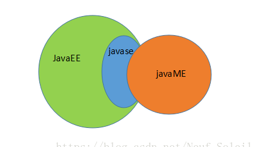

# 什么是 JavaEE

## JavaEE 概念

Java EE，Java 平台企业版（Java Platform Enterprise Edition），之前称为Java 2 Platform, Enterprise Edition (J2EE)，2018年3月更名为 Jakarta EE(这个名称应该还没有得到群众认可)。狭义的 Java EE 是 Sun 公司为企业级应用推出的标准平台，用来开发B/S架构软件，可以说是一个框架，也可以说是一种规范。

广义的 Java EE 包含各种框架，其中最重要的就是 Spring 全家桶。Spring 诞生之初是为了改进 Java EE 开发的体验，后来逐渐成为了 Java Web 开发的实际标准。后面的文章里，会对 Spring 进行进一步的说明。

JavaEE 与 JavaSE 的区别与联系
JavaEE 是在 JavaSE 的基础上构建的，是对 JavaSE 的扩展，增加了一些更加便捷的应用框架。

除了 EE 和 SE，还有为移动端而生的 JavaME，但目前应用不算广泛。三者的关系可以用下图概括：

## JavaEE主要技术

JavaEE 号称有十三种核心技术。它们分别是：JDBC、JNDI、EJB、RMI、Servlet、JSP、XML、JMS、Java IDL、JTS、JTA、JavaMail和JAF。

简单介绍下需要重点关注的技术。

### JDBC

Java 数据库连接，（Java Database Connectivity，JDBC）是 Java 语言中用来规范客户端程序如何来访问数据库的应用程序接口，提供了诸如查询和更新数据库中数据的方法。

### JNDI

Java 命名和目录接口（Java Naming and Directory Interface，JNDI），是 Java 的一个目录服务应用程序界面（API），它提供一个目录系统，并将服务名称与对象关联起来，从而使得开发人员在开发过程中可以使用名称来访问对象。

### EJB

企业级 JavaBean（Enterprise JavaBean, EJB）是一个用来构筑企业级应用的服务器端可被管理组件。不过这个东西在 Spring 问世后基本凉凉了，知道是什么就行。(从客户端软件中抽取出来，封装在一个组件中,并单独运行在一个服务器上)

### Servlet

Servlet（Server Applet），是用 Java 编写的服务器端程序。其主要功能在于交互式地浏览和修改数据，生成动态 Web 内容。

狭义的 Servlet 是指 Java 语言实现的一个接口，广义的 Servlet 是指任何实现了这个 Servlet 接口的类，一般情况下，人们将 Servlet 理解为后者。

### JSP

JSP（全称JavaServer Pages）是由 Sun 公司主导创建的一种动态网页技术标准。JSP 部署于网络服务器上，可以响应客户端发送的请求，并根据请求内容动态地生成 HTML、XML 或其他格式文档的 Web 网页，然后返回给请求者。

## JavaEE框架

JavaEE 拥有广泛市场的原因之一就是可以使用多种框架来使开发变得简单。对于框架的选择多种多样，目前比较常见的框架组合有 SSH和SSM。在后面的章节中会作详细介绍。另外Spring本身也提供了多种层次的框架供选择，可以到Spring官网了解详情。

Spring： https://spring.io/

SSH
Structs + Spring + Hibernate

SSM
Spring +SpringMVC + MyBatis

## JavaEE 学习路径

一般来讲，初学者应该遵循以下路径

Servlet -> JSP -> Spring -> 组合框架