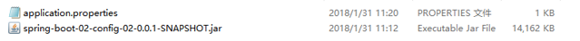

## 配置文件说明

一 、默认配置文件目录
　　spring boot 启动会扫描以下位置的application.properties 或者application.yml文件作为spring boot 的默认配置文件 ，加载的优先由上到下，加载的时候，会把以下路劲的文件都加载一遍。不同的配置内容会全部加载到系统，对于重复的配置内容，优先级别高的配置文件内容会覆盖优先级别低的配置文件内容。

| 点击这里            | 点击这里                                               |
| ------------------- | ------------------------------------------------------ |
| 路劲                | 说明                                                   |
| file：./config/     | 工程文件夹下的config目录。                             |
| file：/             | 工程文件夹目录，如果是maven项目那么和pom.xml是一个层级 |
| classPath：/config/ | 工程 classPath文件夹下的config文件夹                   |
| classPath：/        | 工程classpath文件夹                                    |

　　除了上述的文件目录以外，还可以用spring.config.location 参数的形式指定配置文件 ：java -jar spring-boot-02-config-02-0.0.1-SNAPSHOT.jar --spring.config.location=G:/application.properties ，如果上述的默认路劲有配置文件的话，会和配置内容会形成互补作用，相同的内容优先级别高的会覆盖优先级别低的。

二、外部配置
　　有时候工程已经打成jar了 ，想修改系统的配置，SpringBoot也可以从jar包外面设置参数，加载配置； 以下设置优先级从高到低；高优先级的配置覆盖低优先级的配置，所有的配置会 形成互补配置

　　1.命令行参数
　　　　所有的配置都可以在命令行上进行指定 ，多个配置用空格分开； --配置项=值
　　　　java -jar spring-boot-02-config-02-0.0.1-SNAPSHOT.jar --server.port=8087 --server.context-path=/abc
　　2.来自java:comp/env的JNDI属性
　　3.Java系统属性（System.getProperties()）
　　4.操作系统环境变量
　　5.RandomValuePropertySource配置的random.*属性值
　　在工程jar包的层级目录下建立配置文件如： 那么以参数的形式启动工程：java -jar spring-boot-02-config-02-0.0.1-SNAPSHOT.jar ，加载配置文件，会按以下规则，  由jar包外向jar包内进行寻找；
　　优先加载带profile
　　6.jar包外部的application-{profile}.properties或application.yml(带spring.profile)配置文件
　　7.jar包内部的application-{profile}.properties或application.yml(带spring.profile)配置文件
　　再来加载不带profile
　　8.jar包外部的application.properties或application.yml(不带spring.profile)配置文件
　　9.jar包内部的application.properties或application.yml(不带spring.profile)配置文件
　　10.@Configuration注解类上的@PropertySource
　　11.通过SpringApplication.setDefaultProperties指定的默认属性
　　所有支持的配置加载来源；