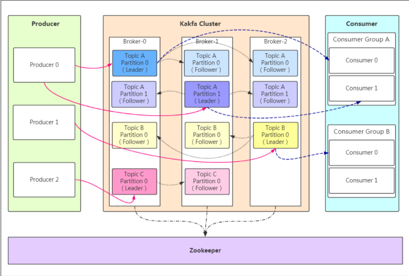
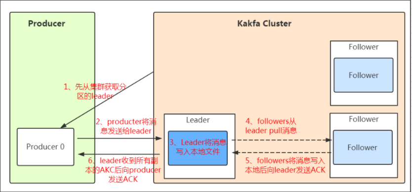

​         Kafka是一种高吞吐量、持久性、分布式的发布订阅的消息队列系统,使用Scala语言编写;它主要用于处理消费者规模网站中的所有动作流数据。动作指(网页浏览、搜索和其它用户行动所产生的数据)。
消息队列通信的两种模式:
​    点对点
​    发布订阅
​    
kafka的特点：
​    1.高吞吐量：可以满足每秒百万级别消息的生产和消费。
​    2.持久性：有一套完善的消息存储机制，确保数据高效安全且持久化。
​    3.分布式：基于分布式的扩展；Kafka的数据都会复制到几台服务器上，当某台故障失效时，生产者和消费者转而使用其它的Kafka。
​    
​    每条记录由键值；"key value"和一个时间戳组成
​    
kafka的架构：
​    
​    
​    概念：
​      Producer：Producer即生产者，消息的产生者，是消息的入口。
　　kafka cluster：
　　　　Broker：Broker是kafka实例，每个服务器上有一个或多个kafka的实例，我们姑且认为每个broker对应一台服务器。每个kafka集群内的broker都有一个不重复的编号，如图中的broker-0、broker-1等……
　　　　Topic：消息的主题，可以理解为消息的分类，kafka的数据就保存在topic。在每个broker上都可以创建多个topic。
　　　　Partition：Topic的分区，每个topic可以有多个分区，分区的作用是做负载，提高kafka的吞吐量。同一个topic在不同的分区的数据是不重复的，partition的表现形式就是一个一个的文件夹！
　　　　Replication:每一个分区都有多个副本，副本的作用是做备胎。当主分区（Leader）故障的时候会选择一个备胎（Follower）上位，成为Leader。在kafka中默认副本的最大数量是10个，且副本的数量不能大于Broker的数量，follower和leader绝对是在不同的机器，同一机器对同一个分区也只可能存放一个副本（包括自己）。
　　　　Message：每一条发送的消息主体。
　　Consumer：消费者，即消息的消费方，是消息的出口。
　　Consumer Group：我们可以将多个消费组组成一个消费者组，在kafka的设计中同一个分区的数据只能被消费者组中的某一个消费者消费。同一个消费者组的消费者可以消费同一个topic的不同分区的数据，这也是为了提高kafka的吞吐量！
　　Zookeeper：kafka集群依赖zookeeper来保存集群的的元信息，来保证系统的可用性。

​    工作模式：
​    
​    
​    消息写入leader后，follower是主动的去leader进行同步的！producer采用push模式将数据发布到broker，每条消息追加到分区中，顺序写入磁盘，所以保证同一分区内的数据是有序的！
​    如果某个topic有多个partition，producer又怎么知道该将数据发往哪个partition呢？kafka中有几个原则：
　　1、 partition在写入的时候可以指定需要写入的partition，如果有指定，则写入对应的partition。
　　2、 如果没有指定partition，但是设置了数据的key，则会根据key的值hash出一个partition。
　　3、 如果既没指定partition，又没有设置key，则会轮询选出一个partition。
​    ACK应答机制保证消息不丢失
​       0代表producer往集群发送数据不需要等到集群的返回，不确保消息发送成功。安全性最低但是效率最高。
　　1代表producer往集群发送数据只要leader应答就可以发送下一条，只确保leader发送成功。
　　all代表producer往集群发送数据需要所有的follower都完成从leader的同步才会发送下一条，确保leader发送成功和所有的副本都完成备份。安全性最高，但是效率最低。

存储策略
　　无论消息是否被消费，kafka都会保存所有的消息。那对于旧数据有什么删除策略呢？
　　1、 基于时间，默认配置是168小时（7天）。
　　2、 基于大小，默认配置是1073741824。
消息存储在log文件后，消费者就可以进行消费了。与生产消息相同的是，消费者在拉取消息的时候也是找leader去拉取。
建议消费者组的consumer的数量与partition的数量一致！
    个人理解：一个topic可以有多个分区（每个分区的内容是不一样的），每个分区有多个副本（副本就是容灾的，每个副本必须在不同的机器上），生产者只会往分区的leader（leader是对于副本而言）上push消息，flower可以同步；
    