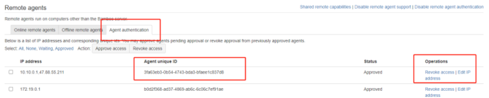
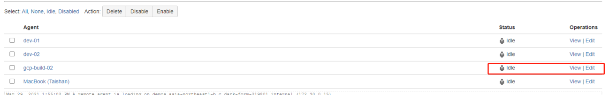
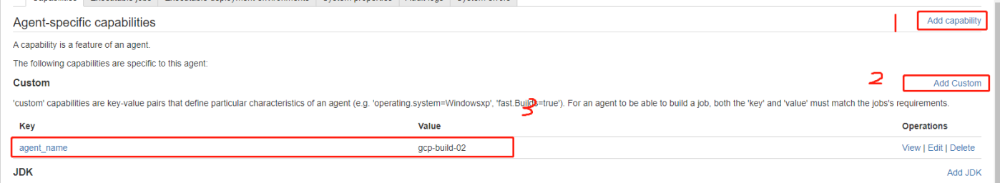

### 安装bamboo remote agent

1、配置及测试JDK环境

下载 java，配置JAVA_HOME，配置PATH，测试JDK 环境

```
> java -version
```


2、启动

```
> java -jar -Dbamboo.home=/data/bamboo-agent-home/ atlassian-bamboo-agent-installer-6.2.1.jar http://bamboo.bianjie.ai/agentServer/
```


3、通过验证
 

4、配置名称及属性


选择新添加的agent



5、添加安装工具

例如安装 kubectl ,根据部署脚本进行添加 kubeconfig 文件