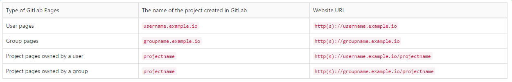

### Pages

首先当你新建一个Gitlab项目的时候，你同时也建了一个存储库。只要你的工程目录的根目录下有.gitlab-ci.yml文件，注意必须严格起这个名字。gitlab runner就会执行这个脚本文件。

脚本的最终目的很简单：把静态文件放入名为public目录下的文件夹内。Gitlab pages会一直去这个存储库的public目录找。注意：这个public是指存储库的public，与项目结构无关。换言之，这个public目录不可见。

也就是说：当你在项目的根目录下添加了.gitlab-ci.yml，且在脚本中将静态文件正确地放入了public文件夹，gitlab page就会自动打开并部署，部署的域名将会默认分配。

一般有两种类型的 Pages 可以创建

- 对于用户（username.example.io）或组（groupname.example.io）
- 对于Project（username.example.io/projectname 或 groupname.example.io/projectname ）

在GitLab中，usernames或groupnames是唯一的，我们经常把他们称为namespaces。在一个GitLab实例中只能有一个namespace。

下面是Gitlab Pages类型、Project Name和 website URL对照表：



### 具体配置

1、gitlab 启用 pages

```
# vim /etc/gitlab/gitlab.rb
pages_external_url "http://pages.bianjie.ai/"
gitlab_pages['enable'] = true
```

2、nginx 配置域名

```
[root@node9 conf.d]# cat gitlab-pages.conf 
## GitLab
##

## Pages serving host
server {
  listen 0.0.0.0:80;

  ## Replace this with something like pages.gitlab.com
  server_name pages.bianjie.ai;
  server_name *.pages.bianjie.ai; # 注意 nginx可以配置泛域名

  ## Individual nginx logs for GitLab pages
  access_log  /var/log/nginx/gitlab_pages_access.log;
  error_log   /var/log/nginx/gitlab_pages_error.log;

  location / {
    proxy_set_header    Host                $http_host;
    proxy_set_header    X-Real-IP           $remote_addr;
    proxy_set_header    X-Forwarded-For     $proxy_add_x_forwarded_for;
    proxy_set_header    X-Forwarded-Proto   $scheme;
    proxy_cache off;
    # The same address as passed to GitLab Pages: `-listen-proxy`
    proxy_pass http://127.0.0.1:8090;
  }

  # Define custom error pages
  error_page 403 /403.html;
  error_page 404 /404.html;
}

```

3、dns 配置解析

```
# 配置 gitlab ip 作为解析ip
192.168.150.39 pages.bianjie.ai
192.168.150.39 devops.pages.bianjie.ai

# 如果 dns 支持泛域名可以配置泛域名
address=/pages.bianjie.ai/192.168.150.39
```

4、配置 .gitlal-ci.yaml

```
image:
  name: bianjie/ops-alpine:0830

stages:
  - deploy

pages:
  stage: deploy
  script:
  - echo 'Nothing to do...'
  - mv test public
  - cd public && tree -J > trees
  artifacts:
    paths:
    - public
  only:
  - dev
```

