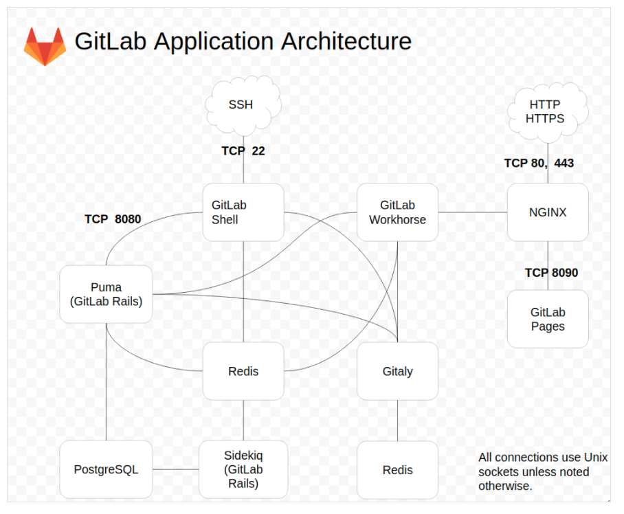

### 架构图

 

gitlab入口：
    nginx-->workhorse
    ssh-->gitlab shell
    
    
    
    
    
底层存储由三个组件负责：
①PostgreSQL：类似于mysql，存储业务数据，比如有哪些项目组，某个项目组下有哪些项目，某项目下哪些人有权限等等
②redis：用于缓存热点数据以及存储异步任务，sidekiq这组件会定期拉取分发异步任务给worker执行
③gitaly：存储底层代码文件，提供rpc接口对外提供git操作服务

接入层由两个组件负责：
gitlab shell和gitlab workhorse，前者负责处理ssh请求，后者负责处理http/https请求
gitlab workhorse对于本地静态文件请求（例如浏览器请求的html、js、css文件）会自己处理掉，对于纯git操作请求会转发给gitaly，对于其他动态请求会转发给unicorn处理

unicorn就是gitlab的主server程序，它会调用其他各个组件完成复杂的动态请求处理

• repository：代码库，可以是硬盘或 NFS 文件系统
• Nginx：Web 入口
• 数据库：包含以下信息：
• repository 中的数据（元数据，issue，合并请求 merge request 等）
• 可以登录 Web 的用户（权限）

• Redis：缓存，负责分发任务
• [sidekiq](https://github.com/mperham/sidekiq)：后台任务，主要负责发送电子邮件。任务需要来自 Redis
• Unicorn：Gitlab 自身的 Web 服务器，包含了 Gitlab 主进程，负责处理快速/一般任务，与 Redis 一起工作。工作内容包括：
• 通过检查存储在 Redis 中的用户会话来检查权限
• 为 Sidekiq 制作任务
• 从仓库（warehouse）取东西或在那里移动东西

• [gitlab-shell](https://gitlab.com/gitlab-org/gitlab-shell/)：用于 SSH 交互，而不是 HTTP。gitlab-shell 通过 Redis 与 Sidekiq 进行通信，并直接或通过 TCP 间接访问 Unicorn
• [gitaly](https://gitlab.com/gitlab-org/gitaly)：后台服务，专门负责访问磁盘以高效处理 git 操作，并缓存耗时操作。所有的 git 操作都通过 Gitaly 处理
• [gitlab-workhorse](https://gitlab.com/gitlab-org/gitlab-workhorse)：反向代理服务器，可以处理与 Rails 无关的请求（磁盘上的 CSS、JS 文件等），处理 Git Push/Pull 请求，处理到 Rails 的连接（修改由 Rails 发送的响应或发送给 Rails 的请求，管理 Rails 的长期 WebSocket 连接等）。
• [mail_room](https://github.com/tpitale/mail_room)：处理邮件请求。回复 GitLab 发出的邮件时，GitLab 会调用此服务
Sidekiq、Unicorn 和 GitLab-shell 是 GitLab 中处理任务的 3 个程序。
GitLab 应用程序是上述所有组件的集合。

GitLab 使用 Nginx 将前端请求代理到 Unicorn Web 服务器。默认情况下，Unicorn 与前端之间的通信是通过 Unix domain 套接字进行的，但也支持通过 TCP 转发请求。Web 前端访问 `/home/git/gitlab/public` 绕过 Unicorn 服务器来提供静态页面，上传（例如头像图片或附件）和预编译资源。GitLab 使用 Unicorn Web 服务器提供网页和 [GitLab API](https://gitlab.com/gitlab-org/gitlab-ce/tree/master/doc/api)。使用 Sidekiq 作为作业队列，反过来，它使用 redis 作为作业信息，元数据和作业的非持久数据库后端。
GitLab 应用程序使用 MySQL 或 PostgreSQL 作为持久数据库，保存用户，权限，issue，其他元数据等，默认存储在 `/home/git/repositories` 中提供的 git repository。
通过 HTTP/HTTPS 提供 repository 时，GitLab 使用 GitLab API 来解析授权和访问以及提供 git 对象。
gitlab-shell 通过 SSH 提供 repository。它管理 `/home/git/.ssh/authorized_keys` 内的 SSH 密钥，不应手动编辑。gitlab-shell 通过 Gitaly 访问 bare repository 以提供 git 对象并与 redis 进行通信以向 Sidekiq 提交作业以供 GitLab 处理。gitlab-shell 查询 GitLab API 以确定授权和访问。
Gitaly 从 gitlab-shell 和 GitLab web 应用程序执行 git 操作，并为 GitLab web 应用程序提供 API 以从 git 获取属性（例如 title，branches，tags，其他元数据）和 blob（例如 diffs，commits ，files）。
GitLab.com 的生产架构可以 [参考这里](https://about.gitlab.com/handbook/infrastructure/production-architecture/)。