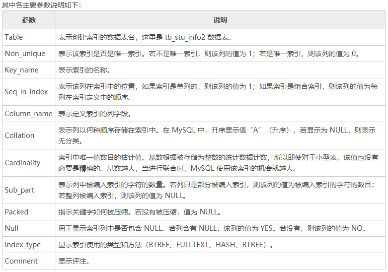

# 索引

索引是一种单独的、物理的对数据库表中一列或多列的值进行排序的一种存储结构，它是某个表中一列或若干列值

的集合和相应的指向表中物理标识这些值的数据页的逻辑指针清单。

索引的作用相当于图书的目录，可以根据目录中的页码快速找到所需的内容。索引提供指向存储在表的指定列中的

数据值的指针，然后根据您指定的排序顺序对这些指针排序。

### 索引的优点

   大大加快了数据的查询速度。

### 索引的缺点

1. 维护索引需要耗费数据库的资源

2. 索引需要占用磁盘空间

3. 当对表的数据进行增删改的时候，增删改的速度会变慢，增删改对底层数据结构进行排序。因为要维护索引，速度会受到影响。

### 索引分类

#### InnoDB

主键索引

​       数据库表中设定主键后，数据库会自动创建主键索引，在 InnoDB 引擎中主键索引也称之为局促索引

单值索引（普通索引）

​        即一个索引只包含单个列，一个表可以有多个单列索引

唯一索引

​        索引列的值必须唯一，但允许有空值

组合索引（复合索引、联合索引）

​        即一个索引包含多个列。

#### MyISAM

 full  Text 全文索引

​        全文索引的索引类型为 FULL Text，在定义索引的列上支持全文查找，运行插入重复的值和空值，只有MYISAM 存储引擎支持的全文索引


注意：在实际环境中，除了默认的主键索引外，一般根据业务的需要来创建对应的索引，比如业务需要根据 a 列和 b 列来查询，就需要创建 a b 列的索引


### 索引操作

查看索引

show index from t_nfts;



 创建索引

```
# 单列/多列普通索引
CREATE INDEX index_name ON table_name (column_name);
CREATE INDEX index_name ON table_name (column1, column2, ...);

# 唯一索引
CREATE UNIQUE INDEX index_name ON table_name (column_name);

# 全文索引
CREATE FULLTEXT INDEX index_name ON table_name (column_name);

# 空间索引
CREATE SPATIAL INDEX index_name ON table_name (column_name);
```

删除索引

```
DROP INDEX id_ex_chain_id_type_id ON tx;
```

