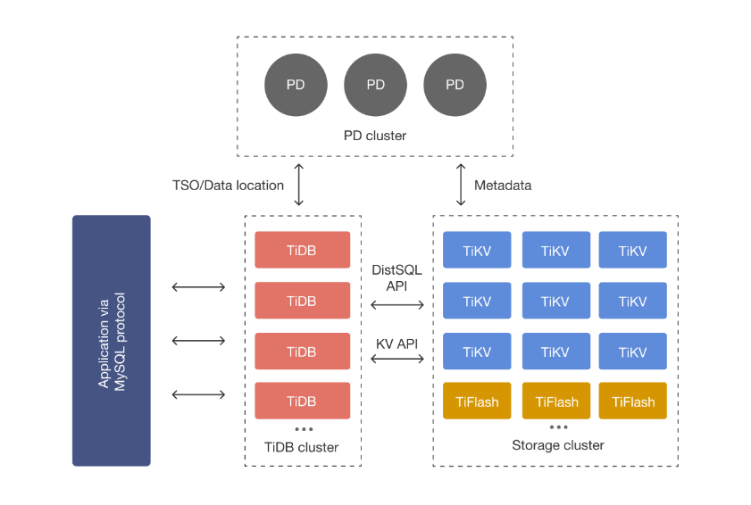

# TiDB

 TiDB 是 [PingCAP](https://pingcap.com/about-cn/) 公司自主设计、研发的开源分布式关系型数据库，是一款同时支持在线事务处理与在线分析处理 (Hybrid Transactional and Analytical Processing, HTAP) 的融合型分布式数据库产品，具备水平扩容或者缩容、金融级高可用、实时 HTAP、云原生的分布式数据库、兼容 MySQL 5.7 协议和 MySQL 生态等重要特性。

目标是为用户提供一站式 OLTP (Online Transactional Processing)、OLAP (Online Analytical Processing)、HTAP 解决方案。

TiDB 适合高可用、强一致要求较高、数据规模较大等各种应用场景

### 架构

- [TiDB Server](https://docs.pingcap.com/zh/tidb/stable/tidb-computing)：SQL 层，对外暴露 MySQL 协议的连接 endpoint，负责接受客户端的连接，执行 SQL 解析和优化，最终生成分布式执行计划。TiDB 层本身是无状态的，实践中可以启动多个 TiDB 实例，通过负载均衡组件（如 LVS、HAProxy 或 F5）对外提供统一的接入地址，客户端的连接可以均匀地分摊在多个 TiDB 实例上以达到负载均衡的效果。TiDB Server 本身并不存储数据，只是解析 SQL，将实际的数据读取请求转发给底层的存储节点 TiKV（或 TiFlash）。
- [PD (Placement Driver) Server](https://docs.pingcap.com/zh/tidb/stable/tidb-scheduling)：整个 TiDB 集群的元信息管理模块，负责存储每个 TiKV 节点实时的数据分布情况和集群的整体拓扑结构，提供 TiDB Dashboard 管控界面，并为分布式事务分配事务 ID。PD 不仅存储元信息，同时还会根据 TiKV 节点实时上报的数据分布状态，下发数据调度命令给具体的 TiKV 节点，可以说是整个集群的“大脑”。此外，PD 本身也是由至少 3 个节点构成，拥有高可用的能力。建议部署奇数个 PD 节点。
- 存储节点
  - [TiKV Server](https://docs.pingcap.com/zh/tidb/stable/tidb-storage)：负责存储数据，从外部看 TiKV 是一个分布式的提供事务的 Key-Value 存储引擎。存储数据的基本单位是 Region，每个 Region 负责存储一个 Key Range（从 StartKey 到 EndKey 的左闭右开区间）的数据，每个 TiKV 节点会负责多个 Region。TiKV 的 API 在 KV 键值对层面提供对分布式事务的原生支持，默认提供了 SI (Snapshot Isolation) 的隔离级别，这也是 TiDB 在 SQL 层面支持分布式事务的核心。TiDB 的 SQL 层做完 SQL 解析后，会将 SQL 的执行计划转换为对 TiKV API 的实际调用。所以，数据都存储在 TiKV 中。另外，TiKV 中的数据都会自动维护多副本（默认为三副本），天然支持高可用和自动故障转移。
  - [TiFlash](https://docs.pingcap.com/zh/tidb/stable/tiflash-overview)：TiFlash 是一类特殊的存储节点。和普通 TiKV 节点不一样的是，在 TiFlash 内部，数据是以列式的形式进行存储，主要的功能是为分析型的场景加速。

