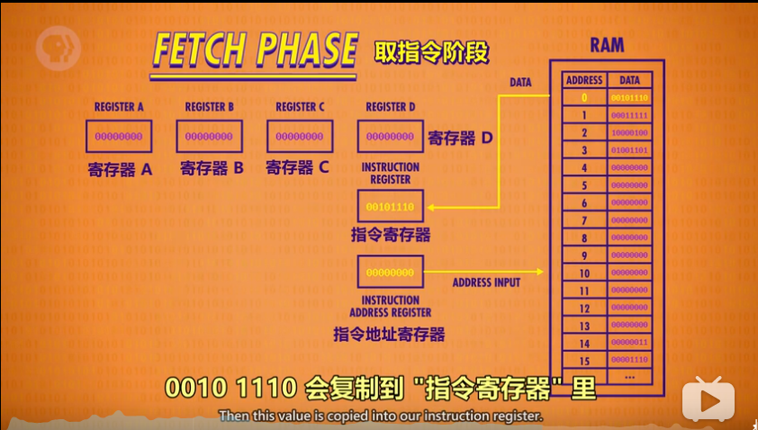
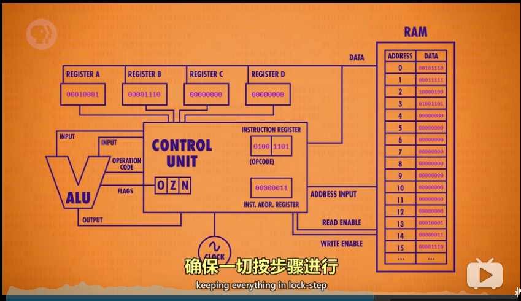
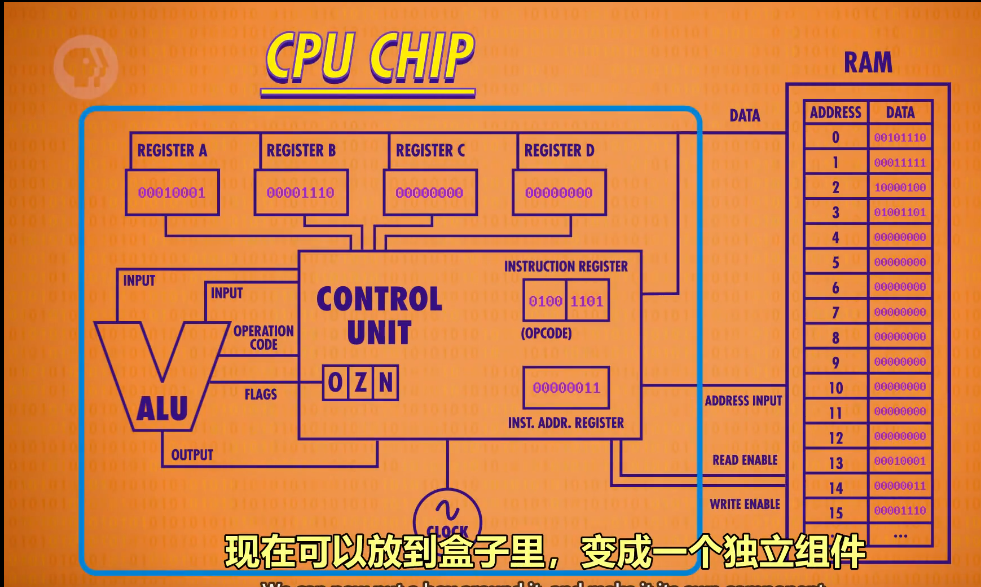
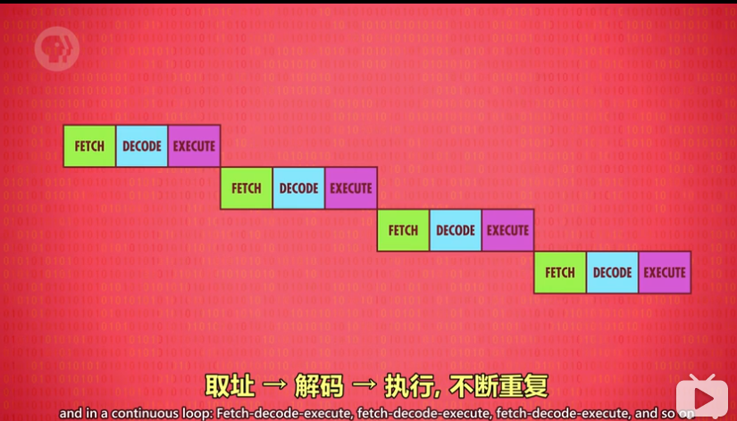
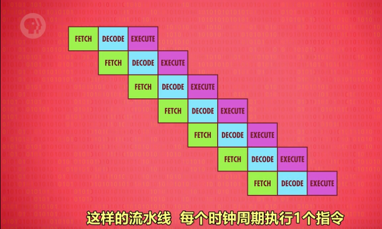

#  计算机科学速成课---B站

早期的计算机单纯是为了计算使用机械和齿轮
后来发展为晶体管，
再后来是半导体(通电和不同电两种状态，用来标识1和0，其实可以根据电流大小也可以表示别的数，但是效率太差，也是因为有完整的理论基础布尔代数   )，半导体0和1之间变化的频率很高。

理论基础是完整的布尔代数（是关于二进制的所有运算与法则），这也是为什么选择了0和1，
布尔代数是研究亚里士多德哲学的逻辑数学，常规的操作就是与(and)，或(or)，非(not)。
算术逻辑单元（ALU），通过与或非3种门来实现全加器，半加器等，组成算数单元，然后还有这3种逻辑门组成的逻辑单元
组合成算数逻辑单元ALU,然后再封装起来，有3个输入（2个数加一个运算符号），1个输出。（例如：1 + 2 = 3）
存储
也是用这3种门通组成1个门集合，成为锁存器（2个输入，1个允许写入开关，一个数据输入），每个锁存器存储1位信息；多个锁存器组成寄存器。（比如8个锁存器组成1个能存储8位信息的寄存器）
要存更大量的信息，锁存器矩阵，多个锁存器矩阵+多路复用器=256位内存
256位内存：
    16行，16列锁存器，4位二进制数表示列，4位二进制数表示行(8位内存地址)；
    256位内存组成：8位地址，数据线，允许写入线，允许读取线
8个256位内存，组成256字节；
上面有些不好理解，可以理解为我们有256个地址，每个地址可以存储一个8位的二进制数；

取指令-->解码-->执行指令

取指令：指令地址寄存器初始值为0，所以读取地址为0的RAM所存的信息存到指令寄存器中；
解码：解析信息的内容，前四位是操作码（如加减，将值放到某个寄存器里面，或者将值从寄存器存到RAM里面），后四位是RAM的地址；
执行指令：然后根据指令执行，执行完后指令地址寄存器＋1；
上面的内容可以抽象为控制单元
然后加入时钟来控制执行的频率；
思考：这些初始的指令是如何定义的呢?
答：应该是二进制数字代表了电路的状态，也就是说是多个逻辑门组成的电路来定义的原始指令（个人理解）；

抽象后（完善点的cpu）：

指令的丰富：loadA,loadB，sub,add,jump......
指令的长度：指令长度，可变指令长度；

cpu的组成：

提高cpu的运行速度：
提高晶体管的切换速度，通过硬件电路实现某些操作（除法，图形处理，加密文档等），这些操作如果用正常的加减法来做会很耗时； 通过缓存；
并行或者是叫流水线处理（实际上就是通过多个任务同时执行，充分利用cpu不同部分的功能，具体自己理解）

乱序执行，分支推测，多核cpu,多个cpu
核心：充分利用每个时钟周期，做更多的事

发展：
程序由穿孔卡纸（发展为纸带，插线板，开关板）写入，穿孔卡纸写出；
也就是说早期的编程语言都是机器语言即二进制编程；
后来发展为伪代码然后通过操作码表把伪代码翻译为机器语言，然后让计算机执行
再接着发展汇编语言，助记符+数据，原理就是用机器语言编写了一个汇编器，汇编器读取汇编语言转换为机器语言，然后执行；
注意汇编与机器指令是一一对应的，所以只是好记了一旦而已（类似于域名和ip）,但是编程还是很麻烦
高级语言，编译器的产生，一行高级语言通过编译器可以转换为几十条机器或者汇编语言；
一个有意思的问题，现代高级语言的编译器是怎么写的？套娃？（机器语言->汇编->c语言->python）
自举，就是说用汇编语言写python的一个基础模块的编译器，语言叫p1，然后用p1来写其他模块，p2，用p2写其他的模块python,然后就ok了；
ok编译器理解之后就可以编程了，不用管底层的一些寄存器，内存地址等东西
函数，多个函数组成程序，一定要多写函数
算法及算法复杂度
经典算法：
    排序
    图搜索 edsger dijkstra
   图灵机
    根据初始状态及读到的数据，进行下一步操作
    停机问题
    人工智能，当人问2个单位(1个单位是人一个单位是计算机)问题，分辨不出来哪一个是人的时候，那么...