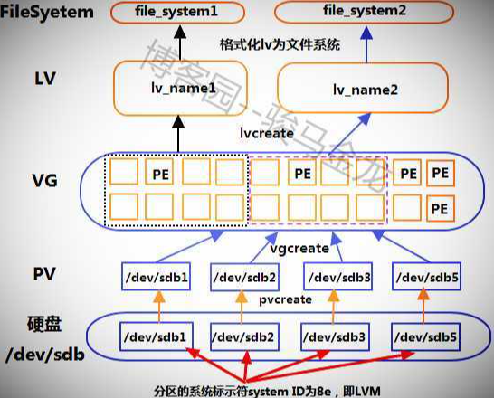

### 硬盘和磁盘

#### 相关命令

lsblk ：列出当前系统识别的硬盘

https://uoften.com/article/223064.html

blkid：查看盘UUID信息及文件系统的类型

### 分区

Linux中磁盘分区分为 MBR 和 GPT

MBR 全称为 Master Boot Record，为主引导记录，是传统的分区机制，应用于绝大多数使用的BIOS的PC设备。

MBR分区的特点：

1、MBR支持32位和64位的系统

2、MBR支持分区数量有限

 3、MBR只支持不超过2T的硬盘，超过2T的硬盘将只能用2T空间


GPT（全称为GUID Partition Table）分区为全局唯一分区表，是一个较新的分区机制，解决了MBR很多缺点

GPT分区的特点：

1、支持超过2T的磁盘（64位寻址）。Fdisk最大只能建立2TB大小的分区

2、向后兼容MBR

3、必须在支持UEFI的硬件上才能使用（Intel提出，用于取代BIOS）

4、 必须使用64位系统

#### 相关命令

fdisk、parted

fdisk 是属于 MBR 分区

http://c.biancheng.net/view/891.html

parted 是属于 GPT分区


### 格式化和挂载

常用的磁盘格式有 xfs ext4 

```shell
mkfs.xfs -f /dev/sdb
mkdir /data
echo '/dev/sdb /data xfs defaults 0 0' >> /etc/fstab
mount -a
```


### LVM 相关

逻辑卷管理 (Logical Volume Manager)，为了解决磁盘分区动态调整

#### LVM 图解



#### 相关概念

LVM 一共分为四层

最底层是 PP 层

PP： physical partition。物理分区。这一层是我们的物理磁盘设备，它可以是裸设备（未格式化的磁盘）、也可以是分区（sdb2,sda1等）、也可以是LUN

往上一层是 PV 层

PV: physical volume。物理卷。这一层我们把pp中的每一个物理设备都做成一个物理卷。pv的最小单元是pe,pe默认大小是4M，相当于把500G的磁盘空间分成一个一个4M的空间作为存储单元。

在往上一层是 VG 层

VG: volume group。卷组。卷组的作用相当于是池化资源，即把底层的所有物理资源集合在一起，形成一个大池子。这个池子中包含所有PV中的PE。这里我们的卷组有1500G资源。

最上边一层是LV层

LV：logic volume。 逻辑卷。逻辑卷就相当于我们的逻辑分区，是给到人具体使用的。比如我们有一个业务需要200G的空间，那么我们就从VG中划分出来一个200G 的逻辑卷（lv）给它使用。

还有一个概念是 PE : physical extend，物理扩展块。是LVM的最小存储单位，默认大小为4M；可以通过调整PE块的数量来定义LV的容量。

#### 相关操作

|      |           |           |           |
| :--- | --------- | --------- | --------- |
| 功能 | 管理pv    | 管理 vg   | 管理lv    |
| 扫描 | pvscan    | vgscan    | lvscan    |
| 创建 | pvcreate  | vgcreate  | lvcreate  |
| 显示 | pvdisplay | vgdisplay | lvdispaly |
| 删除 | pvremove  | vgremove  | lvremove  |
| 扩展 | -         | vgextend  | lvextend  |
|      |           |           |           |

参考：

https://www.pianshen.com/article/1742387373/

https://cloud.tencent.com/developer/article/1937939