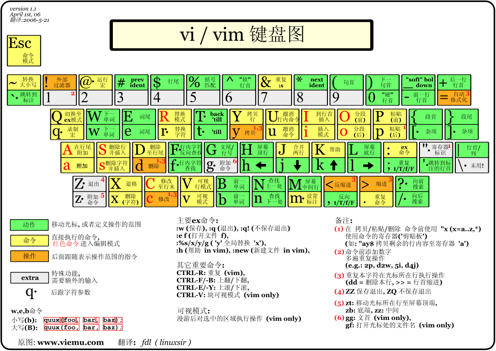
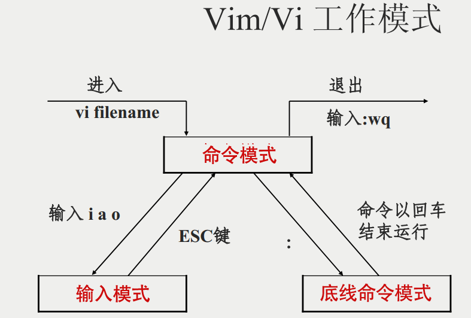
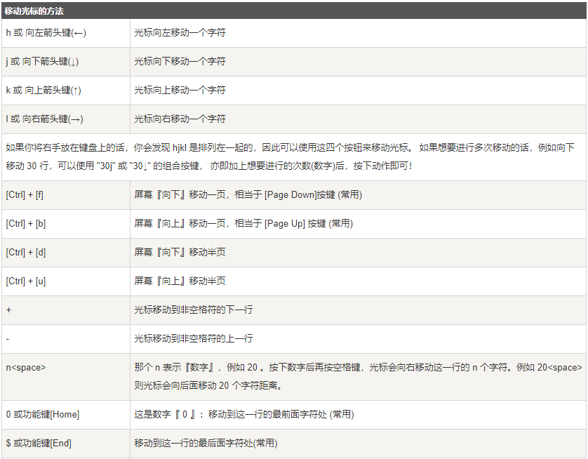
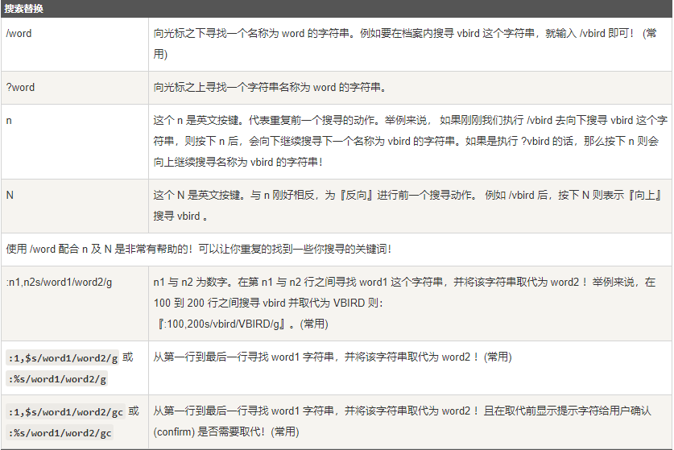
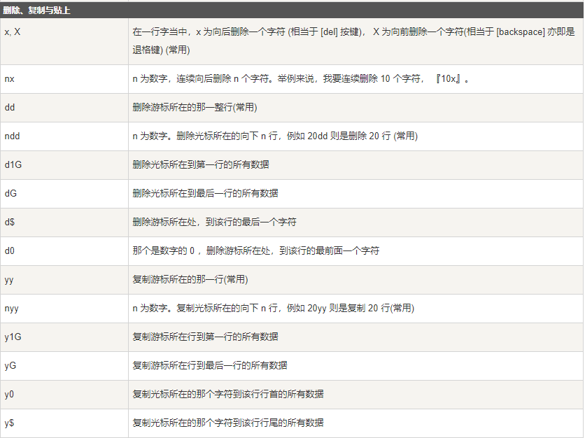
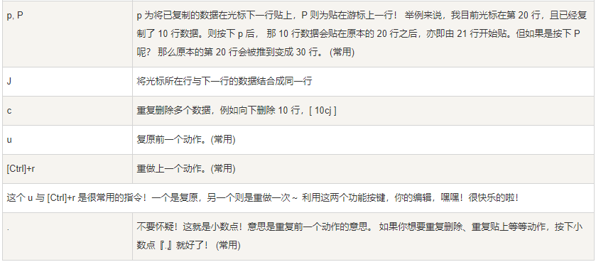
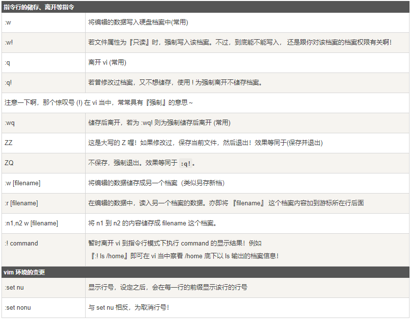

# Vim

#### Vim 编辑技巧

```
gg:跳到文件头
G:跳到文件尾
yy：复制一行
p：粘贴    
u:撤销
o:行后插入
O：行前插入
/：查找  n:往下匹配，N：网上匹配
dd:删除
v/V:矩形选择多行进行操作
^:一行最左边字符
$:一行最右边字符


```


## 什么是 vim？

Vim 是从 vi 发展出来的一个文本编辑器。代码补完、编译及错误跳转等方便编程的功能特别丰富，在程序员中被

广泛使用。

简单的来说， vi 是老式的字处理器，不过功能已经很齐全了，但是还是有可以进步的地方。 vim 则可以说是程序

开发者的一项很好用的工具。

连 vim 的官方网站 ([http://www.vim.org](http://www.vim.org/)) 自己也说 vim 是一个程序开发工具而不是文字处理软件。
vim 键盘图：




## vi/vim 的使用


基本上 vi/vim 共分为三种模式，分别是命令模式（Command mode），输入模式（Insert mode）和底线命令模式（Last line mode）。 这三种模式的作用分别是：


### 命令模式：


用户刚刚启动 vi/vim，便进入了命令模式。
此状态下敲击键盘动作会被Vim识别为命令，而非输入字符。比如我们此时按下i，并不会输入一个字符，i被当作了一个命令。
以下是常用的几个命令：
• i 切换到输入模式，以输入字符。
• x 删除当前光标所在处的字符。
• : 切换到底线命令模式，以在最底一行输入命令。
若想要编辑文本：启动Vim，进入了命令模式，按下i，切换到输入模式。
命令模式只有一些最基本的命令，因此仍要依靠底线命令模式输入更多命令。


### 输入模式


在命令模式下按下i就进入了输入模式。
在输入模式中，可以使用以下按键：
• **字符按键以及Shift组合**，输入字符
• **ENTER**，回车键，换行
• **BACK SPACE**，退格键，删除光标前一个字符
• **DEL**，删除键，删除光标后一个字符
• **方向键**，在文本中移动光标
• **HOME**/**END**，移动光标到行首/行尾
• **Page Up**/**Page Down**，上/下翻页
• **Insert**，切换光标为输入/替换模式，光标将变成竖线/下划线
• **ESC**，退出输入模式，切换到命令模式


### 底线命令模式

在命令模式下按下:（英文冒号）就进入了底线命令模式。
底线命令模式可以输入单个或多个字符的命令，可用的命令非常多。
在底线命令模式中，基本的命令有（已经省略了冒号）：
• q 退出程序
• w 保存文件
按ESC键可随时退出底线命令模式。
简单的说，我们可以将这三个模式想成底下的图标来表示：


## vi/vim 使用实例


### 使用 vi/vim 进入一般模式


如果你想要使用 vi 来建立一个名为 runoob.txt 的文件时，你可以这样做：
$ vim runoob.txt直接输入 vi 文件名 就能够进入 vi 的一般模式了。请注意，记得 vi 后面一定要加文件名，不管该文件存在与否！


### 按下 i 进入输入模式(也称为编辑模式)，开始编辑文字


在一般模式之中，只要按下 i, o, a 等字符就可以进入输入模式了！
在编辑模式当中，你可以发现在左下角状态栏中会出现 –INSERT- 的字样，那就是可以输入任意字符的提示。
这个时候，键盘上除了 Esc 这个按键之外，其他的按键都可以视作为一般的输入按钮了，所以你可以进行任何的编辑。


### 按下 ESC 按钮回到一般模式


好了，假设我已经按照上面的样式给他编辑完毕了，那么应该要如何退出呢？是的！没错！就是给他按下 Esc 这个按钮即可！马上你就会发现画面左下角的 – INSERT – 不见了！


### 在一般模式中按下 :wq 储存后离开 vi


OK，我们要存档了，存盘并离开的指令很简单，输入 :wq 即可保存离开！
OK! 这样我们就成功创建了一个 runoob.txt 的文件。


## vi/vim 按键说明


除了上面简易范例的 i, Esc, :wq 之外，其实 vim 还有非常多的按键可以使用。


### 第一部分：一般模式可用的光标移动、复制粘贴、搜索替换等








### 第二部分：一般模式切换到编辑模式的可用的按钮说明


### 第三部分：一般模式切换到指令行模式的可用的按钮说明



特别注意，在 vi/vim 中，数字是很有意义的！数字通常代表重复做几次的意思！ 也有可能是代表去到第几个什么

什么的意思。

举例来说，要删除 50 行，则是用 『50dd』 对吧！ 数字加在动作之前，如我要向下移动 20 行呢？那就是

『20j』或者是『20↓』即可。

#### vim 配置