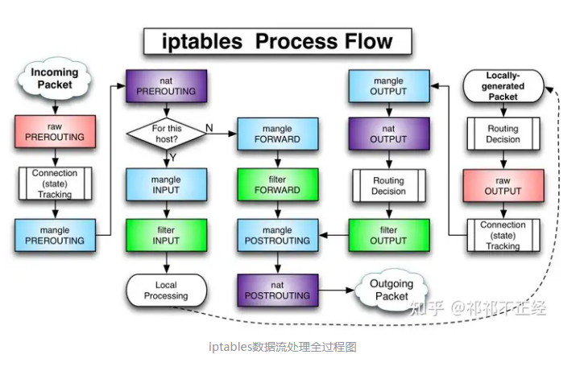

# iptables

### 定义

iptables 是 Linux 上一个强大的防火墙工具，用于管理网络包的过滤、转发和地址转换。它工作在用户空间，利

用内核中的 netfilter 框架来实现其功能。iptables 可以根据源地址、目的地址、传输协议、应用程序端口等信

息，对进出网络接口的数据包进行精细控制。

### 功能

网络地址转换(Network Address Translate)

数据包内容修改

以及数据包过滤的防火墙功能

#### iptables、Ufw（Uncomplicated Firewall）、firewalld 和 nftables的区别和联系

##### 各自定义

iptables、Ufw（Uncomplicated Firewall）、firewalld 和 nftables 是 Linux 上用于管理和配置网络流量规则的不同工具和框架。它们在功能上有所重叠，但也有各自的特点和使用场景。

**iptables**
iptables 是长期以来 Linux 系统中用于配置防火墙规则的标准工具。它操作复杂但功能强大，直接操作内核的 

netfilter 框架来控制进出数据包。

特点：功能全面，灵活性高，但配置相对复杂，学习曲线陡峭。

**Ufw（Uncomplicated Firewall）**

Ufw 是为了简化 iptables 的配置而设计的接口，提供了一个更用户友好的方式来管理防火墙规则。

特点：易于使用，适合那些希望通过简单命令配置防火墙而不需要深入了解所有细节的用户。

**firewalld**

firewalld 是一个较新的防火墙管理工具，旨在提供动态的防火墙管理功能，不需要重启服务即可应用新的规则。

特点：支持区域和服务的概念，可以更灵活地组织规则，适合动态和复杂的网络环境。它也可以使用 iptables 或 

nftables 作为后端。

**nftables**

nftables 是 iptables 的后继者（作用等同于 iptables ），旨在解决 iptables 的一些设计问题，提供更高效和更直观的方式来管理网络相关

的钩子。

特点：提供了一种新的语法和工具集，用于配置内核的 packet filtering 规则。它整合了之前 iptables、

ip6tables、arptables 和 ebtables 的功能。

##### 关系

iptables 和 nftables 都是直接与 Linux 内核的 netfilter 框架交互

Ufw 是 iptables 的前端工具，旨在简化其配置过程

firewalld 可以使用 iptables 或 nftables 作为其后端，提供动态防火墙管理


参考

https://blog.csdn.net/hougang/article/details/133393806

### 基本概念

表（Table）：iptables 中的表是一组规则链的集合，用于存储特定类型的规则。常见的表有

filter 表：负责过滤功能，防火墙；内核模块：iptables_filter

nat 表：network address translation，网络地址转换功能；内核模块：iptable_nat

mangle 表：拆解报文，做出修改，并重新封装 的功能；iptable_mangle

raw 表：关闭 nat 表上启用的连接追踪机制；iptable_raw


链（Chain）：链是一组按顺序排列的规则，用于对数据包进行处理。常见的链有 INPUT、OUTPUT、FORWARD、PREROUTING 和 POSTROUTING。


| 链名           | 功能                   |
| -------------- | ---------------------- |
| **INPUT**      | 处理输入数据包         |
| **OUTPUT**     | 处理输出数据包         |
| **PORWARD**    | 处理转发数据包         |
| **PREROUTING** | 用于目标地址转换(DNAT) |
| **POSTOUTING** | 用于源地址转换(SNAT)   |

规则（Rule）：规则是 iptables 中的基本单位，用于定义如何处理数据包。规则包括匹配条件和目标动作，当数据包满足匹配条件时，将执行目标动作。


##### 终止目标

| 动作       | 含义                                                         |
| ---------- | ------------------------------------------------------------ |
| ACCEPT     | 允许数据包通过                                               |
| DROP       | 直接丢弃数据包，不给任何回应信息，这时候客户端会感觉自己的请求没有响应，过了超时时间才会有反应。 |
| REJECT     | 拒绝数据包通过，必要时会给数据发送端一个响应的信息，客户端刚请求就会收到拒绝的信息 |
| SNAT       | 源地址转换，解决内网用户用同一个公网地址上网的问题           |
| MASQUERADE | 是SNAT的一种特殊形式，适用于动态的、临时会变的ip上           |
| DNAT       | 目标地址转换                                                 |
| REDIRECT   | 在本机做端口映射                                             |
| LOG        | 在/var/log/messages文件中记录日志信息（其实就是写入系统日志，通过dmesg也可以看到），然后将数据包传递给下一条规则，也就是说除了记录以外不对数据包做任何其他操作，仍然让下一条规则去匹配 |


|          |            | 链表关系 |         |        |             |
| -------- | ---------- | -------- | ------- | ------ | ----------- |
| Tables   | PREROUTING | INPUT    | FORWARD | OUTPUT | POSTROUTING |
| raw      | ✅          |          |         | ✅      |             |
| mangle   | ✅          | ✅        | ✅       | ✅      | ✅           |
| nat      | ✅          |          |         | ✅      | ✅           |
| filter   |            | ✅        | ✅       | ✅      |             |
| security |            | ✅        | ✅       | ✅      |             |

##### 其他

1. 防火墙策略规则的匹配顺序是从上至下的，因此要把较为严格、优先级较高的策略规则放到前面

2. 表的优先级为： raw -> mangle -> nat -> filter
3. 最常用的就是 filter、nat 表
4. 数据包经过一条链要将所有的规则都匹配一遍


##### 链表的优先级

在 iptables 中，链表的执行顺序决定了数据包的路由和处理方式。一般来说，链表的优先级顺序是先处理，后执行。

- `PREROUTING`链(位于raw, mangle, nat表):当数据包进入网卡时，首先会被`PREROUTING`链处理。由于该链在多个表(raw, mangle, nat)中都存在，其执行的优先级是raw(PREROUTING) -> mangle(PREROUTING) -> nat(PREROUTING)。
- `INPUT`链(位于filter表):针对进入主机的网络数据包进行处理。
- `FORWARD`链(位于filter表):针对经过主机转发的网络数据包进行处理。
- `OUTPUT`链(位于filter表):针对主机发出的网络数据包进行处理。
- `POSTROUTING`链(位于nat表):对即将离开主机的网络数据包进行处理，比如进行源地址转换。

所以，`PREROUTING`链是最先被执行的，而`POSTROUTING`链是最后被执行的，其主要作用是对数据包进行地址修改。

总结来说，iptables 的链表优先级大致如下:

1. `PREROUTING` (raw, mangle, nat)
2. `INPUT` (filter)
3. `FORWARD` (filter)
4. `OUTPUT` (filter)
5. `POSTROUTING` (nat)

需要注意的是，`PREROUTING`链在三个表(raw, mangle, nat)中都有存在，其执行顺序是先raw，然后mangle，最后是nat。


##### 数据包处理流程图



文字版

数据包在 Linux 网络栈中的处理顺序取决于 **数据包方向**（入站/出站/转发）。以下是经典流程：

（1）入站流量（Incoming Traffic，目标为本机）

```
1. 网卡接收数据包
   │
   ↓
2. **raw 表 PREROUTING 链**（决定是否跳过连接跟踪）
   │
   ↓
3. **mangle 表 PREROUTING 链**（修改包标记、TTL 等）
   │
   ↓
4. **nat 表 PREROUTING 链**（DNAT：修改目标地址，如端口转发）
   │
   ↓
5. 路由决策（判断包是发给本机还是转发？）
   │
   ↓
6. **mangle 表 INPUT 链**（进一步修改包）
   │
   ↓
7. **filter 表 INPUT 链**（过滤：允许/拒绝/丢弃）
   │
   ↓
8. 本地进程处理（如应用程序接收数据）
```

（2）出站流量（Outgoing Traffic，本机发出）

```
1. 本地进程生成数据包
   │
   ↓
2. **raw 表 OUTPUT 链**（决定是否跳过连接跟踪）
   │
   ↓
3. **mangle 表 OUTPUT 链**（修改包标记、TTL 等）
   │
   ↓
4. **nat 表 OUTPUT 链**（出站 DNAT，较少使用）
   │
   ↓
5. 路由决策（确定出口网卡和目标 MAC）
   │
   ↓
6. **filter 表 OUTPUT 链**（过滤：允许/拒绝/丢弃）
   │
   ↓
7. **mangle 表 POSTROUTING 链**（最后修改包）
   │
   ↓
8. **nat 表 POSTROUTING 链**（SNAT/MASQUERADE：修改源地址）
   │
   ↓
9. 发送到网卡
```

（3）转发流量（Forwarded Traffic，经本机路由）

```
1. 网卡接收数据包
   │
   ↓
2. **raw 表 PREROUTING 链**（跳过连接跟踪？）
   │
   ↓
3. **mangle 表 PREROUTING 链**（修改包）
   │
   ↓
4. **nat 表 PREROUTING 链**（DNAT：修改目标地址）
   │
   ↓
5. 路由决策（判断需要转发）
   │
   ↓
6. **mangle 表 FORWARD 链**（修改转发包）
   │
   ↓
7. **filter 表 FORWARD 链**（过滤：允许/拒绝/丢弃）
   │
   ↓
8. **mangle 表 POSTROUTING 链**（最后修改包）
   │
   ↓
9. **nat 表 POSTROUTING 链**（SNAT/MASQUERADE：修改源地址）
   │
   ↓
10. 发送到目标网卡
```


### 常用参数

```
参数	作用
-t  指定表，不指定默认为 filter 表
-P	设置默认策略
-F	清空规则链
-Z  清空规则链中的数据包计算器和字节计数器
-X  删除自定义链
-L	查看规则链
-A	在规则链的末尾加入新规则
-I num	在规则链的头部加入新规则
-D num	删除某一条规则
-s	匹配来源地址IP/MASK，加叹号“!”表示除这个IP外
-d	匹配目标地址
-i 网卡名称	匹配从这块网卡流入的数据
-o 网卡名称	匹配从这块网卡流出的数据
-p	匹配协议，如TCP、UDP、ICMP
--dport num	匹配目标端口号
--sport num	匹配来源端口号
--
-v 详细模式,显示规则时提供更多的信息
-n 数值模式,在输出结果时使用数字地址（IP 地址和端口号），而不是尝试将它们解析为主机名、网络名或服务名
--line-numbers 规则展示序号
```

### 常用命令

```
# 查看 iptables 规则
iptables -vnL --line-numbers
iptables -t nat -vnL --line-numbers

# 添加 filter 表规则
iptables -A INPUT -p tcp --dport 179 -j ACCEPT
iptables -A INPUT -p 89 -j ACCEPT

# 添加 nat 表规则
iptables -t nat -A POSTROUTING -d 10.24.0.0/16 -o eth0 -j MASQUERADE
iptables -t nat -A POSTROUTING -d 10.5.0.0/25 -o eth0 -j MASQUERADE

# 新建链
iptables -t nat -N CHAINNAME

# 修改 FORWARD 链的默认规则为 DROP
iptables -P FORWARD DROP

# 删除规则， INPUT 链
iptables -D INPUT 5
iptables -D INPUT -s 10.4.5.88 -j ACCEPT

# nat 表 POSTROUTING 链
iptables -t nat -D POSTROUTING 2

# 清空链
iptables -t nat -F DOCKER

# 删除链
iptables -t nat -X DOCKER


## 其他相关命令
iptables-save
# iptables 规则备份
iptables-save > /etc/iptables/rules.v4

# iptables 规则还原
iptables-restore < /etc/iptables/rules.v4

```


### 参考

https://typonotes.com/posts/2021/06/25/linux-iptable-introduce/

https://www.cnblogs.com/liufarui/p/10970468.html

https://zhuanlan.zhihu.com/p/618848653