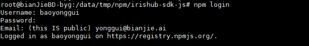

# Push NPM 包

### 手动推送

1. 注册npm账号

注册地址：

注册地址：https://www.npmjs.com/
注册时需要提供

Public Email 邮箱(邮箱是公开的)

· Username：用户名，唯一性

· Password：登录密码

2. 在github中创建一个npm包的代码库

将github的代码库git clone到本地

git clone https://github.com/irisnet/irishub-sdk-js.git

进入代码目录

cd irishub-sdk-js/

执行

npm init

输入相关信息

package name: (@irisnet/irishub-sdk) irishub-sdk-js

version: (0.0.1) v1.0.0-rc0

git repository: (https://github.com/irisnet/irishub-sdk-js.git)

author: bianjie.ai

license: (Apache-2.0)

例如：
package name：比较重要，会显示到 npm 仓库，不能和现有的名称重复
version: 版本号
license：开源协议

3. 登录 npm 账号

打开 cmd 命令行，输入 npm login
分别输入用户名，密码，邮箱，如下图所示



4. 发布 npm 包到仓库

cmd 命令行执行 npm publish

5. 发布成功后，到npm仓库搜索package name即可查询到


### 自动推送

1、创建 actions 模板

```
name: Node.js Package

on:
  create:
  push:
    tags:
      - '*'
      - '**'
jobs:
  publish-npm:
    runs-on: ubuntu-latest
    steps:
      - uses: actions/checkout@v2
            - uses: actions/setup-node@v1
        with:
          node-version: 12
          registry-url: https://registry.npmjs.org/
            - run: echo ${GITHUB_REF}
                  - run: npm publish
        env:
                NODE_AUTH_TOKEN: ${{secrets.NPM_TOKEN}}
```


2、新建 NPM 仓库的 Access token

3、设置 Github 的 Secrets

4、触发 action 进行推送

注意：package  的 name 和 version 都是从 package.json 中拿的