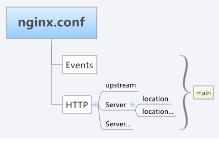

### 基础知识

Nginx 是一款面向性能设计的 HTTP 服务器，能反向代理 HTTP，HTTPS 和邮件相关(SMTP，POP3，IMAP)的协

议链接。并且提供了负载均衡以及 HTTP 缓存。 

它的设计充分使用异步事件模型，削减上下文调度的开销，提高服务器并发能力。 采用了模块化设计，提供了丰

富模块的第三方模块。 

所以关于 Nginx，有这些标签：「异步」「事件」「模块化」「高性能」「高并发」「反向代理」「负载均衡」

webserver基本功能


• TCP监听模块
服务器监听某个端口（一般默认是8080端口，用户可以设置其他端口），以建立和用户代理之间的连接。一旦建立连接，用户代理的后续HTTP请求将不用再进入监听模块。

• 预处理
此处主要做三件事：1. 从TCP报文中获取HTTP请求报文。 2. 根据和用户代理的协商进行解密，解压，安全处理等等。3. 根据服务器自身的配置进行安全处理，建立会话状态等等。

• UR路由
解析URL字符串和动作以确定用户代理请求的资源，根据匹配规则（通常根据正则表达式+后缀）路由到静态资源处理模块或动态资源处理模块。

• 静态资源处理模块负责找到静态资源，比如HTML/Javascript/CSS文件/图片/图像，确定内容是字符流或者字节流，并确定对应MIME,比如HTML生成MIME为text/html的字符流，mpeg视频文件生成MIME为video/mpeg的字节流。

• 动态资源处理模块
运行业务逻辑处理，动态决定返回的资源内容和类型，内容和类型的处理原则同上。

• 后处理
根据和用户协商的协议进行加密，压缩，安全处理等等。

• 资源输出模块
把处理好的内容和类型封装成HTTP报文，往TCP连接另一头的用户代理发送TCP报文（内容是HTTP报文）。

事件模型
Nginx 对于事件，以异步非阻塞方式来实现。
异步和非异步，阻塞和非阻塞是两组不同的概念，前者更多对于应用程序而言，而后者更多对于 CPU 来说
• 异步：执行一个动作之后，可以去操作别的操作，然后等待通知再回来执行刚才没执行完的操作
• 非异步(同步)：执行一个操作之后，等待结果，然后才继续执行下面的操作
• 阻塞：给 CPU 传达任务之后，一直等待 CPU 处理完毕(即使会产生I/O)，然后才执行下面操作
• 非阻塞：给 CPU 传达任务之后，继续处理后面的操作，隔段时间再来询问之前的操作是否完成

Nginx 的异步非阻塞方式，具体到系统调用的话，就是像 select/poll/epoll/kqueue 这样的系统调用。它们提供了一种机制，让你可以同时监控多个事件，调用他们是阻塞的，但可以设置超时时间，在超时时间之内，如果有事件准备好了，就返回。 

epoll 是在 Linux 上关于事件的实现，而 kqueue 是 OpenBSD 或 FreeBSD 操作系统上采用类似 epoll 的事件模型。

epoll 
  该方案给是 Linux 下效率最高的 I/O 事件通知机制，在进入轮询的时候如果没有检查到 I/O 事件，将会进入休眠，直到事件将它唤醒。它是真实利用了事件通知、执行回调的方式，而不是遍历查询，所以不会浪费 CPU，执行效率较高。

### Nginx 处理请求过程

1 request 请求进来 
2 初始化 HTTP Request， 生成 HTTP Request 对象 
3 处理请求头 
4 处理请求体 
5 调用与此请求关联的 handler（根据你URL或者Location配置） 
6 依次调用各 phase handler 进行处理 
    1)   获取 location 配置 
    2)  产生适当的响应 
    3)  发送 response header 
    4)  发送 response body

### 安装

rpm 安装
yum install nginx

源码安装
略

### nginx 进程进程管理

进程模型

Nginx 的进程是使用经典的「Master-Worker」模型。Nginx在启动后，会有一个 master 进程和多个 worker 进程。

• master进程主要用来管理worker进程
• 接收来自外界的信号，向各worker进程发送信号
• 监控worker进程的运行状态，当worker进程退出后(异常情况下)，会自动重新启动新的worker进程
worker 进程主要处理基本的网络事件，多个 worker 进程之间是对等的，他们同等竞争来自客户端的请求，各进程互相之间是独立的。
• worker 只有主线程，即单线程
• 多个worker进程之间是对等的,他们同等竞争来自客户端的请求，各进程互相之间是独立的
• 一个请求，只可能在一个worker进程中处理
• worker进程的个数是可以设置的，一般我们会设置与机器cpu核数一致 

nginx的进程模型，可以由下图来表示：


命令行

```
# 指定配置文件的启动方式 
nginx -c /tmp/nginx.conf 

# 测试配置信息是否有错误 
nginx -t 

#显示版本信息 
nginx -v 

# 显示编译阶段的参数 
nginx -V 

# 快速停止服务 
nginx -s stop 

# 强制停止服务，想master进程发送TERM信号 “优雅”地停止服务 
nginx -s quit

# 区别: stop 时，worker 进程与 master 进程收到信号后立刻跳出循环，退出进程；
quit时，首先关闭监听端口，停止接收新的连接，然后把当前正在处理的连接全部处理完，最后退出进程。

# 使运行中的nginx重读配置项并生效 
nginx -s reload 


# 日志文件回滚 
nginx -s reopen
重新打开日志文件
```

信号
• TERM, INT Quick shutdown
• QUIT  Graceful shutdown(优雅关闭进程，等请求结束后再关闭)
• KILL  Halts a stubborn process
• HUP   Configuration reload,Start the new worker processes with a new configuration,Gracefully shutdown the old worker processes(改变配置文件,平滑重读配置文件)
• USR1  Reopen the log files(重读日志，可在日志切割时使用)
• USR2  Upgrade Executable on the fly(平滑升级)
• WINCH Gracefully shutdown the worker processes(优雅关闭旧的进程) 

发信号: 
kill 信号 MASTER_PID

平滑升级Nginx
\1. 发送USR2信号 kill -s SIGUSER2 <nginx master pid> 

运行中的nginx会将pid文件重命名，在nginx.pid重命名为nginx.pid.oldbin

\2. 启动新版本的nginx

\3. 通过kill命令向旧版本的master进程发送SIGQUIT信号 
显示命令行帮助

### nginx 配置

nginx 的配置系统由一个主配置文件和其他一些辅助的配置文件构成。这些配置文件均是纯文本文件，全部位于nginx安装目录下的conf目录下。 
/etc/nginx/nginx.conf
在nginx.conf中，包含若干配置项。 
每个配置项由配置指令和指令参数2个部分构成。 指令参数也就是配置指令对应的配置值。

指令
配置指令是一个字符串(如果配置指令包含空格，一定要引号引起来)

指令参数
指令的参数使用一个或者多个空格或者TAB字符与指令分开。指令的参数有一个或者多个TOKEN串组成。TOKEN串之间由空格或者TAB键分隔。

TOKEN 串
TOKEN串分为简单字符串或者是复合配置块。 
如果一个配置指令的参数全部由简单字符串构成，那么我们就说这个配置指令是一个简单配置项，否则称之为复杂配置项。 

对于简单配置，配置项的结尾使用分号结束。

简单配置项: 
error_page   500 502 503 504  /50x.html;

复合配置块即是由大括号括起来的一堆内容。一个复合配置块中可能包含若干其他的配置指令。 
对于复杂配置项，包含多个TOKEN串的，一般都是简单TOKEN串放在前面，复合配置块一般位于最后，而且其结尾，并不需要再添加分号。
复杂配置项：
location /home {
    root   /data/www/html;
    index  index.html index.htm;
}

指令上下文
nginx.conf中的配置信息，根据其逻辑上的意义，对它们进行了分类，也就是分成了多个作用域，或者称之为配置指令上下文。不同的作用域含有一个或者多个配置项。
nginx支持的几个指令上下文：
• main: nginx在运行时与具体业务功能（比如http服务或者email服务代理）无关的一些参数，比如工作进程数，运行的身份等。
• http: 与提供http服务相关的一些配置参数。例如：是否使用keepalive啊，是否使用gzip进行压缩等。
• server: http服务上支持若干虚拟主机。每个虚拟主机一个对应的server配置项，配置项里面包含该虚拟主机相关的配置。在提供mail服务的代理时，也可以建立若干server.每个server通过监听的地址来区分。
• location: http服务中，某些特定的URL对应的一系列配置项。
• mail: 实现email相关的SMTP/IMAP/POP3代理时，共享的一些配置项（因为可能实现多个代理，工作在多个监听地址上）。

配置文件

```
nginx文件结构
...              #全局块

events {         #events块
   ...
}

http {      #http块
    ...   #http全局块
    server        #server块
    { 
        ...       #server全局块
        location [PATTERN]   #location块
        {
            ...
        }
        location [PATTERN] 
        {
            ...
        }
    }

    server
    {
      ...
    }
    ...     #http全局块
}

stream {


}
```

nginx配置文件架构的图


配置文件详解
\#定义Nginx运行的用户和用户组
user www www;

\#nginx进程数，建议设置为等于CPU总核心数。
worker_processes 8;

\#全局错误日志定义类型，[ debug | info | notice | warn | error | crit ]
error_log /var/log/nginx/error.log info;

\#进程文件
pid /var/run/nginx.pid;

\#一个nginx进程打开的最多文件描述符数目，理论值应该是最多打开文件数（系统的值ulimit -n）与nginx进程数相除，但是nginx分配请求并不均匀，所以建议与ulimit -n的值保持一致。
worker_rlimit_nofile 65535;

\#工作模式与连接数上限
events
{
    \#参考事件模型，use [ kqueue | rtsig | epoll | /dev/poll | select | poll ]; epoll模型是Linux 2.6以上版本内核中的高性能网络I/O模型，如果跑在FreeBSD上面，就用kqueue模型。
    useepoll;
    \#单个进程最大连接数（最大连接数=连接数*进程数）
    worker_connections 65535;
}

\#设定http服务器
http
{
    include mime.types;#文件扩展名与文件类型映射表
    default_type application/octet-stream;#默认文件类型
    \#charset utf-8; #默认编码
    server_names_hash_bucket_size 128;#服务器名字的hash表大小
    client_header_buffer_size 32k;#上传文件大小限制
    large_client_header_buffers 464k;#设定请求缓
    client_max_body_size 8m;#设定请求缓
    \#开启高效文件传输模式，sendfile指令指定nginx是否调用sendfile函数来输出文件，对于普通应用设为 on，如果用来进行下载等应用磁盘IO重负载应用，可设置为off，以平衡磁盘与网络I/O处理速度，降低系统的负载。注意：如果图片显示不正常把这个改成off。
    sendfile on;
    autoindex on;#开启目录列表访问，合适下载服务器，默认关闭。
    tcp_nopush on;#防止网络阻塞
    tcp_nodelay on;#防止网络阻塞
    keepalive_timeout 120;#长连接超时时间，单位是秒

​    \#FastCGI相关参数是为了改善网站的性能：减少资源占用，提高访问速度。下面参数看字面意思都能理解。
​    fastcgi_connect_timeout 300;
​    fastcgi_send_timeout 300;
​    fastcgi_read_timeout 300;
​    fastcgi_buffer_size 64k;
​    fastcgi_buffers 464k;
​    fastcgi_busy_buffers_size 128k;
​    fastcgi_temp_file_write_size 128k;

​    \#gzip模块设置
​    gzip on;#开启gzip压缩输出
​    gzip_min_length 1k;#最小压缩文件大小
​    gzip_buffers 416k;#压缩缓冲区
​    gzip_http_version 1.0;#压缩版本（默认1.1，前端如果是squid2.5请使用1.0）
​    gzip_comp_level 2;#压缩等级
​    gzip_types text/plain application/x-javascript text/css application/xml;
​    \#压缩类型，默认就已经包含text/html，所以下面就不用再写了，写上去也不会有问题，但是会有一个warn。
​    gzip_vary on;
​    \#开启限制IP连接数的时候需要使用
​    \#limit_zone crawler $binary_remote_addr 10m; 

​    \#upstream的负载均衡，weight是权重，可以根据机器配置定义权重。weigth参数表示权值，权值越高被分配到的几率越大。
​    upstream blog.ha97.com{
​        server 192.168.80.121:80 weight=3;
​        server 192.168.80.122:80 weight=2;
​        server 192.168.80.123:80 weight=3;
​    }

​    \#虚拟主机的配置，每个server就是虚拟主机

​    server
​    {
​        \#监听端口
​        listen80;
​        \#域名可以有多个，用空格隔开
​        server_name www.ha97.com ha97.com;
​        index index.html index.htm index.php;
​        root /data/www/ha97;
​        location ~ .*\.(php|php5)?$
​        {
​            fastcgi_pass 127.0.0.1:9000;
​            fastcgi_index index.php;
​            include fastcgi.conf;
​        }
​        \#图片缓存时间设置
​        location ~ .*\.(gif|jpg|jpeg|png|bmp|swf)$
​        {
​            expires 10d;
​        }
​        \#JS和CSS缓存时间设置
​        location ~ .*\.(js|css)?$
​        {
​            expires 1h;
​        }

​        \#日志格式设定

​        log_format access'$remote_addr - $remote_user [$time_local] "$request" '
​            '$status $body_bytes_sent "$http_referer" '
​            '"$http_user_agent" $http_x_forwarded_for';
​        \#定义本虚拟主机的访问日志
​        access_log /var/log/nginx/ha97access.log access;

​        \#对 "/" 启用反向代理
​        location / {
​            proxy_pass http://127.0.0.1:88;
​            proxy_redirect off;
​            proxy_set_header X-Real-IP $remote_addr;
​            \#后端的Web服务器可以通过X-Forwarded-For获取用户真实IP
​            proxy_set_header X-Forwarded-For $proxy_add_x_forwarded_for;
​            \#以下是一些反向代理的配置，可选。
​            proxy_set_header Host $host;
​            client_max_body_size 10m;#允许客户端请求的最大单文件字节数
​            client_body_buffer_size 128k;#缓冲区代理缓冲用户端请求的最大字节数，
​            proxy_connect_timeout 90;#nginx跟后端服务器连接超时时间(代理连接超时)
​            proxy_send_timeout 90;#后端服务器数据回传时间(代理发送超时)
​            proxy_read_timeout 90;#连接成功后，后端服务器响应时间(代理接收超时)
​            proxy_buffer_size 4k;#设置代理服务器（nginx）保存用户头信息的缓冲区大小
​            proxy_buffers 432k;#proxy_buffers缓冲区，网页平均在32k以下的设置
​            proxy_busy_buffers_size 64k;#高负荷下缓冲大小（proxy_buffers*2）
​            \#设定缓存文件夹大小，大于这个值，将从upstream服务器传
​            proxy_temp_file_write_size 64k;
​        }

​        \#设定查看Nginx状态的地址
​        location /NginxStatus{
​            stub_status on;
​            access_log on;
​            auth_basic "NginxStatus";
​            auth_basic_user_file conf/htpasswd;
​            \#htpasswd文件的内容可以用apache提供的htpasswd工具来产生。
​        }

​        \#本地动静分离反向代理配置
​        \#所有jsp的页面均交由tomcat或resin处理
​        location ~ .(jsp|jspx|do)?${
​            proxy_set_header Host $host;
​            proxy_set_header X-Real-IP $remote_addr;
​            proxy_set_header X-Forwarded-For $proxy_add_x_forwarded_for;
​            proxy_pass http://127.0.0.1:8080;
​        }
​        \#所有静态文件由nginx直接读取不经过tomcat或resin
​        location ~ .*.(htm|html|gif|jpg|jpeg|png|bmp|swf|ioc|rar|zip|txt|flv|mid|doc|ppt|pdf|xls|mp3|wma)$
​        {expires 15d;}
​        location ~ .*.(js|css)?$
​        {expires 1h;}
​    }
}

### 虚拟主机

虚拟主机（Virtual Host）可以在一台服务器上绑定多个域名，架设多个不同的网站 

所有虚拟主机都是在http区域中添加一个server段(区块) 

nginx的虚拟主机配置其实也挺简单，为了使得配置文件清晰，可以给每一个虚拟主机建立一个配置文件，然后在

主配置文件（nginx.conf）里使用include语句包含所有的虚拟主机配置文件。

include conf.d/*.conf

基于域名的虚拟主机

server{
    server_name mobanker.com;
    root /var/www/html;     #指定根目录，理论上可以指定任意目录
    index index.html;       #当直接输入域名，不加任何路径时，会默认显示index.html这个文件
}

基于端口的虚拟主机

server {
      listen 2022;
      server_name mobanker.com;
      root /var/www/html/admin/;
      index index.html;
}

基于IP的虚拟主机
server {
    server_name 192.168.33.100;
    root /var/www/html;
    index index.html;
}

反向代理

反向代理是指以代理服务器来接受连接请求，然后将请求转发给内部网络上的服务器，并将从服务器上得到的结果

返回给请求连接的客户端，此时代理服务器对外就表现为一个反向代理服务器。 

简单来说就是真实的服务器不能直接被外部网络访问，所以需要一台代理服务器，而代理服务器能被外部网络访问

的同时又跟真实服务器在同一个网络环境，或同一台服务器不同端口。


反向代理主要作用

• 加密和SSL加速
• 负载均衡
• 缓存静态内容
• 压缩
• 减速上传
• 安全防火墙
• 外网发布
• 突破互联网封锁
• 解决跨域问题
server {
        listen      80;
        server_name  localhost;
        client_max_body_size 1024M;
        location / {                           #匹配指向请求URL后的路径，可以多个
            proxy_pass http://localhost:8080;  #URL后缀不得以在端口后加个工程目录  #被代理的url 后不加/ ，location的会和 url拼接起来，而加了/ 会直接访问url
            proxy_set_header Host $host:$server_port;
        }
    }

https/SSL
server {
    listen       443 ssl;
    server_name  mobp2p.com;
    ssl         on;
    ssl_certificate /etc/nginx/conf.d/ssl/mobp2p.crt;
    ssl_certificate_key /etc/nginx/conf.d/ssl/mobp2p.key;
    ssl_session_cache shared:SSL:200m;
    ssl_session_timeout 20m;

​    ssl_prefer_server_ciphers on;
​    ssl_protocols TLSv1 TLSv1.1 TLSv1.2;
​    ssl_ciphers ECDHE-RSA-AES256-GCM-SHA384:ECDHE-RSA-AES128-GCM-SHA256:DHE-RSA-AES256-GCM-SHA384:DHE-RSA-AES128-GCM-SHA256:ECDHE-RSA-AES256-SHA384:ECDHE-RSA-AES128-SHA256:ECDHE-RSA-AES256-SHA:ECDHE-RSA-AES128-SHA:DHE-RSA-AES256-SHA256:DHE-RSA-AES1
28-SHA256:DHE-RSA-AES256-SHA:DHE-RSA-AES128-SHA:ECDHE-RSA-DES-CBC3-SHA:EDH-RSA-DES-CBC3-SHA:AES256-GCM-SHA384:AES128-GCM-SHA256:AES256-SHA256:AES128-SHA256:AES256-SHA:AES128-SHA:DES-CBC3-SHA:HIGH:!aNULL:!eNULL:!EXPORT:!CAMELLIA:!DES:!MD5:!PSK:!RC4;

​    location / {
​        proxy_set_header    Host              $host;
​        proxy_pass          http://mobp2p.com;
​        \#root /data/www/ssl/;
​    }
}

处理跨域

跨域 
  只要协议、域名、端口有任何一个不同，都被当作是不同的域 
  浏览器同源策略，其限制之一是不能通过ajax的方法去请求不同源中的文档。 第二个限制是浏览器中不同域的框架之间是不能进行js的交互操作的。
    location /api/ {
            proxy_pass http://sjd-distribexternal.ql.corp:9003/;
            proxy_set_header Host $http_host;
    }

负载均衡

是当有2台或以上服务器时，根据规则随机的将请求分发到指定的服务器上处理，负载均衡配置一般都需要同时配置反向代理，通过反向代理跳转到负载均衡


upstream 模块负责负载均衡模块
upstream test {
   server localhost:8080;
   server localhost:8081;
}
server {
    listen   81;
    server_name  localhost;
    client_max_body_size 1024M;
    location / {
      proxy_pass http://test;
      proxy_set_header Host $host:$server_port;
    }
}

负载均衡算法
\1. 轮询（默认）  
  每个请求按时间顺序逐一分配到不同的后端服务器，如果后端服务器down掉，能自动剔除。 
\2. weight  
  指定轮询几率，weight和访问比率成正比，用于后端服务器性能不均的情况。 
\3. ip_hash  
  每个请求按访问ip的hash结果分配，这样每个访客固定访问一个后端服务器，可以解决session的问题。  
\4. fair（第三方）  
  按后端服务器的响应时间来分配请求，响应时间短的优先分配。  
\5. url_hash（第三方）

nginx+php

FastCGI是一个可伸缩地、高速地在HTTP server和动态脚本语言间通信的接口。多数流行的HTTP server都支持FastCGI，包括Apache、Nginx和lighttpd等，同时，FastCGI也被许多脚本语言所支持，其中就有PHP.FastCGI接口方式采用C/S结构，可以将HTTP服务器和脚本解析服务器分开，同时在脚本解析服务器上启动一个或者多个脚本解析守护进程。

Nginx+FastCGI运行原理

Nginx不支持对外部程序的直接调用或者解析，所有的外部程序（包括PHP）必须通过FastCGI接口来调用。FastCGI接口在Linux下是socket，（这个socket可以是文件socket，也可以是ip socket）。为了调用CGI程序，还需要一个FastCGI的wrapper（wrapper可以理解为用于启动另一个程序的程序），这个wrapper绑定在某个固定socket上，如端口或者文件socket。当Nginx将CGI请求发送给这个socket的时候，通过FastCGI接口，wrapper接纳到请求，然后派生出一个新的线程，这个线程调用解释器或者外部程序处理脚本并读取返回数据；接着，wrapper再将返回的数据通过FastCGI接口，沿着固定的socket传递给Nginx；最后，Nginx将返回的数据发送给客户端，这就是Nginx+FastCGI的整个运作过程


PHP-FPM也是一个第三方的FastCGI进程管理器，它是作为PHP的一个补丁来开发的，在安装的时候也需要和PHP源码一起编译，也就是说PHP-FPM被编译到PHP内核中，因此在处理性能方面更加优秀；同时它在处理高并发方面也比spawn-fcgi引擎好很多，因此，推荐Nginx+PHP/PHP-FPM这个组合对PHP进行解析。
server {  
 include port.conf;  
 server_name www.ixdba.net ixdba.net;  

 location / {  
    index index.html index.php;  
    root /web/www/www.ixdba.net;  
 }  

 location ~ \.php$ {  
            root           html;  
            fastcgi_pass   127.0.0.1:9000;  
            fastcgi_index  index.php;  
            fastcgi_param  SCRIPT_FILENAME  html$fastcgi_script_name;  
            include        fastcgi_params;  
        }  
}  

进一步学习
• location
• rewrite
• 调优

location匹配命令
~      #波浪线表示执行一个正则匹配，区分大小写
~*    #表示执行一个正则匹配，不区分大小写
^~    #^~表示普通字符匹配，如果该选项匹配，只匹配该选项，不匹配别的选项，一般用来匹配目录
=      #进行普通字符精确匹配
@     #"@" 定义一个命名的 location，使用在内部定向时，例如 error_page, try_files

location 匹配的优先级(与location在配置文件中的顺序无关)
= 精确匹配会第一个被处理。如果发现精确匹配，nginx停止搜索其他匹配。
普通字符匹配，正则表达式规则和长的块规则将被优先和查询匹配，也就是说如果该项匹配还需去看有没有正则表达式匹配和更长的匹配。
^~ 则只匹配该规则，nginx停止搜索其他匹配，否则nginx会继续处理其他location指令。
最后匹配理带有"~"和"~*"的指令，如果找到相应的匹配，则nginx停止搜索其他匹配；当没有正则表达式或者没有正则表达式被匹配的情况下，那么匹配程度最高的逐字匹配指令会被使用。
location 优先级官方文档
\1. Directives with the = prefix that match the query exactly. If found, searching stops.
\2. All remaining directives with conventional strings, longest match first. If this match used the ^~ prefix, searching stops.
\3. Regular expressions, in order of definition in the configuration file.
\4. If #3 yielded a match, that result is used. Else the match from #2 is used.
\1. =前缀的指令严格匹配这个查询。如果找到，停止搜索。
\2. 所有剩下的常规字符串，最长的匹配。如果这个匹配使用^〜前缀，搜索停止。
\3. 正则表达式，在配置文件中定义的顺序。
\4. 如果第3条规则产生匹配的话，结果被使用。否则，使用第2条规则的结果。

例子：
location  = / {
  \# 只匹配"/".
  [ configuration A ] 
}
location  / {
  \# 匹配任何请求，因为所有请求都是以"/"开始
  \# 但是更长字符匹配或者正则表达式匹配会优先匹配
  [ configuration B ] 
}
location ^~ /images/ {
  \# 匹配任何以 /images/ 开始的请求，并停止匹配 其它location
  [ configuration C ] 
}
location ~* .(gif|jpg|jpeg)$ {
  \# 匹配以 gif, jpg, or jpeg结尾的请求. 
  \# 但是所有 /images/ 目录的请求将由 [Configuration C]处理.   
  [ configuration D ] 
}

请求URI例子:
• / -> 符合configuration A
• /documents/document.html -> 符合configuration B
• /images/1.gif -> 符合configuration C
• /documents/1.jpg ->符合 configuration D
@location 例子
error_page 404 = @fetch;
location @fetch(
proxy_pass http://fetch;
)