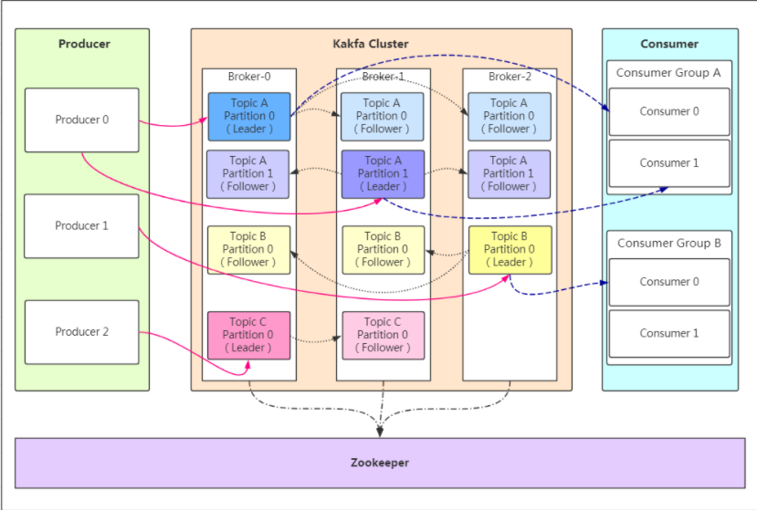
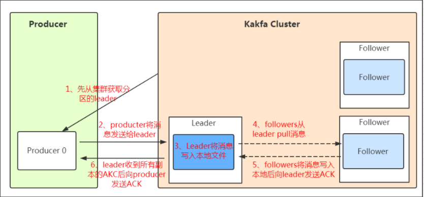

### 概念

Kafka 是一种高吞吐量、持久性、分布式的发布订阅的消息队列系统,使用 Scala 语言编写;它主要用于处理消费者规模网站中的所有动作流数据。动作指(网页浏览、搜索和其它用户行动所产生的数据)。

消息队列通信的两种模式

​    点对点
​    发布订阅

### kafka 特点

1. 高吞吐量：可以满足每秒百万级别消息的生产和消费。

2. 持久性：有一套完善的消息存储机制，确保数据高效安全且持久化。

3. 分布式：基于分布式的扩展；Kafka 的数据都会复制到几台服务器上，当某台故障失效时，生产者和消费者转而使用其它的Kafka。

每条记录由键值；"key value"和一个时间戳组成

### kafka 架构

​    
​ 

### 概念术语

Producer：Producer 即生产者，消息的产生者，是消息的入口。

Broker：Broker 是 kafka 实例，每个服务器上有一个或多个 kafka 的实例，我们姑且认为每个broker对应一台服

务器。每个 kafka 集群内的 broker 都有一个不重复的编号，如图中的 broker-0、broker-1等……

Topic：消息的主题，可以理解为消息的分类，kafka 的数据就保存在 topic。在每个 broker 上都可以创建多个

topic。

Partition：Topic 的分区，每个 topic 可以有多个分区，分区的作用是做负载，提高 kafka 的吞吐量。同一个

topic 在不同的分区的数据是不重复的，partition 的表现形式就是一个一个的文件夹！

Replication：每一个分区都有多个副本，副本的作用是做备胎。当主分区（Leader）故障的时候会选择一个备胎

（Follower）上位，成为Leader。在 kafka 中默认副本的最大数量是 10 个，且副本的数量不能大于 Broker 的数

量，follower 和 leader 绝对是在不同的机器，同一机器对同一个分区也只可能存放一个副本（包括自己）。

Message：每一条发送的消息主体。

Consumer：消费者，即消息的消费方，是消息的出口。

Consumer Group：我们可以将多个消费组组成一个消费者组，在kafka的设计中同一个分区的数据只能被消费者

组中的某一个消费者消费。同一个消费者组的消费者可以消费同一个topic的不同分区的数据，这也是为了提高

kafka的吞吐量！

Zookeeper：kafka集群依赖 zookeeper 来保存集群的的元信息，来保证系统的可用性。

#### 工作模式

​    
​ 
​消息写 入leader 后，follower 是主动的去 leader 进行同步的！producer 采用 push 模式将数据发布到 broker，每条消息追加到分区中，顺序写入磁盘，所以保证同一分区内的数据是有序的！

如果某个 topic 有多个 partition，producer 又怎么知道该将数据发往哪个 partition 呢？

kafka 中有几个原则：
　　1、 partition 在写入的时候可以指定需要写入的 partition，如果有指定，则写入对应的 partition。
　　2、 如果没有指定 partition，但是设置了数据的 key，则会根据key的值hash出一个 partition。
　　3、 如果既没指定 partition，又没有设置 key，则会轮询选出一个partition。

ACK 应答机制保证消息不丢失

​       0 代表 producer 往集群发送数据不需要等到集群的返回，不确保消息发送成功。安全性最低但是效率最高。
　　1 代表 producer 往集群发送数据只要leader应答就可以发送下一条，只确保leader发送成功。
　　all 代表 producer 往集群发送数据需要所有的 follower 都完成从 leader 的同步才会发送下一条，确保 leader发送成功和所有的副本都完成备份。安全性最高，但是效率最低。

存储策略
　　无论消息是否被消费，kafka 都会保存所有的消息。那对于旧数据有什么删除策略呢？
　　1、 基于时间，默认配置是 168 小时（7天）。
　　2、 基于大小，默认配置是1073741824。
消息存储在 log 文件后，消费者就可以进行消费了。与生产消息相同的是，消费者在拉取消息的时候也是找 

leader 去拉取。

建议消费者组的 consumer 的数量与 partition 的数量一致！

#### 消息持久化

Kafka 使用基于时间或消息数量的策略将数据从内存中的页缓存刷写到磁盘上，防止数据丢失。

- **参数 `log.flush.interval.messages`** ：每写入多少条消息刷盘一次。
- **参数 `log.flush.interval.ms`** ：每隔多少时间刷盘一次。

### 高可用

topic 副本机制

ISR 机制（ In-Sync Replica）。每个 Leader 会动态维护一个 ISR 列表，该列表里存储的是和 Leader 基本同步

的 Follower。如果有 Follower 由于网络、GC 等原因而没有向 Leader 发起拉取数据请求，此时 Follower 相对于

Leader 是不同步的，则会被踢出 ISR 列表。所以说，ISR 列表中的 Follower 都是跟得上 Leader 的副本。

Controller 选举： Kafka 集群中有一个专门的节点称为 Controller，负责管理分区和副本的状态。当集群中的 

Controller 发生故障时，会自动进行 Controller 的选举，确保集群能够继续正常运行。选举完成后，新选举出的 

Controller 负责维护和管理分区和副本的状态。

数据持久化： Kafka 使用磁盘作为主要的数据存储介质，消息和日志被持久化写入到磁盘中。这样即使发生节点

故障，数据也不会丢失

#### 个人理解

一个 topic 可以有多个分区（每个分区的内容是不一样的），每个分区有多个副本（副本就是容灾

的，每个副本必须在不同的机器上），生产者只会往分区的 leader（ leader 是对于副本而言）上 push 消息，

flower 可以同步；

关于消息的顺序性，可以使用单分区，如果是多分区就不太好报证；    

### 参考

https://developer.aliyun.com/article/848162

https://developer.aliyun.com/article/1280549