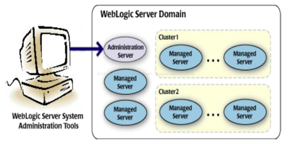
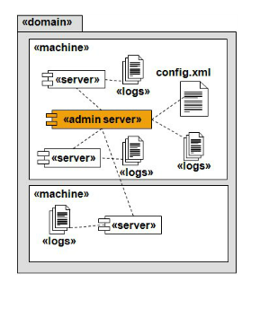
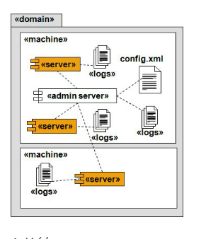
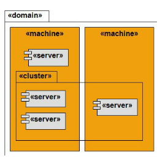
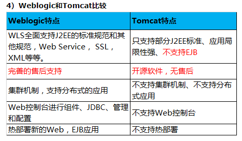

#  Weblogic

WebLogic是美国Oracle公司出品的一个application server确切的说是一个基于JAVAEE架构的中间件，BEA WebLogic是用于开发、集成、部署和管理大型分布式Web应用、网络应用和数据库应用的Java应用服务器。

## 基本概念：

### 域(Domain)：

1，概念
      (1)域是管理的单元或边界；

   (2)作为一个单元来管理的，并相互关联的一组WebLogic服务器资源被称为域；

   (3)Domain是webLogic Server管理的一个基本单元，包括一个管理server和一个管理的入口。

   (4)在创建server和使用server的时候需要先创建Domain。

   (5)每个Domain都包括一个confirm.xml文件，在domain的根目录下的config目录中。

2，组成
      (1)由server组成

   (2)server分Administration server和Managed Servers

   (3)Administrationserver负责domain的管理，一般不负责应用

   (4)Managed server部署实际的应用

   (5)Cluster

3,总结：
Domain是一个逻辑上的概念

Domain是一组Sever的集合

一个域有且只有一个管理服务器

## 服务器(Server)：

1，分类
服务器(Server)分Administration Server(管理服务器)和Managed Server(被管理服务器)

2，Administration Server(管理服务器)

——是控制整个域配置的中心操作节点，管理服务器维护着整个域Domain 的配置并将配置分配到每个被管理服务器 Managed Server 中，每个域中都必须有一个Administration Server。

Admin Server如果挂了，对于Domain中的ManagedServer不会产生影响，如果配置了集群，对于负载均衡和Failover机制也不会产生影响，因为这些都是基于配置文件的（config.xml），而不依赖与AdminServer的实例。Admin Server 不必时刻运行，当我们需要修改配置或者部署应用时，把Admin Server运行起来就行。

3,Managed Server(被管理服务器)

——是一个WebLogicServer的实例，他从Admin Server那里获取配置信息。通常在Managed Server上部署自己的服务、组件或应用。基于性能考虑，ManagedServer维护着一份只读的域配置文件，当服务启动的时候，会从Admin Server上同步配置文件信息，如果配置文件发生了改变，AdminServer也会将改变推送到Managed Server上。

4,总结：

(1)Administration Server(管理服务器)：

——可控制整个域（Domain）

——可存储配置信息和日志信息

——可通过管理服务器访问控制台

(2)Managed Server(被管理服务器)：

——可以是除管理服务器外的任何服务器

——与管理服务器建立连接获取配置信息

——可以解析承载应用程序

(3)Sever是JVM的一个实例；

​      一个Server：在机器上运行，且拥有自己的内存空间，且为多线程。

## 机器(Machine)：

——机器是物理上的概念，代表一台运行WebLogic应用服务器的实在的机器，包括其IP地址等信息。一个域中可以包括多台机器。

总结：Machine是一台承载Weblogic服务器的机器；可以承载多个Weblogic服务器实例。

## 5）Cluster集群

集群是一组WebLogic Server的组合，集群是为了满足服务的高可用（High Avilability）以及可扩展（Load Balancing）需求而出现的。需要注意的是，集群中的WebLogic Server必须版本号一致。Cluster需要注意的几个问题：不能够跨Domain、Cluster中的服务器必须在同一个域中、Domain中可以有多个Cluster

**weblogic目录介绍**

### 1）WebLogic基本目录介绍

Coherence：集群组件，在可靠的、高度可伸缩的对等集群协议之上提供了复制的、分布式的（分区的）数据管理和缓存服务
Logs：系统日志目录
Modules: 第三方模块包，weblogic运行时需要的jar文件
user_projects：定义域存放的位置
Utils：用户可以存放的第三方工具包，下面uninstall用来卸载，quickstart用来创建域的工具
wlserver_10.3：weblogic的主目录

### 2）User_projects目录介绍 

Autodeploy：用于存储主服务器部署的项目（在weblogic中尽量不要部署项目它是用来启动后台控制面板和管理其它服务器的），当Weblogic服务实例与开发模式运行时,此目录下应用程序(ear, war)等将被自动展开服务
Bin：存放域中的可执行文件
Config：本域相关的配置文件
Console-ext：控制台信息, 只应用于adminServer
Lib：存放库文件
Security：安全相关，存储密码
Servers：包含域的所有服务，及缓存等信息 
StartWebLogic.cmd 启动主服务器命令（控制台、Admin），调用bin下面的StartWebLogic.cmd
StartWebLogic.sh：调用bin下面 StartWebLogic.sh (Linux下) 

# weblogic和tomcat的比较：

Tomcat是Apache基金会提供的Servlet容器，它支持JSP, Servlet和JDBC等J2EE关键技术，所以用户可以用Tomcat开发基于数据库，Servlet和JSP页面的Web应用，这是没有问题的。
但是，Tomcat却不是EJB容器；也就是说，Tomcat不支持J2EE的重要技术之一，EJB。那么，使用EJB组件开发的Web应用程序就无法在Tomcat下面运行。众所周知，EJB是分布式应用程序的核心技术，所以说凡是需要使用EJB来开发的应用（例如，银行、电信等大型的分布式应用系统）就不能用Tomcat了。这也就是很多公司不选择Tomcat的原因。
至于支持EJB的应用服务器，Weblogic( Oracle), WebSphere（IBM)和JBoss( Redhat)都是符合J2EE规范的EJB容器，所以都可以用来开发大型的分布式应用程序。
所以，原则上来说，只要你要开发基于EJB组件的应用，上述三种任选一个都是可以的。唯一的区别是，Weblogic和WebSphere都是付费的，JBoss是开源免费的。
很多公司为了省钱，选择了JBoss作为应用服务器，但是，开源免费也就意味着厂商不会为终端用户直接负责；所以，当JBoss服务器出现任何问题......元芳，你怎么看？
总的来说，Weblogic和WebSphere还有JBoss都有人用，但是很多公司拿着这些大玩意儿实际上干的也只是Tomcat级别的项目，所以如此一来，差别也就不大了，估计楼主吐槽是因为这个吧。
你说公司接了个几千万的项目，你用tomcat你的预算怎么给人家算？人家客户尤其是政府国企之类的，那么些钱怎么花出去？想着法子造项目就是为了来年的经费可以多申请一些，你整些便宜的，人家怎么超预算啊