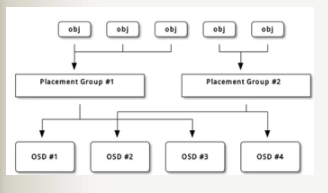
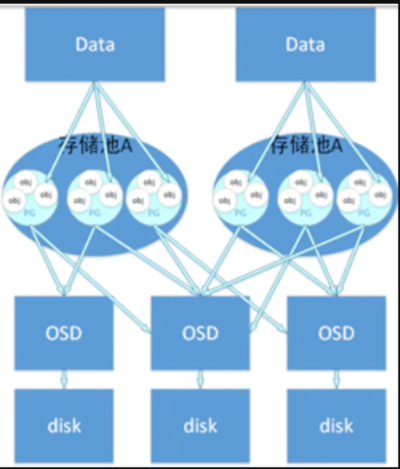
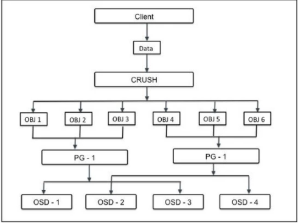
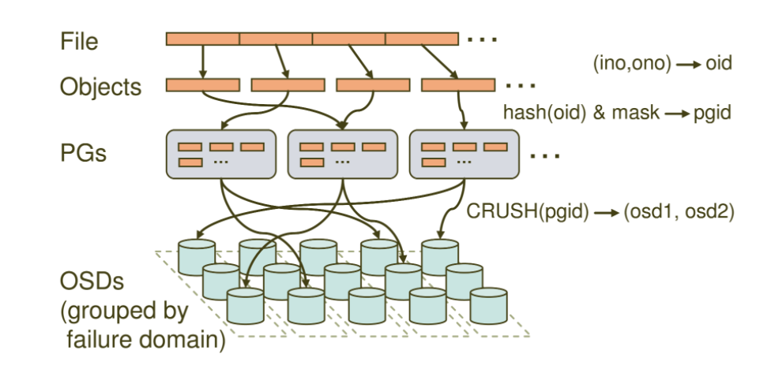

Pg和osd的关系

object、pg、pool、osd、存储磁盘的关系

通常在创建pool之前，需要覆盖默认的pg_num，官方推荐：

• 若少于5个OSD， 设置pg_num为128。
• 5~10个OSD，设置pg_num为512。
• 10~50个OSD，设置pg_num为4096。
• 超过50个OSD，可以参考pgcalc计算

​         

主要分四层，File->Objects->PGs->OSDs。
• File: 就是我们想要存储和访问的文件，这个是面向我们用户的，是我们直观操作的对象。
• Object：object就是Ceph底层RADOS所看到的对象，也就是在Ceph中存储的基本单位。object的大小由RADOS限定（通常为2m或者4m）。就跟HDFS抽象一个数据块一样，这里也是为了方便底层存储的组织管理。当File过大时，需要将File切分成大小统一的objects进行存储。
• PG (Placement Group): PG是一个逻辑的概念，它的用途是对object的存储进行组织和位置的映射，通过它可以更好的分配数据和定位数据。
• OSD (Object Storage Device): 它就是真正负责数据存取的服务。
PG和object是一对多的关系，一个PG里面组织若干个object，但是一个object只能被映射到一个PG中。
PG和OSD是多对多的关系，一个PG会映射到多个OSD上（大于等于2,此处即为副本机制），每个OSD也会承载大量的PG。
通过寻址流程图我们可以看到，Ceph中的寻址需要经历三次映射，分别是File->Object,Object->PG,PG->OSD