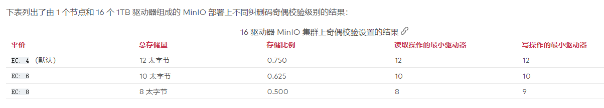
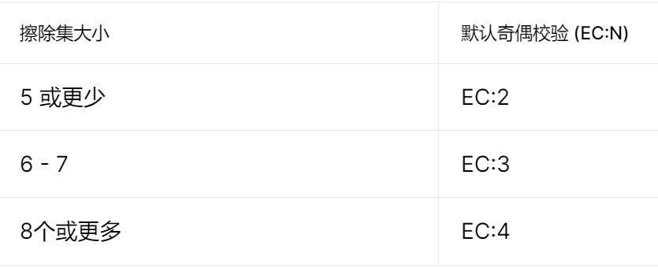

MinIO 是一种高性能对象存储解决方案，原生支持 Kubernetes 部署。

MinIO 提供与 Amazon Web Services S3 兼容的 API，并支持所有核心 S3 功能，它的底层原理是纠删码，采用的 Reed-Solomon code（纠删码中的一种）将对象拆分成 m 份数据和 n 份奇偶校验块。

#### 基本概念：

Drive：即存储数据的磁盘，在 MinIO 启动时，以参数的方式传入。

Erasure Set（擦除集）：即一组 Drive 的集合，分布式部署根据集群规模自动划分一个或多个 Erasure Set（每

个 Erasure Set 包含 4 到 16 个 Drive），每个 Erasure Set 中的 Drive 分布在不同位置。一个对象存储在一个 Erasure Set 上。

数据块&奇偶校验块：MinIO 将每个新对象拆分为数据块和奇偶校验块，其中奇偶校验块支持重建丢失或损坏的数

据块

纠删码：MinIO 纠删码是一种数据冗余和可用性功能，它允许 MinIO 部署在集群中丢失多个驱动器或节点的情况

下自动即时重建对象

### 纠删码奇偶校验 ( EC:N)

MinIO 使用 Reed-Solomon 算法根据部署中的[擦除集](https://docs.min.io/minio/baremetal/concepts/erasure-coding.html#minio-ec-erasure-set)大小将对象拆分为数据块和奇偶校验块。

对于给定大小的擦除集`M`，MinIO 将对象拆分为`N`奇偶校验块和`M-N`数据块。

MinIO 使用该`EC:N`符号来表示`N`部署中的奇偶校验块 ( )的数量。

MinIO 默认为`EC:4`每个对象 4 个奇偶校验块。MinIO对部署中的`EC:N`所有擦除集和[服务器池](https://docs.min.io/minio/baremetal/introduction/minio-overview.html#minio-intro-server-pool)使用相同的值 。

MinIO 可以容忍`N`每个擦除集丢失多达驱动器并继续执行读写操作（“仲裁”）。如果`N`恰好等于擦除集中驱动器

的 1/2，则 MinIO 写入仲裁要求 `N+1`驱动器避免数据不一致（“裂脑”）。

为部署设置奇偶校验是可用性和总可用存储之间的平衡。较高的奇偶校验值以可用存储为代价增加了对驱动器或节

点故障的弹性，而较低的奇偶校验值可提供最大存储量，同时降低对驱动器/节点故障的容忍度

### 存储类

MinIO 支持带有擦除编码的存储类，以允许应用程序指定每个对象的[奇偶校验](https://docs.min.io/minio/baremetal/concepts/erasure-coding.html#minio-ec-parity)。每个存储类指定一个`EC:N`奇偶校验设置以应用于使用该类创建的对象

MinIO 提供以下两种存储类：

- STANDARD

- REDUCED_REDUNDANCY

#### STANDARD

存储`STANDARD`类是所有对象的默认类。MinIO`STANDARD`根据擦除集中的卷数设置奇偶校验：

可以`STANDARD`使用以下任一方法覆盖默认奇偶校验：

- 环境[`MINIO_STORAGE_CLASS_STANDARD`](http://www.minio.org.cn/docs/minio/linux/reference/minio-server/minio-server.html#envvar.MINIO_STORAGE_CLASS_STANDARD)变量，*或*
- 修改配置设置的命令。[`mc admin config`](http://www.minio.org.cn/docs/minio/linux/reference/minio-mc-admin/mc-admin-config.html#command-mc.admin.config)`storage_class.standard`

最大值是[擦除集中](http://www.minio.org.cn/docs/minio/linux/operations/concepts/erasure-coding.html#minio-ec-erasure-set)驱动器总数的一半。最小值为`2`。

`STANDARD`奇偶校验*必须*大于或等于`REDUCED_REDUNDANCY`。如果`REDUCED_REDUNDANCY`未设置，`STANDARD`奇偶校验*必须*大于 2。

#### REDUCED_REDUNDANCY

存储`REDUCED_REDUNDANCY`类允许创建奇偶校验低于`STANDARD`. 在 MinIO 部署中`REDUCED_REDUNDANCY` 至少需要5 个驱动器。

MinIO默认将`REDUCED_REDUNDANCY`奇偶校验设置为。`EC:2`您可以`REDUCED_REDUNDANCY`使用以下任一方法覆盖存储类奇偶校验：

- 环境[`MINIO_STORAGE_CLASS_RRS`](http://www.minio.org.cn/docs/minio/linux/reference/minio-server/minio-server.html#envvar.MINIO_STORAGE_CLASS_RRS)变量，*或*
- 修改配置设置的命令。[`mc admin config`](http://www.minio.org.cn/docs/minio/linux/reference/minio-mc-admin/mc-admin-config.html#command-mc.admin.config)`storage_class.rrs`

`REDUCED_REDUNDANCY`奇偶校验*必须*小于或等于`STANDARD`。

### 位腐烂保护

静默数据损坏或位腐烂是数据驱动器面临的严重问题，导致数据在用户不知情的情况下损坏

MinIO 对[HighwayHash 算法](https://github.com/minio/highwayhash/blob/master/README.md)的优化实现确保它可以即时捕获和修复损坏的对象。通过在读取时计算散列并在写入时从应用程序、跨网络到内存或驱动器验证它，从头到尾确保完整性

官方存储效率计算器：https://min.io/product/erasure-code-calculator

### 参考

https://docs.min.io/minio/baremetal/concepts/erasure-coding.html

https://blog.csdn.net/crazymakercircle/article/details/120855464