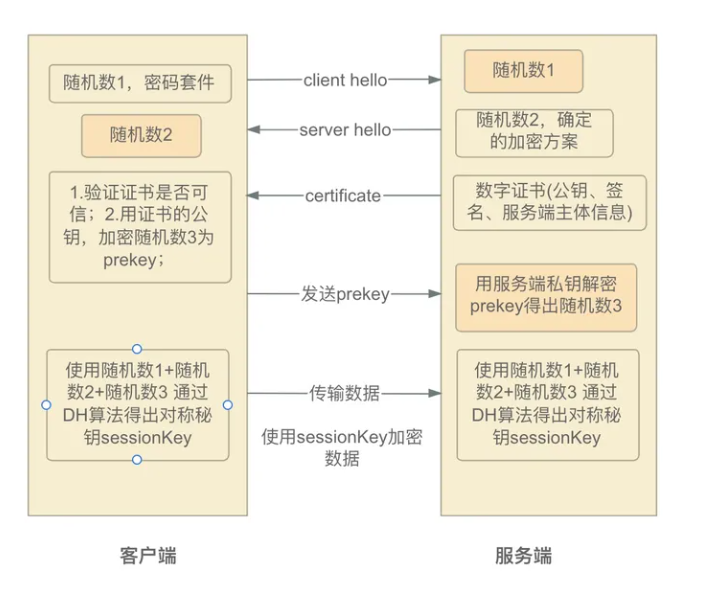

# TLS 证书

### https协议

HTTPS 其实只是在 HTTP 协议和 TCP 层之间增加了一个SSL的安全传输协议，整个传输的加密过程都在新的安全层

SSL/TLS中实现

### TLS/SSL协议

SSL最早是由网景公司(Netscape)开发的，后被IETF（The Internet Engineering Task Force - 互联网工程任务

组）标准化后写入RFC（Request For Comments），SSL在迭代到3.0后才将其标准化，并重新更名为TLS。目前

TLS先后迭代了[TLS 1.0](https://link.zhihu.com/?target=https%3A//www.rfc-editor.org/rfc/rfc2246.html)、[TLS 1.1](https://link.zhihu.com/?target=https%3A//www.rfc-editor.org/rfc/rfc4346.html)、[TLS 1.2](https://link.zhihu.com/?target=https%3A//www.rfc-editor.org/rfc/rfc5246.html)和[TLS 1.3](https://link.zhihu.com/?target=https%3A//www.rfc-editor.org/rfc/rfc8446.html)，目前被广泛使用的是TLS 1.2版本。

### TLS 加密原理

基于非对称加密的低效率和对称加密的不安去，TLS 采用非对称加密和对称加密结合的方式，通过服务端生成非

对称秘钥对，私钥自己保存，将公钥明文传输给客户端；客户端生成一个对称秘钥，再将对称秘钥使用收到的公钥

进行加密，将加密后的秘钥传送给服务端；这样双端都持有相同的对称秘钥，之后的数据就通过该秘钥进行加密再传输。

### 数字证书和CA

CA（Certificate Authority）机构是一种数字证书颁发机构，其主要作用是发放和管理数字证书，以确保网络通信的安全和可信性

### TLS 认证原理

### HTTPS 请求过程

简略流程：浏览器本地保存一份 CA 根证书，当浏览器去请求 https 网站时，会获取到该网站的证书，然后会通过本地内置的 CA 证书来验证这份证书的可靠性，包括域名/主体/时间有效性 （详情见认证链），验证通过后，浏览器通过证书的公钥加密信息发送给服务端，服务端通过本地的私钥进行验证，最终双方生成一个对称加密的私钥进行会话；

备注

浏览器使用本地内置的根CA证书来验证HTTPS连接，不需要在线访问CA机构进行验证

### 认证链

当客户端获得服务器的证书时会通过以下流程一步一步验证是否可信：

1. 通过域名核对，找出所要访问的服务端的证书A，即小米证书；
2. 通过证书A的Issuer找到其颁发者证书B，即中间证书RapidSSL；
3. 通过证书B的Issuer找到根证书C，发现其已内置在本地，然后用证书C的公钥解密证书B的签名取出摘要1，再用同样的哈希算法计算出证书B的摘要2，两者比对，如果一致，就证明证书B是可信的；
4. 用同样的方法，取证书B的公钥解密证书A的签名，比对摘要相等后也证明了证书A是可信的，这时验证过程就完成了，这时就可以拿证书A的公钥去做加密Random3进行下一步握手流程了

### 参考

https://zhuanlan.zhihu.com/p/440612523