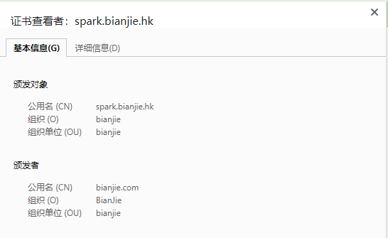

# 自签 SSL 证书

### 生成CA根证书

1.生成CA私钥

```javascript
openssl genrsa -out ca.key 2048
```

2.生成CA证书请求文件

```javascript
openssl req -new -key ca.key -out ca.csr
```

3.生成CA根证书

```javascript
openssl x509 -req -in ca.csr -signkey ca.key -out ca.crt -days 3650
```

### 生成服务器证书

1.生成服务器私钥

```javascript
openssl genrsa -out server.key 2048
```

2.生成证书请求文件

```javascript
openssl req -new -key server.key -out server.csr
```

3.根据CA机构的自签名证书ca.crt或者叫根证书生、CA机构的私钥ca.key、服务器的证书申请文件server.csr生成服务端证书

```javascript
openssl x509 -req -CA ca.crt -CAkey ca.key -CAcreateserial -in server.csr -out server.crt -days 3650
```

如果需要让浏览器信任这个证书，需要添加额外的SAN

```
openssl x509 -req -CA ca.crt -CAkey ca.key -CAcreateserial -in server.csr -out server.crt -extfile private.ext -extensions SAN -days 3650
```

private.ext 文件内容如下：

```
[ req ]
default_bits = 1024
distinguished_name = req_distinguished_name
req_extensions = san
extensions = san
[ req_distinguished_name ]
countryName = CN
stateOrProvinceName = Definesys
localityName = Definesys
organizationName = Definesys
[SAN]
authorityKeyIdentifier=keyid,issuer
basicConstraints=CA:FALSE
keyUsage = digitalSignature, nonRepudiation, keyEncipherment, dataEncipherment
subjectAltName = @alt_names

[ alt_names ]
DNS.1 = *.bianjie.ai
DNS.2 = *.spark.bianjie.hk
```

注意点：

1. 不同域名的证书使用  private.ext 文件下的  alt_names  模块来区分
2. 证书的信息有几块重要的内容 ，颁发者即 CA 的信息，颁发对象即证书的信息
3. 生成证书请求文件时会填写信息，详情如下，其他信息可不用填写

```
# 国家
Country Name (2 letter code) [AU]:CN

# 省/州
State or Province Name (full name) [Some-State]:HK

# 城市
Locality Name (eg, city) []:HK

# 组织名字
Organization Name (eg, company) [Internet Widgits Pty Ltd]:bianjie

# 组织单位名字
Organizational Unit Name (eg, section) []:bianjie

# 通用名字/域名
Common Name (e.g. server FQDN or YOUR name) []:spark.bianjie.hk
```

​	4.证书信息如图：



### 证书使用

kubernetes ingress

```
kubeas -n spark-v2 create secret tls spark-tls \
  --cert=./server.crt \
  --key=./server.key
```

nginx

```
server {
        listen       443 ssl;
        listen       [::]:443;
        server_name test.spark.bianjie.hk
        root         /usr/share/nginx/html;
		ssl_certificate cert/server.crt;  
		ssl_certificate_key cert/server.key; 
}
```

