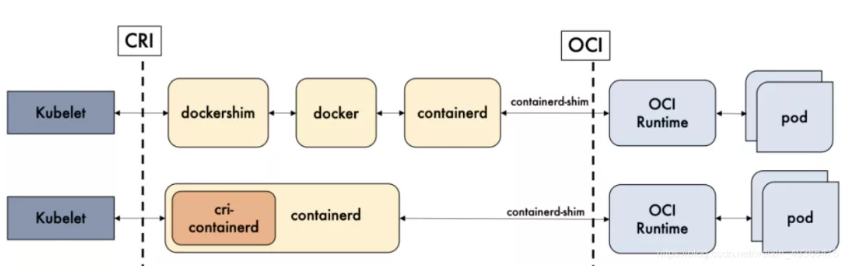

CRI（Container Runtime Interface）和容器运行时：CRI是Kubernetes的容器运行时标准接口，满足这个标准的所有容器运行时都可以被使用。容器运行时则提供了一个轻量级的容器运行环境，用于创建、启动和停止容器。

OCI（Open Container Initiative）和 runc：OCI是一个开放的容器组织，它制定了容器运行时的规范，包括运行时规范、容器镜像规范等。runc是OCI标准的一个参考实现，它与容器所依赖的cgroup/linux kernel等进行交互，是容器最终运行的形态之一

参考：

https://www.51cto.com/article/690710.html

https://baijiahao.baidu.com/s?id=1785236325461606813&wfr=spider&for=pc