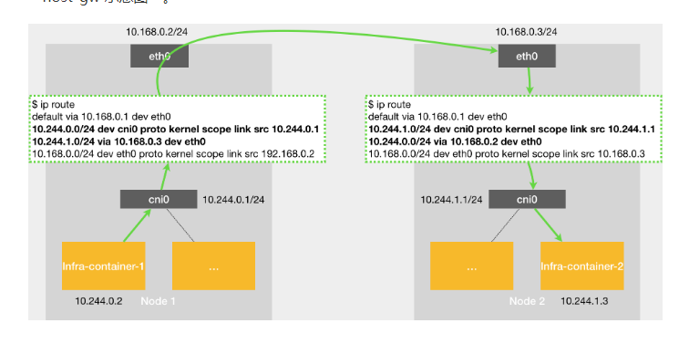

### Flannel

主要负责 Pod 网络的创建和管理。网络插件为 Pod 分配 IP 地址，确保同一个集群中的 Pod 可以互相通信，并实

现网络隔离和策略控制

#### 网络模式

UDP 模式

VxLAN 模式(常用/默认）

host-gw 模式

### 网络模型

以下是关于 flannel 的详细解释

##### udp 模型

Node1 上的 container1 (10.196.1.2)访问 Node2 上的 container2 (10.196.2.3),因为目的地址并不在 Node1 上的

docker0 网桥的网段里，ip 包会被交给默认路由规则（这个规则是安装 flannel 的时候 flannel 生成的），根据这

个规则 ip 会进入到 flannel0 的设备，flanneld 进程监测到有 ip 包到 flannel0 设备，就会发现ip包的目标地址是

10.196.2.3，flannel就会知道Node2的地址（node和子网的对应关系保存在etcd里面），然后把这个ip包封装到

udp包里面发给node2的flannel监听的端口；

另一边的 flanneld 进程会做相反的操作，解封，将包发给 flannel0 设备，根据路由规则发送给 container2;

upd 模型有严重的性能问题：
	1、用户态和内核态数据的拷贝次数过多（第一次<用户态进入内核态>进程发送数据到docker0,第二次<内核态

进入用户态>flannel0传给flanneld进程，第三次<用户态进入内核态>flanneld封装后进入eth0）

​	2、flannel 在用户态进行封装和解封

上述两种动作在 linux 代价比较大

#####  host-gw 模型

Node1 上的 container1(10.196.1.2)访问 Node2 上的 container2 (10.196.2.3),当 flannel 使用 host-gw 模式之

后，会在宿主机创建一条路由规则<访问某个宿主机上 pod 网段内的 ip,要经过 eth0 发送出去，下一条地址是目标

pod 所在的宿主机>，就会到达目标宿主机到达宿目标主机的 eth0 后根据包的目的地址，根据路由规则，进入cni0 网桥，从而到达目标pod

总结：host-gw 模式的工作原理就是将每个 flannel 子网的下一跳，设置为其他子网对应的宿主机 ip ，FLannel 

host-gw 模式必须要求集群宿主机之间是二层连通的

##### VxLAN 模型

Node1 上的 container1(10.196.1.2) 访问 Node2 上的 container2(10.196.2.3)，和 udp 一样根据路由规则通过

docker0 网桥进入 flannel1 设备，<这时的数据包称为原数据包>, flannel1 设备根据路由规则原数据包的下一跳地

址目标宿主机上的 flannel1 设备；【将原数据包前面加目标 flannel 的 mac:目标容器的地址】<目标flannel1设备

的 mac 地址是在安装启动 flannel 时会在其他所有节点的 arp 表添加记录><【目标 flannel 的 mac:目标容器的地

址:原数据包】 称为内部数据帧>，然后 linux 内核将这个内部数据帧前面加 VNI 标识，然后封装到一个UDP包里

面，【目标主机的mac地址:目标主机的ip地址:udp header:VxLAN header[VNI]:目标flannel的mac:目标容器的

地址:原数据包】，目标主机的 mac 地址也是flannel维护记录在 FDB 里；VNI=1<-->flannel1<识别flannel设备的

标志位，都是1> 然后 flannel1 从 Node1 的 eth0 发送到 Node2 的 eth0 ,Node2 的内核网络栈发现数据帧里面有

VxLAN header 且 VNI=1 ,然后就把包发送给 flannel1 设备；进行拆包，到达目标容器；

flannel1 设备也就是 VTEP 设备进行封装和解封都是在内核里完成的 <VxLAN就是内核的一个模块>，所以性能比

udp好；

用于宿主机不在同一个 2 层网络下，（如果宿主机在 2 层网络下，它可以启动直接路由（directrouting）和host-gw 效果一样<此时流量不走 flannel 设备，走的是宿主机网关>）

SNAT 规则

优化 flannel 通过 ipatables 非从 docker0 设备出，非目标 ip 为 pod 网络才进行 snat 转换	

在集群内部，使用 pod ip(让集群内部的容器互相看到真实的 pod ip,不要使用 node ip)，在外部可以使用宿主机 ip

### 总结

Flannel 的 VxLAN 和 UDP 模式都是利用覆盖网络（Overlay Network）的原理，将数据包进行封装后传输，只不过使用的技术不一样，一个是 UDP 简单封装，一个是 VxLAN 标准封装；而 Host-GW 是通过主机的路由功能来实现的；理论上来说 Host-GW 模式不需要封装性能要比另外两种要好；但是它对主机网络架构有一定的要求，不适合复杂的网络架构；

