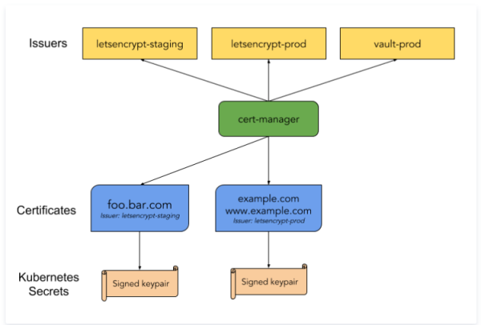

架构




cert-manager 在 k8s 中定义了两个自定义类型资源：Issuer 和 Certificate

其中Issuer代表的是证书颁发者，可以定义各种提供者的证书颁发者，当前支持基于Letsencrypt、vault和CA的证书颁发者，还可以定义不同环境下的证书颁发者。而Certificate代表的是生成证书的请求，一般其中存入生成证书的元信息，如域名等等。一旦在 k8s 中定义了上述两类资源，部署的 cert-manager 则会根据Issuer和Certificate生成TLS证书，并将证书保存进k8s的Secret资源中，然后在Ingress资源中就可以引用到这些生成的Secret资源。对于已经生成的证书，还是定期检查证书的有效期，如即将超过有效期，还会自动续期。


### 安装配置

 Cert-manager 安装

```
kubectl apply -f https://github.com/cert-manager/cert-manager/releases/download/v1.10.1/cert-manager.yaml
```

参考官网 https://cert-manager.io/docs/installation/

ClusterIssuer 安装

```
apiVersion: cert-manager.io/v1
kind: ClusterIssuer
metadata:
  name: letsencrypt-production
spec:
  acme:
    # You must replace this email address with your own.
    # Let's Encrypt will use this to contact you about expiring
    # certificates, and issues related to your account.
    email: devops@bianjie.ai
    server: https://acme-v02.api.letsencrypt.org/directory
    privateKeySecretRef:
      # Secret resource that will be used to store the account's private key.
      name: letsencrypt-production-secret
    # Add a single challenge solver, HTTP01 using nginx
    solvers:
    - http01:
        ingress:
          class: nginx
```


### crd 资源 & 证书申请流程

```
# crd 资源
issuers
clusterissuers

certificates
certificaterequests
orders
challenges

# 证书申请流程
ingress --> clusterissuer --> cert-manager
Certificate --> CertificateRequest --> order --> Challenge
secret
最终证书存在 secret 里面
```


### 更新升级

如果是跨大版本升级建议重新安装，重新安装前备份下相关资源即可

```
# Backup
kubectl get --all-namespaces -oyaml issuer,clusterissuer,cert > backup.yaml

# Restore
kubectl apply -f <(awk '!/^ *(resourceVersion|uid): [^ ]+$/' backup.yaml)

# uninstall
kubectl delete -f cert-manager-old.yaml
# reinstall
kubectl apply -f cert-manager-new.yaml
```


参考
https://cert-manager.io/docs/
https://letsencrypt.org/zh-cn/

https://cloud.tencent.com/developer/article/2022489