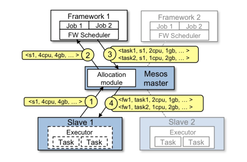

mesos的核心架构：

  
​    
​    
​    
个人理解：
​    agent以固定的频率向master汇报自己所在节点的资源（cpu，内存，磁盘），master向Framework发出资源邀约，内容是哪些节点有哪些资源，用户操作Framework生成任务，然后
​    Framework响应master的邀约（如果没有任务则会拒绝邀约），根据任务内容要求一定资源，master向slave下发任务，用这些资源启动任务；

网上资料：

• Slave 1 向 Master 汇报其空闲资源：4 个 CPU、4GB 内存。然后，Master 触发分配策略模块，得到的反馈是 Framework 1 要请求全部可用资源。
• Master 向 Framework 1 发送资源邀约，描述了 Slave 1 上的可用资源。
• Framework 的调度器（Scheduler）响应 Master，需要在 Slave 上运行两个任务，第一个任务分配 <2 CPUs, 1 GB RAM> 资源，第二个任务分配 <1 CPUs, 2 GB RAM> 资源。
• 最后，Master 向 Slave 下发任务，分配适当的资源给 Framework 的任务执行器（Executor）, 接下来由执行器启动这两个任务（如图中虚线框所示）。 此时，还有 1 个 CPU 和 1GB 的 RAM 尚未分配，因此分配模块可以将这些资源供给 Framework 2。

问题：
    framework的执行器是以什么形式存在的呢，启动应用这一步到底怎么实现的？
    又查了查资料应该是这样的
    1、一旦资源邀约被接受，Framework 将与 Master 协作调度任务，并在数据中心的相应 Slave 节点上运行任务。
    2、Mesos是经典的二层架构，Master只负责管理资源，Framework负责任务调度，它们两者都可以直接给slave通信；Master保持着通用性，轻量性，它和Framework、Slave之间的的交互更多的是状态信息同步；在Slave上有两类进程：一类为Manager，用来与Master通信，交互状态信息，另一类则是由Framework实现的具体Executor，它负责任务的运行，对于Manager而言，他看到的所有Executor、Task都是一致的容器，而不管这些任务具体执行什么样的业务逻辑；
    红字部分可能描述得不太准确，但是应该差不多是这情况，agent有2个进程，一个负责汇报资源，一个是执行器，负责执行任务
    上面说得还是太笼统不详细，实际得细节没有暴露出来。
    scheduler以及executor都是由Framework自己实现得（但是要按照mesos得标准或者规则来），mesos只负责转发task到slave，由slave调用Framework的executor去执行task；
    也就是说mesos转发调度器得任务到slave,slave通过Framework得执行器去执行task;
    Mesos要求可接入的框架必须有一个调度器模块,该调度器负责框架内部的任务调度。
    当一个Framework想要接入Mesos时,需要修改自己的调度器,以便向mesos注册,并获取Mesos分配给自己的资源。
    这样再由自己的调度器将这些资源分配给框架中的任务,也就是说,整个mesos系统采用了双层调度框架:第一层,由mesos将资源分配给框架；第二层,框架自己的调度器将资源分配给自己内部的任务。

​    终极理解：
​    agent以固定的频率向master汇报自己所在节点的资源（cpu，内存，磁盘），master向Framework resource offer，用户操作Framework生成任务，然后Framework的scheduler响应master的邀约（如果没有任务则会拒绝邀约），选择自己需要的资源之后向master下发任务，master在接收到任务后向slave下发任务，slave调度（Framework的）执行器来执行任务；
​    目前先理解为这个样子；
​    mesos的双层调度架构还是很强的，可扩展的Framework使得大型调度得以轻松实现；更深一层的声明了资源和服务的关系，未来不可限量；
​    
​    
​    
​    
​    