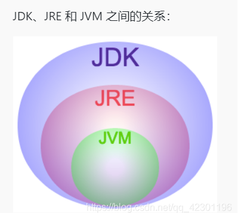
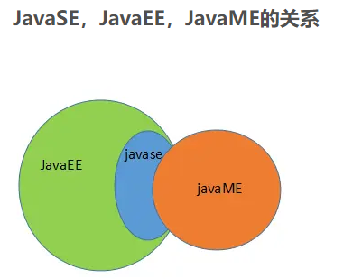

### Java

### JDK&JRE&JVM 

##### JDK

Java Development Kit 的简称，java 开发工具包，提供了 java 的开发环境和运行环境

##### JRE

Java Runtime [Environment](https://so.csdn.net/so/search?q=Environment&spm=1001.2101.3001.7020) 的简称，java 运行环境，为 java 的运行提供了所需环境

JDK 其实包含了 JRE，同时还包含了编译 java [源码](https://so.csdn.net/so/search?q=源码&spm=1001.2101.3001.7020)的编译器 javac，还包含了很多 java 程序调试和分析的工

具。简单来说：如果你需要运行 java 程序，只需安装 JRE 就可以了，如果你需要编写 java 程序，需要安装 JDK

##### JVM

Java Virtual Machine 的简称，

java 虚拟机，主流有以下几种

HotSpot VM

J9 VM

Zing VM

Eclipse Temurin JDK 支持两种虚拟机： HotSpot 和 OpenJ9

HotSpot 是 JVM 的一种实现，最初由Sun开发，现在被 Oracle 所有，除了 Hotspot 还有其他实现，如 JRockit, IBM J9等。

### JavaSE&JavaEE&JavaME

##### Java SE（Java Platform，Standard Edition）

Java SE 以前称为 J2SE

它允许开发和部署在桌面、服务器、嵌入式环境和实时环境中使用的 Java 应用程序

Java SE 包含了支持 Java Web服务开发的类，并为 Java Platform，Enterprise Edition（Java EE）提供基础

##### Java EE，Java 平台企业版（Java Platform Enterprise Edition） 之前称为Java 2

是 Sun 公司为企业级应用推出的标准平台，用来开发B/S架构软件

JavaEE 是 Java 应用最广泛的部分

##### Java ME 又称为J2ME（Java Platform，Micro Edition）

是为机顶盒、移动电话和PDA之类嵌入式消费电子设备提供的Java语言平台，包括虚拟机和一系列标准化的Java API。

### spring

Spring 框架是一个开源的 Java 平台，它最初是由 Rod Johnson 编写的，并且于 2003 年 6 月首 次在 Apache 2.0 许可下发布。

Spring 是轻量级的框架，其基础版本只有 2 MB 左右的大小。

Spring 框架的核心特性是可以用于开发任何 Java 应用程序，但是在 Java EE 平台上构建 web 应 用程序是需要扩展的。

Spring 框架的目标是使 J2EE 开发变得更容易使用，通过启用基于 POJO 编程模型来促进良好的编程实践。

spring 广义上来说是个框架组，包括很多框架 Spring Boot 、Spring Cloud、Spring FrameWork 、Spring Session、Spring Security、Spring Cloud Data Flow、Spring Web Flow、Spring Web Services、Spring Vault、Spring Data 等

其他框架

### SSH

Struts、Spring和Hibernate ，简称SSH。

### SSM

SSM 框架是 Spring + Spring MVC + MyBatis 三个框架整合而成的，其实 Spring MVC 属于 Spring 框架，所以SSM 框架其实就是 Spring 和 Mybatis 两个框架的整合运用

两个框架的主要区别在于两点:

- MVC 分离的实现方式中前者为 Struts，后者为 Spring MVC
- 持久层的框架前者为 Hibernate，后者为 MyBatis

### 参考

https://www.cnblogs.com/williamjie/p/11101020.html

https://cloud.tencent.com/developer/article/1605707

https://www.w3cschool.cn/article/22970393.html

https://blog.csdn.net/weixin_60664694/article/details/127083698

https://blog.csdn.net/guorui_java/article/details/120432267