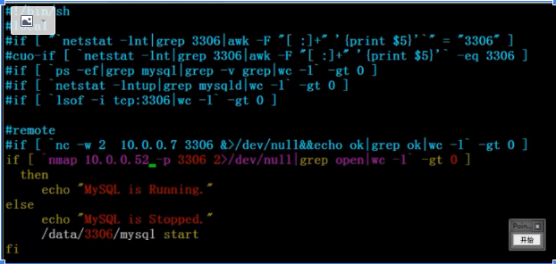
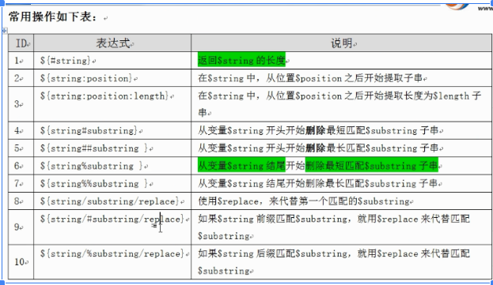
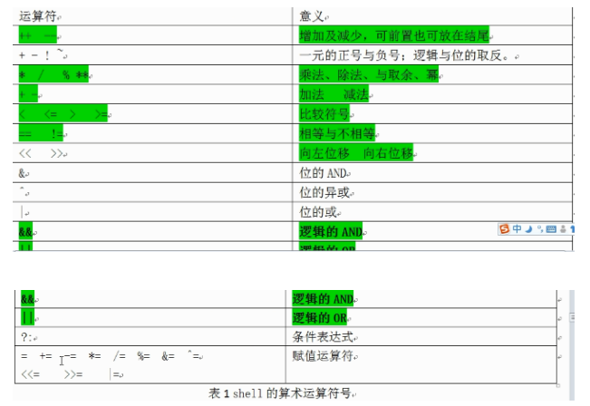
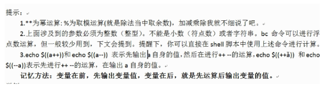
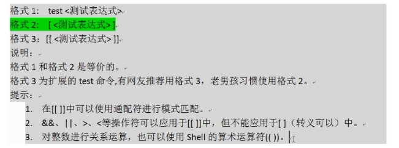
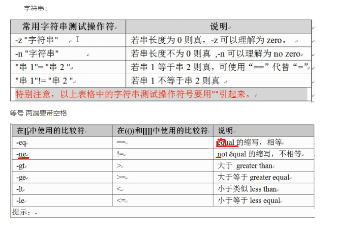

老男孩shell编程shell编程课程笔记：

换框架（运维-->总监-->ITO）
目标：年度目标分解：季度，月度勤奋：坚持：行动：
一、
第2课：基础----------------------
基础：.vimrc 设置常用命令grep sed awk常用服务
目标：22道题

第3课：第一个 shell---------------------------硬件-->内核-->shell-->应用程序

第4课：----------------两大类shell
Bourne shell: Bourne shell Korn shell Bourne again shell POSIX shell C shell c shell TENEX/TOPS C shell
脚本编写注意事项解释器： #!/bin/bash#!/bin/sh#!/bin/awk#!/bin/sed
开头必须添加解释器，如果不加，就得用指定得解释器来执行脚本；
注释：
第5课：-----------------------------------当运行脚本时，它首先会查找环境变量ENV,该变量指定一个环境文件（.bashrc）,然后开始执行；
 运行shell脚本得三种方式：1、bash sname 或者 sh sname2、path/sname 或 ./sname3、source sname 或 . sname 
\#./test.sh sh ./test.sh bash ./test.sh 都是创建子shell来执行脚本，可以继承父shell的变量，但子shell的变量无法传给父shell执行；（其他方法可以，但不了解）source test.sh . test.sh 是在当前父shell中执行此脚本
./test.sh sh ./test.sh bash ./test.sh 其中./test.sh 运行脚本，必须具有执行权限，这样才能读取到用哪种解释器解释此脚本如#!/bin/bash #!/user/bin/expect；bash ./test.sh sh ./test.sh 是指定sh 来解释此脚本；传子不传父规范：开头指定脚本编辑器开头加版本版权等信息
\#!/bin/bash#Date 2019-08-01#Author:#Mail:#func:#version:
脚本不用中文注释脚本以.sh结尾书写习惯 成对内容一次写出来，防止遗漏[]中括号两端要有空格流程语句一次写完ifthenfi通过缩进让代码易读（4个空格）
变量：全局变量，局部变量
设置环境变量：1.export byg="baoyonggui"2.byg="baoyonggui"  ll="fsf"  export byg 113.declare -x byg="baoyonggui"
常放在 /etc/profile;;/etc/profile.d/env,set 显示默认的环境变量

局部变量：变量名:"value"
不加引号：如果带有空格则最好使用双引号，建议使用双引号
单引号：所见即所得，不解析变量
命令双引号：会解析变量
命令awk相反：建议：纯数字，不带空格字符不加引号字符串，使用双引号需要内容原样输出得使用单引号；
命名规范：变量名大写，局部变量小写，函数名小写，名字体现出实际意义；引用使用${}局部变量使用 local 声明将命令作为变量： xx=`date`,xx=$(date)字符串变量："${AA}"
第6课：
 常用的文件测试表达式：
 (man test) 
  -f:file,文件存在且为普通文件 
   -d:directory  
   -s:size  
   -e:exit,文件存在  
   -r:read,文件存在且可读  
   -w:write,文件存在且可写 
    -x:executable,文件存在且可执行  
    -L:文件存在且为链接文件  
    f1 -nt f2: newer than,f1比f2新  
    f1 -ot f2:older than ,f1比f2旧
    [ -f test ] && {echo 1echo 2} 等号 两端要带空格
    -eq ,equal:等于
    -ne,not equal:不等于
    -gt,greater than:>大于-ge,greater than:>大于等于-lt,
    less than:>小于-le，less equal:小于等于
逻辑操作符：-a , && ,与• -o,||，或
！，！，非[]中使用-a,-o,![[ ]]中使用 &&,||.!test用法和[]相同
-z,zero:字符串长度为0-n,：字符串长度不为0打印菜单menu() {cat << END123END}menu
if
if [ -f $file ];thenecho 1fi
netstat -lnt|grep 3306 |wc -l  :判断服务是启动；端口检测：本地：netstat/ss/lsof远程：telnet/nmap/nc

01-bash的内部变量介绍与应用实践_rec
1、位置变量$0 获取当前的shell 脚本名，包括路径信息；$n 获取第n个参数，0-- 当n为0时，表示脚本的文件名，大于10时，${10}m$#获取当前参数的总个数
2、进程状态变量$$ 进程号$? 获取返回值，0成功，其他失败；
内部变量env,set,man bashRANDOM 随机变量
\------------------------------------------------
02-bash的内部命令介绍与应用实践_rec
内部命令(help xx)echoread  read -p "xx:"  varhistory history -c -d,printfulimit 
export 变量名=varlue ,让子shell继承父shellshift 砍掉第一个参数timehelp(man)evalargsexec
\----------------------------------------------------------------
03-bash变量子串的常用操作深入浅出讲解_rec变量字串的常用操作：

\--------------------------------------------------------------
04-bash变量子串的多个生产案例实践讲解_rec
ls +awk拼出命令字符串交给bash处理ls "*.jpg" |awk -F "finished" "{print "mv " $0,$1""$2}"|bash
rename from to file
\----------------------------------------------------------------------
05-bash变量子串的深入介绍与系统案例分析01_rec
${value:-word}test=${ask:-/tmp}echo $askecho $test当ask为空时，将/tmp 赋值给ask${value=-word}，value不在，word上场；${value:?word}${value:+word}
\---------------------------------------------------
05-bash变量子串的深入介绍与系统案例分析02_rec
path=/server/scriptfind ${path:-/tmp} -type f -name "*.tar.gz" -exec rm -f {} \;或者 进入一个目录 cd /tmp
\---------------------------------------------
06-变量数值运算知识与双括号运算实践案例_rec
1、(()),let,expr,bc,$[],tpyeset(())简单的整数运算； 

（（a=1+3**3-2*3））echo $aa=$（（a=1+3**3-2*3））  

\---------------------------------------------------------------
07-bash特殊变量与双括号计算多案例讲解_rec
命令行的参数a=$1b=$2简易的计算器实现echo $(($1))或者是echo $(($1$2$3))
08-bash内部命令let介绍与常见案例及应用_rec
let i=i+8等同于（（i=i+8）），尽量不用let;
\----------------------------------------------------------------------
09-bash内部命令expr介绍与常见案例及应用建议_rec
expr计算的时候需要空格，* 要 \* 转义；expr length "oldboy"expr substr "oldboy" 2 2
\----------------------------------------------
10-实战比较各种计算变量长度的方法_rec
chars=`seq -s " " 100`echo ${#chars}expr length "${chars}"echo ${chars} |wc -Ltime for i in $(seq 5000) ;do cont=`echo ${#chars}`；done
\-------------------------------------------------------------
11-bash内部命令bc介绍与常见多案例讲解_rec
1+2+3....+99+100的方法：seq -s "+" 100 |bcecho {1..100} |tr " " "+" |bc
\-------------------------------------------------------
12-shell其他计算命令介绍案例讲解回顾_rececho $[ 2 +3 ]杨辉三角typeset
\----------------------------------------------------------
01-bash获取标准输入命令read介绍与多种实践案例讲解_rec
read -p:提示信息-t:设置等待时间read -p "pls input two number:" v1 v2
\-------------------------------------------------------------
02-shell编程条件测试多种方法及语法实践讲解介绍_rec

[  -f xx -a -d yy ] &&echo 1||echo 0[[ -f xx && -d yy ]] &&echo 1||echo 0[ -f xx ] && [ -d yy ] &&echo 1||echo 0
\-----------------------------------------------------
03-shell编程文件测试-字符串测试-整数比较操作符介绍与实践_rec
常用的文件测试表达式：(man test)  -f:file,文件存在且为普通文件  -d:directory  -s:size  -e:exit,文件存在  -r:read,文件存在且可读  -w:write,文件存在且可写  -x:executable,文件存在且可执行  -L:文件存在且为链接文件  f1 -nt f2: newer than,f1比f2新  f1 -ot f2:older than ,f1比f2旧 字符串：

逻辑操作符：-a , && ,与-o,||，或！，！，非[]中使用-a,-o,![[ ]]中使用 &&,||.!test用法和[]相同
\-----------------------------------------------------------
04-shell编程字符串比较测试与逻辑操作符介绍_rec
\--------------------------------------------------------------
05-shell编程结合生产与系统自带脚本案例深度讲解文件测试_rec
-a,-o 用于 []&&,|| 用于[[ ]],或[] && []
\-----------------------------------------------------------------------------------
06-shell编程结合生产与系统自带脚本案例深度讲解字符串测试_rec
字符串测试要加“”，例、[ -z "$f1"] &&echo 1 ||echo 2[ "${#f1}" == "${#f2}" ] &&echo 1 ||echo 0-n-z        
\--------------------------------------------------------------------------
07-shell编程多条件逻辑操作符结合字符串测试_rec 
       同05       [[  "$file1" != "$file2" ]] && echo 1 ||echo 0
\--------------------------------------------------------------
08-shell编程条件测试之整数比较举例与总结_rec
[ $a1 -gt $a2 ] && echo 1 ||echo 0[[ $a1 > $a2 ]] && echo 1 ||echo 0
\---------------------------------------------------------------------------
09-shell编程条件测试优秀命令test深度讲解实践_rec
\--------------------------------------------------------------------------
11-shell编程打印一级和多级菜单自动化运维脚本案例_rec
一级菜单：menu (){cat << END1.[install lamp]2.[install lnmp]3.[exited]please input the num than you want:END}menuread num 
多级菜单：menu1(){cat << END1.[install lamp]2.[exit]please input the num you want：NED}menu2(){cat <<END1.[install nginx]2.[exit]please input the 2 num you want：END}menu1read num [ $num -eq 1] && {menu2read num2[ $num -eq 1 ]  && {echo "install nginx"exit}}
\---------------------------------------
01-if条件句单分支结构语法及案例讲解01_rec
语法：if []  then指令fi
\-------------------------------------
03、双分支if 条件then指令else指令fi
多分枝if 条件then指令e	lif  条件then指令else指令fi判断字符串是否为数字：[ -n "`echo $num|sed 's#[0-9]##g' `" ]expr 1 + $num > /dev/null 2>&1 ;echo $?
\-------------------------------------------------------------
08-企业生产环境监控MySQL服务的5种方案实践01_rec监控mysql 的脚本名称中不要带有mysql字样；监控mysql的脚本中不带明文密码如何操作？