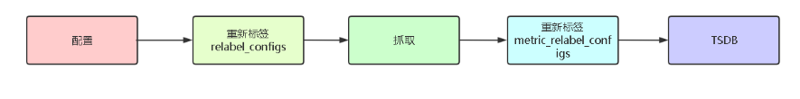
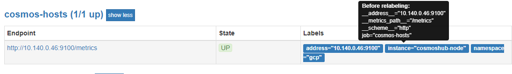

### labels

#### Prometheus 标签的作用

Prometheus中存储的数据为时间序列，是由Metric的名字和一系列的标签(键值对)唯一标识的, 不同的标签代表不

同的时间序列，即 通过指定标签查询指定数据 。

#### Metadata 标签

在被监控端纳入普罗米修斯里面定义了一些元数据标签


#### Prometheus 标签的管理

Prometheus 在处理数据指标的过程中，包括【抓取的生命周期】和【标签的生命周期】。

默认情况下，当 Prometheus加载 Target 实例完成后，这些Target时候都会包含一些默认的标签：这些标签将会

告诉Prometheus如何从该Target实例中获取监控数据。



#### Prometheus 的标签配置

Prometheus通过标签可以实现查询过滤，并且还支持重新标签实现动态生成标签、过滤、删除无用标签等灵活配

置。在采集数据之前可以使用 relabel_configs 进行重新标记，存储数据之前可以使用 metric_relabel_configs 重新标记。

两种重新打标签的方式都支持以下动作：

- replace：默认动作，将匹配到的标签内容做替换
- keep：通过正则匹配，仅保留正则匹配到的标签
- drop：通过正则匹配，删除正则匹配到的标签
- labeldrop：删除指定标签，比如一些默认标签并不需要，可以用该动作删除
- labelkeep：仅保留指定标签

还可以自定义标签

replace 示例



```
    - "job_name": "cosmos-hosts"                   # job name
      "static_configs":                            # 静态配置
      - "targets": ["10.140.0.46:9100"]            # 目标
      "relabel_configs":                           # 重新打标签配置
      - "source_labels": ["__address__"]           # 源标签 key
        "target_label": "address"                  # 目标标签 key
        "action": "replace"                        # 默认动作
      - "source_labels": ["__address__"]
        "target_label": "namespace"
        "replacement": "gcp"                       # 替换的标签 value
      - "source_labels": ["__address__"]
        "target_label": "instance"
        "regex": "10.140.0.46:9100"                # 待匹配标签的 value
        "replacement": "cosmoshub-node"            # 替换的标签 value

  - job_name: "explorer-backend"
    static_configs:
      - targets: ["172.16.1.23:3000"]
        labels:                                     # 还可以自定义标签
          namespace: vm
    relabel_configs:
      - source_labels: [job]
        target_label: service

```

总结：以上分为三种标签替换方式 

1、根据原标签 key 只替换为新标签 key

2、根据原标签 key 替换成新标签 key，且替换新标签的 value (忽略原标签 value)

3、根据原标签 key 替换成新标签 key ，且根据原标签的 value 替换新标签的 value（指定 value 替换的条件）

标签不是一对一替换的，可以类似于添加标签/新增标签；

#### relabel_configs 和 metric_relabel_cionfigs 的区别

Prometheus 需要知道要抓取哪些指标，这是服务发现和 relabel_configs 决定的。

Relabel 的配置允许你选择你想抓取的目标和这些目标的标签是什么

metric_relabel_configs 是发生在抓取之后，但在数据被插入存储系统之前使用。

如果有些你想过滤的指标，或者来自抓取本身的指标（比如来自/metrics页面）你就可以使用metric_relabel_configs 来处理。

relabel_config 发生在抓取之前，metric_relabel_configs 发生在抓取之后

总结：relabel_configs 是针对 target 指标采集前和采集中的筛选，而 metric_relabel_configs 是针对指标采集后的筛选，一般情况下用  relabel_configs 就行。

### 参考

https://blog.csdn.net/qq_34556414/article/details/113503945


