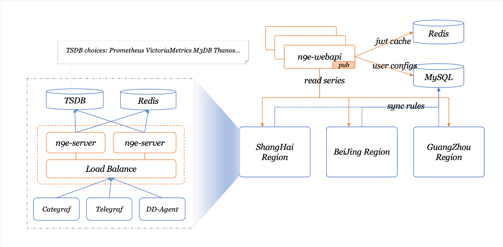

# 原理

架构图

夜莺 v5 的设计非常简单，核心是 server 和 webapi 两个模块，webapi 无状态，放到中心端，承接前端请求，将用户配置写入数据库；server 是告警引擎和数据转发模块，一般随着时序库走，一个时序库就对应一套 server，每套 server 可以只用一个实例，也可以多个实例组成集群，server 可以接收 Categraf、Telegraf、Grafana-Agent、Datadog-Agent、Falcon-Plugins 上报的数据，写入后端时序库，周期性从数据库同步告警规则，然后查询时序库做告警判断。每套 server 依赖一个 redis。