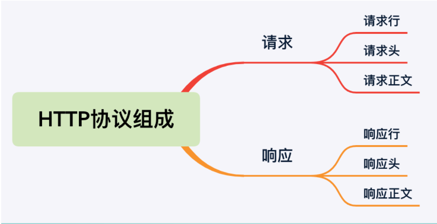
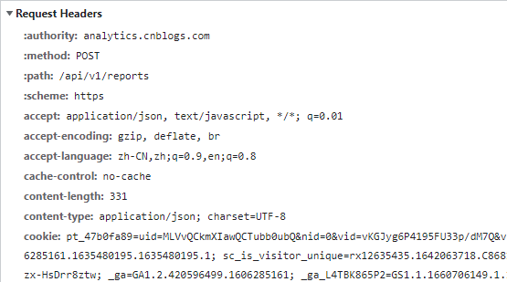

# HTTP 协议

HTTP 协议（超文本传输协议）是一种网络通信协议，它允许将超文本标记语言(HTML)文档从Web服务器传送到客户端的浏览器

### 特点


### HTTP 协议组成



#### 请求行

请求行由请求方法字段、URL 字段和 HTTP 协议版本字段 3 个字段组成

```
POST /reinforce?downloadUrl=https://d.bianjie.aiA-Bank.apk HTTP/1.1
```

URL字段：

　　URL字段也称为请求地址

HTTP协议版本：

　　HTTP协议版本目前常用的是 HTTP1.1、HTTP2.0

HTTP协议的请求方法:

　　HTTP协议的请求方法有 GET、POST、HEAD、PUT、DELETE、OPTIONS、TRACE、CONNECT。

#### 请求头

请求头部由关键字/值对组成，每行一对，关键字和值用英文冒号 “ : ” 分隔。




常见典型的请求头有

User-Agent：产生请求的浏览器类型

Accept：客户端可识别的内容类型列表

Host：请求的主机名，允许多个域名同处一个IP地址，即虚拟主机

Content-Type：请求体的MIME类型，MIME类型：描述消息内容类型的因特网标准，常见的有

application/json、image/jpeg、application/octet-stream等

#### 请求正文（body）

请求正文向服务器提交的请求数据，GET请求的参数一般是放在请求行后的键值对，post请求的参数类型多样（表单、json、xml、图片等）

#### 相应行

响应行由响应状态码、响应信息和HTTP协议版本字段3个字段组成

```
HTTP/1.1 200 OK
```

响应状态码由三位数字组成，第一个数字定义了响应的类别，且有五种类型

- 1xx：指示信息--表示请求已接收，继续处理
- 2xx：成功--表示请求已被成功接收、理解、接受
- 3xx：重定向--要完成请求必须进行更进一步的操作
- 4xx：客户端错误--请求有语法错误或请求无法实现
- 5xx：服务器端错误--服务器未能实现合法的请求

#### 响应头

响应头用于描述服务器的基本信息，以及数据的描述，服务器通过这些数据的描述信息，可以通知客户端如何处理等一会儿它回送的数据。

常见的响应头有：

Content-Length：表示内容长度

Content- Type：表示后面的文档属于什么MIME类型

Server：服务器通过这个头告诉浏览器服务器的类型

#### 响应正文

响应正文就是响应的消息体，如果是纯数据就是返回纯数据，如果请求的是HTML页面，那么返回的就是HTML代码，如果是图片就是图片等

### 参考

https://www.ruanyifeng.com/blog/2016/08/http.html

https://www.cnblogs.com/YouJeffrey/p/15334068.html