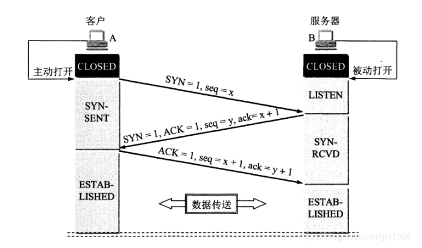
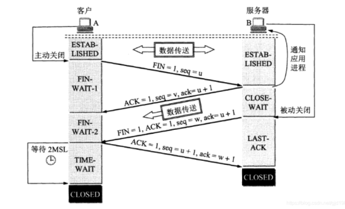

## 三次握手

1、A 主动向 B 发起连接请求，发送 SYN 包（之后A进入 SYN-SENT 状态）
2、B 收到之后即向 A 发送 ACK 包与自己的 SYN 包（之后 B 进入 SYN-RCVD状态）
3、A 收到 B 的 ACK包和 SYN 包即也发送 ACK包（之后A进入 ESTAB-LISHED 状态，B 收到 A 的 ACK 包之后也进入 ESTAB-LISHED 状态）

## 四次挥手

1、A 主从发起断开连接请求，向 B 发送 FIN 包(之后进入 FIN-WAIT-1 状态)
2、B 收到 A 发来的 FIN 包之后，向 A 发送 ACK 包（之后B进入CLOSE-WAIT）,A 收到 B 发来的 ACK 包之后就进入到 FIN-WAIT-2 状态
3、B 也向 A 发起断开连接请求，向 A 发送 FIN 包(之后进入 LAST-ACK 状态)
4、A收到 B 发来的 FIN 包，即向B发送 ACK 包（之后 A 进入 TIME-WAIT 状态，等待 2MSL 之后进入 CLOSED状态，释放连接），B 收到 A 的 ACK 包之后就进入 CLOSED 状态，释放连接了；

注意：
1、主动发起方的 TIME-WAIT 状态是为了防止发起方向被动方发送的 ACK 包丢失导致被动方无法正常释放连接，所以要等 2MSL 时间；
2、RST 包用于强制关闭 TCP 链接。（比如四次挥手时到某个步骤发生了问题，机会导致某一方发送RST包来释放连接）
参考：
https://blog.csdn.net/hkhl_235/article/details/79721645
https://blog.csdn.net/hik_zxw/article/details/50167703