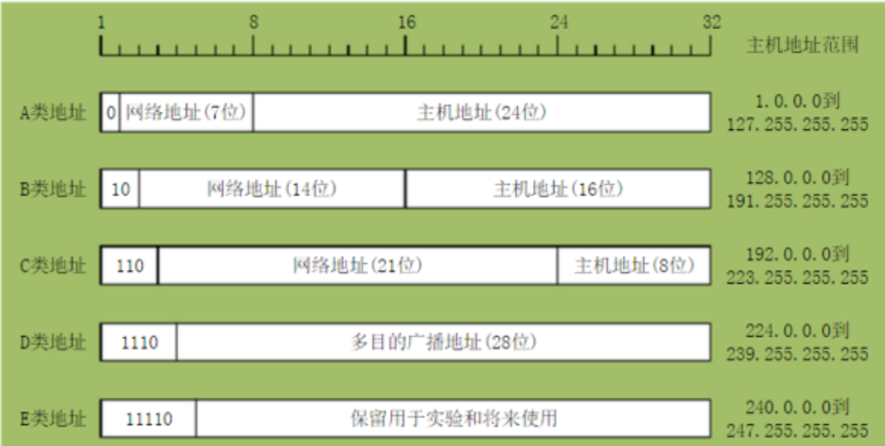

### 概念

IP地址I是一个32位的二进制数，通常被分割为4个“8位二进制数”（也就是4个字节）。IP地址通常用“点分十进制”表示成（a.b.c.d）的形式，其中，a,b,c,d都是0~255之间的十进制整数。例：点分十进IP地址（100.4.5.6），实际上是32位二进制数（01100100.00000100.00000101.00000110）。

### 分类

| 概念    | 特征                             | 网络范围      | 默认掩码         |
| ------- | -------------------------------- | ------------- | ---------------- |
| A类地址 | 第1个8位中的第1位始终为0         | 0-127.x.x.x   | 255.0.0.0/8      |
| B类地址 | 第1个8位中的第1、2位始终为10     | 128-191.x.x.x | 255.255.0.0/16   |
| C类地址 | 第1个8位中的第1、2、3位始终为110 | 192-y.x.x.x   | 255.255.255.0/24 |

广播地址

在使用TCP/IP 协议的网络中，主机标识段host ID 为全1 的IP 地址为广播地址

### 子网掩码

IP地址都是由网络号+主机号组成，IP地址总共是32位二进制数表示，每8位为一节，总共4节，日常使用中每节用一个十进制表示（0-255），其中前面n位表示网络号，后面32-n位表示主机号，n则是由子网掩码来决定。

在子网掩码中用1和0来分别网络号位和主机号位，其中是1的表示是网络位，0表示主机位，前面说的IP中前面的N位表示网络号，后面的32-N位才是主机号，所以子网掩码总是前面一段全是1，后面一段全是0。我们的IP范围就是主机号范围。所有主机号中的最后一个主机号为广播地址。所以，IP地址位数=网络位数+主机位数=32位。子网掩码的位数就是网络的位数。

### 网关

### 子网划分

可用IP = 主机位IP -2

第一个为网络 ip ，最后一个为广播 ip ,都不能用

参考

https://blog.csdn.net/gatieme/article/details/50989257

https://ip.liangwei.cc/network.html

https://zhuanlan.zhihu.com/p/337000554

https://blog.csdn.net/FYR1018/article/details/122362629