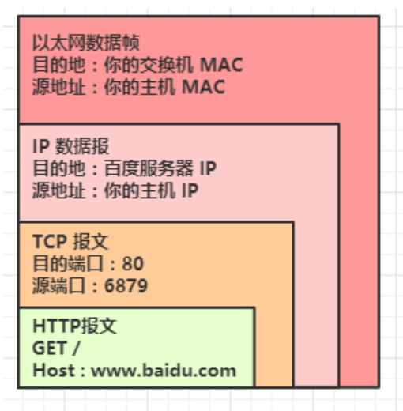

### IP 地址

P地址是一个32位的二进制数，通常被分割为4个“8位二进制数”（也就是4个字节）。IP地址通常用“点分十进制”表示成（a.b.c.d）的形式，其中，a,b,c,d都是0~255之间的十进制整数

### 子网

### 子网掩码

### 网关

### 路由器 & 交换机

路由器工作在第三层（网络层），而我们常说的交换机 工作在第二层（链路层）（目前有更加高级的三层交换机，四层交换机，甚至还有七层交换机）

路由器：寻址，转发（依靠 IP 地址）

交换机：过滤，转发（依靠 MAC 地址）

自己理解

层数越高，越在包的里面；比如链路层就在最外层；由此来分析 4 层代理比 7 层代理性能好，如果是 7 层代理，需要一直拆到最里面那层才能知道你要去哪，然后再重新封装；

参考：

https://blog.csdn.net/h4241778/article/details/125842624