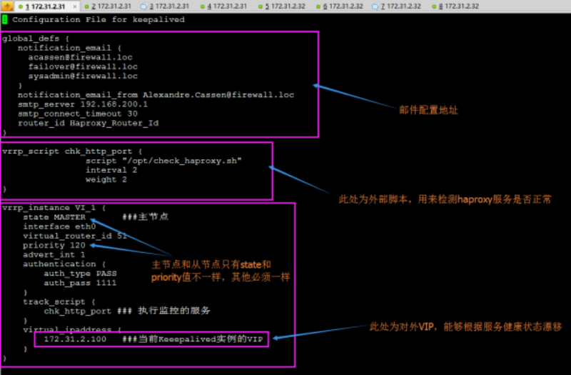
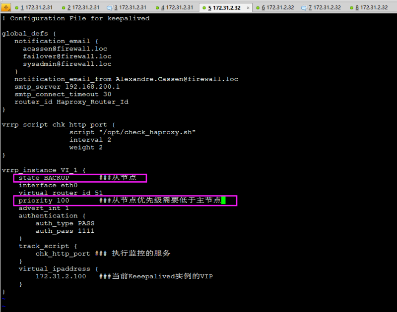
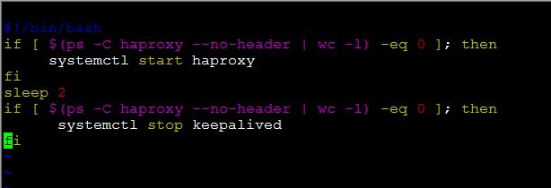
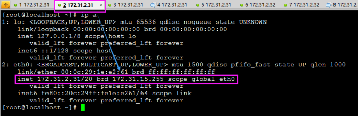
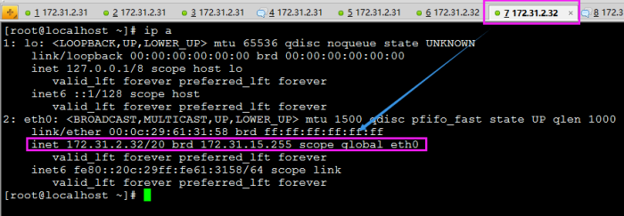
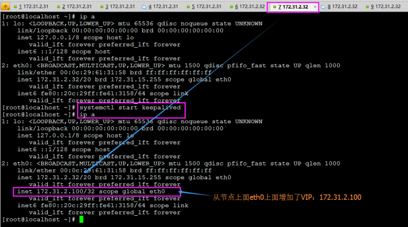
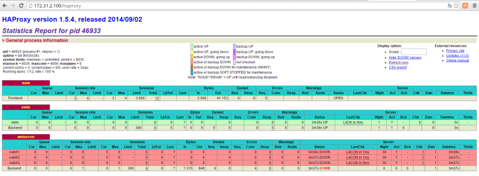
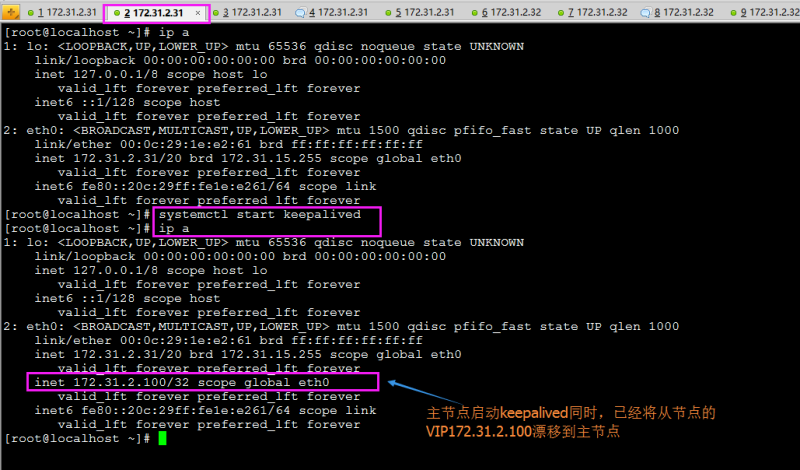
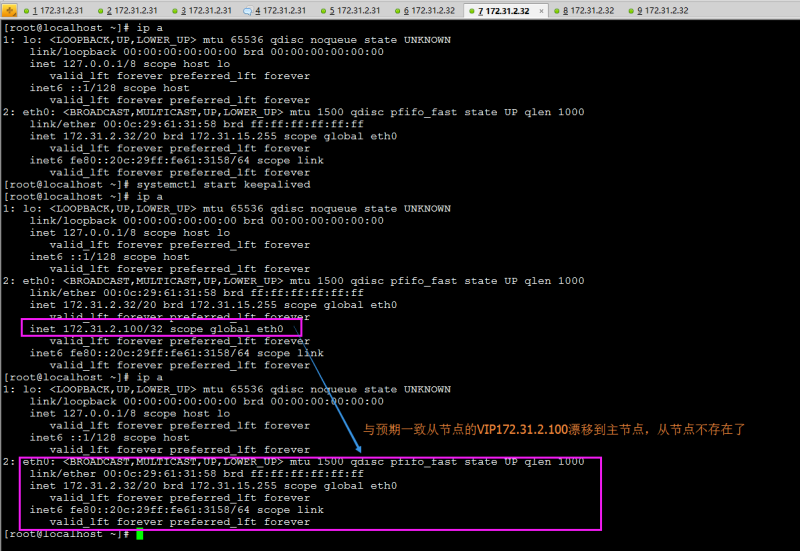

## 原理

keepalived利用VRRP（虚拟冗余路由）协议

自己理解：
    每个机器上安装keepalived，指定某个网卡，都虚拟出同样的vip,根据配置的 **priority**选出主，vip就会在主节点指定的网卡产生vip，
    然后从节点一直在检测主的状态一旦主挂掉（ 通过设置**virtual_router_id**让主从在同一个虚拟路由里），从就会将vip，转移到自己的网卡上，keepalived会通过脚本（一旦节点上的负载均衡服务挂掉，就会kill掉自己，从而将vip转移至从节点）来检测你配置的负载均衡的服务状态（可以是lvs,nginx，haproxy）

工作方式：
    抢占式：当主挂掉之后，vip在从节点，主恢复后，vip会重新会到主节点
        通过配置state master backup
    非抢占式： 当主挂掉之后，vip在从节点，主恢复后,vpi继续在从节点
        通过配置state backup backup ,添加nopreempt来标识非抢占式；

## 实验

    环境配置：
    172.31.2.31（安装keepalived）（实例配置里面的VIP为172.31.2.100）
    172.31.2.32（安装keepalived）（实例配置里面的VIP为172.31.2.100）
    注：
        本次实验中，必须能让上述两台机器的keepalived能够通信（增加相应iptables规则或者临时实验关闭iptables -F）
        两台机器需要时间同步：简单起见都执行：ntpdate cn.pool.ntp.org
        keepalived的日志默认在：tailf /var/log/messages
        上述两台机器都需要安装keepalived：
        yum install keepalived -y
        配置主节点：172.31.2.31
    vim /etc/keepalived/keepalived.conf

配置从节点：172.31.2.32
vim /etc/keepalived/keepalived.conf

主从节点都必须有的检测haproxy服务状态的文件（注：该文件必须有可执行权限！！！）：
vim /opt/check_haproxy.sh 

解释脚本：

\#!/bin/bash
if [ $(ps -C haproxy --no-header | wc -l) -eq 0 ]; then###判断haproxy是否已经启动
     systemctl start haproxy###如果没有启动，则启动haproxy程序
fi
sleep 2###睡眠两秒钟，等待haproxy完全启动
if [ $(ps -C haproxy --no-header | wc -l) -eq 0 ]; then###判断haproxy是否已经启动
      systemctl stop keepalived###如果haproxy没有启动起来，则将keepalived停掉，则VIP
                        自动漂移到另外一台haproxy机器,实现了对haproxy的高可用
fi

注：有上述脚本可以看出，每次启动keepalived的同时，第一件事，就是先启动haproxy。
接下来测试VIP漂移：
此时为初始状态即keepalived和haproxy服务都没有启动。
首先在主从节点分别查看eth0网卡情况：
主节点172.31.2.31：

从节点172.31.2.32：

在从节点172.31.2.32上启动keepalived，在查看eth0网卡（在启动keepalived的同时，首先会将haproxy启动）

这样我们可以通过请求172.31.2.100来达到直接访问172.31.2.32的目的（因为172.31.2.100是VIP，请求VIP则会自动将之转发到172.31.2.32）：

上述在从节点启动keepalived完成。（VIP安装预期绑定到了eth0网卡）。
那么接下来实现将主节点172.31.2.31上的keepalived启动起来：
预测：由于172.31.2.31上配置的主节点的优先级比从节点高，因此，启动主节点的keepalived，则从节点上面172.31.2.100的VIP应该自动删除，漂移到主节点：

正常推测此时从节点的VIP应该不在了：
