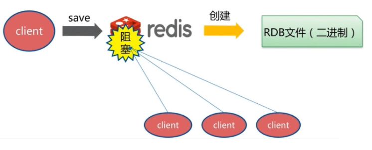
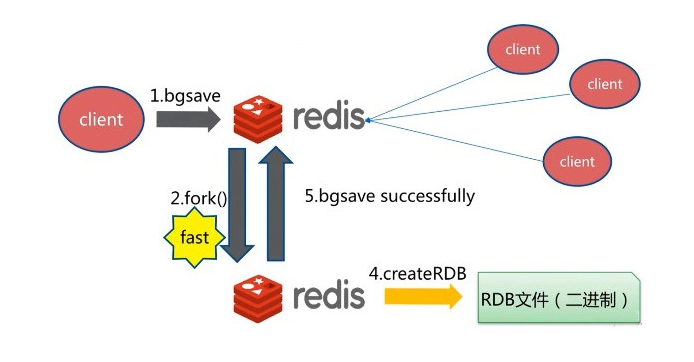

#### 定义

​    Redis 是一个基于内存的高性能key-value数据库.

#### 特点

​    单进程单线程，基于内存，每秒可以处理超过 10万次读写操作，是已知性能最快的Key-Value DB，支持保存多种数据结构，此外单个value的最大限制是1GB；

​    redis的主要缺点是数据库容量受到物理内存的限制，不能用作海量数据的高性能读写，因此Redis适合的场景主要局限在较小数据量的高性能操作和运算上

#### 常用的数据类型

string（字符串）: 基本的数据存储单元，可以存储字符串、整数或者浮点数。

hash（哈希）:一个键值对集合，可以存储多个字段。

list（列表）:一个简单的列表，可以存储一系列的字符串元素。

set（集合）:一个无序集合，可以存储不重复的字符串元素。

zset(sorted set：有序集合): 类似于集合，但是每个元素都有一个分数（score）与之关联。

#### 内存回收策略

一、内存使用达到 maxmemory 上限时候触发的溢出回收

LRU算法：最近最少使用页面置换算法(Least Recently Used),也就是首先淘汰最长时间未被使用的页面!

LFU算法：最近最不常用页面置换算法(Least Frequently Used),也就是淘汰一定时期内被访问次数最少的页!

配置方法：maxmemory-policy noeviction   #默认
	noeviction： 默认的策略，不会删除任何数据，即当内存使用达到阈值的时候，拒绝所有写入操作并返 回客

户端错误信息，此时Redis只响应读操作。

​	volatile-lru -> 根据LRU算法删除设置了超时属性（expire）的键，直到腾出足够空间为止。如果没有可删除的

键对象，回退到noeviction策略

​	allkeys-lru -> 根据LRU算法删除键，不管数据有没有设置超时属性，直到腾出足够空间为止

​	volatile-lfu -> 根据LFU算法删除设置了超时属性（expire）的键，直到腾出足够空间为止。如果没有可删除的键对象，回退到noeviction策略。

​	allkeys-lfu -> 根据LFU算法删除键，不管数据有没有设置超时属性，直到腾出足够空间为止。
​	volatile-random -> 随机删除过期键，直到腾出足够空间为止。
​	allkeys-random -> 随机删除所有键，直到腾出足够空间为止。
​	volatile-ttl -> 根据键值对象的ttl属性，删除最近将要过期数据。如果没有，回退到noeviction策略

二、设置过期时间，删除过期对象

Redis 所有的键都可以设置过期属性，内部保存在过期字典中，由于进程内保存大量的键，维护每个键精准的过期

删除机制会导致消耗大量的 CPU，对于单线程的Redis来说成本过高，因此Redis采用惰性删除和定时任务删除机制实现过期键的内存回收。

1、惰性删除：顾名思义，指的是不主动删除，**当用户访问已经过期的对象的时候才删除**，最大的优点是节省cpu

的开销，不用另外的内存和TTL链表来维护删除信息，缺点就是如果数据到期了但是一直没有被访问的话就不会被

删除，会占用内存空间。

2、定时任务删除：为了弥补第一种方式的缺点，redis内部还维护了一个定时任务，默认每秒运行10次。定时任务

中删除过期逻辑采用了自适应算法，使用快、慢两种速率模式回收键。

定时任务流程说明：

1> 定时任务在每个数据库空间随机检查xx个键，当发现过期时删除对应的键。

2> 如果超过检查数25%的键过期，循环执行回收逻辑直到不足25%或 运行超时为止，慢模式下超时时间为25毫秒。

3> 如果之前回收键逻辑超时，则在Redis触发内部事件之前再次以快模 式运行回收过期键任务，快模式下超时时

间为1毫秒且2秒内只能运行1次。

4> 快慢两种模式内部删除逻辑相同，只是执行的超时时间不同。

#### 数据持久化(把内存中的数据保存到磁盘上) 

##### RDB

RDB 持久化方式能够在指定的时间间隔能对你的数据进行快照存储（默认使用）。

工作方式

当 Redis 需要保存 dump.rdb 文件时， 服务器执行以下操作:

1. Redis 调用 forks。同时拥有父进程和子进程。
2. 子进程将数据集写入到一个临时 RDB 文件中。
3. 当子进程完成对新 RDB 文件的写入时，Redis 用新 RDB 文件替换原来的 RDB 文件，并删除旧的 RDB 文件。

在 Redis 运行时， RDB 程序将当前内存中的数据库快照保存到磁盘文件中， 在 Redis 重启动时， RDB 程序可以通过载入 RDB 文件来还原数据库的状态。

 三种机制：
save：会占用主进程，阻塞客户端的请求（很少用）
​        
bgsave：Redis使用Linux系统的fock()生成一个子进程来将DB数据保存到磁盘，主进程继续提供服务以供客户端调用。(如果操作成功，可以通过客户端命令LASTSAVE来检查操作结果。)
​        

自动生成 RDB：设置条件60 秒内有至少有 1000 个键被改动，则进行自动保存；（save 60 1000）    

##### AOF

打开AOF后， 每当 Redis 执行一个改变数据集的命令时（比如 SET）， 这个命令就会被追加到 AOF 文件的末尾。这样的话， 当 Redis 重新启时， 程序就可以通过重新执行 AOF 文件中的命令来达到重建数据集的目的。<就像二进制日志一样记录你做了什么>
三种策略：
always
每次有新命令追加到 AOF 文件时就执行一次 fsync ：非常慢，也非常安全。
everysec
每秒 fsync 一次：足够快（和使用 RDB 持久化差不多），并且在故障时只会丢失 1 秒钟的数据。
推荐（并且也是默认）的措施为每秒 fsync 一次， 这种 fsync 策略可以兼顾速度和安全性。
no
从不 fsync ：将数据交给操作系统来处理，由操作系统来决定什么时候同步数据。更快，也更不安全的选择。

AOF 重写：就是将刚开始保存的操作记录重新编写（比如一个键值由A->B->C->D-B,重写后只记录A->B，） 减少磁盘占用量， 加速数据恢复
auto-aof-rewrite-min-size	触发AOF文件执行重写的最小尺寸 xx mb（aof文件超过这个大小）
auto-aof-rewrite-percentage	触发AOF文件执行重写的增长率 xx ()
即 AOF 重写自动触发机制，需要同时满足以上两个条件

#### 参考

 https://segmentfault.com/a/1190000016021217