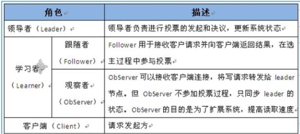

## zookeeper 简介： 

zookeeper是一个分布式的，开放源码的分布式应用程序协调服务，是hadoop和Habase的重要组件，是为分布式应用提供一致性服务的软件。

##  作用： 

1.配置管理
在我们的应用中除了代码外，还有一些就是各种配置。比如数据库连接等。一般我们都 是使用配置文件的方式，在代码中引入这些配置文件。当我们只有一种配置，只有一台服务 器，并且不经常修改的时候，使用配置文件是一个很好的做法，但是如果我们配置非常多， 有很多服务器都需要这个配置，这时使用配置文件就不是个好主意了。这个时候往往需要寻 找一种集中管理配置的方法，我们在这个集中的地方修改了配置，所有对这个配置感兴趣的 都可以获得变更。Zookeeper 就是这种服务，它使用 Zab 这种一致性协议来提供一致性。现 在有很多开源项目使用 Zookeeper 来维护配置，比如在 HBase 中，客户端就是连接一个 Zookeeper，获得必要的 HBase 集群的配置信息，然后才可以进一步操作。还有在开源的消 息队列 Kafka 中，也使用 Zookeeper来维护broker的信息。在 Alibaba开源的 SOA 框架Dubbo 中也广泛的使用 Zookeeper 管理一些配置来实现服务治理。
\2. 名字服务
名字服务这个就很好理解了。比如为了通过网络访问一个系统，我们得知道对方的 IP 地址，但是 IP 地址对人非常不友好，这个时候我们就需要使用域名来访问。但是计算机是 不能是域名的。怎么办呢？如果我们每台机器里都备有一份域名到 IP 地址的映射，这个倒 是能解决一部分问题，但是如果域名对应的 IP 发生变化了又该怎么办呢？于是我们有了 DNS 这个东西。我们只需要访问一个大家熟知的(known)的点，它就会告诉你这个域名对应 的 IP 是什么。在我们的应用中也会存在很多这类问题，特别是在我们的服务特别多的时候， 如果我们在本地保存服务的地址的时候将非常不方便，但是如果我们只需要访问一个大家都 熟知的访问点，这里提供统一的入口，那么维护起来将方便得多了。
\3. 分布式锁
其实在第一篇文章中已经介绍了 Zookeeper 是一个分布式协调服务。这样我们就可以利 用 Zookeeper 来协 调多个分布式进程之间的活动。比如在一个分布式环境中，为了提高可靠 性，我们的集群的每台服务器上都部署着同样的服务。但是，一件事情如果集群中的每个服 务器都进行的话，那相互之间就要协调，编程起来将非常复杂。而如果我们只让一个服务进 行操作，那又存在单点。通常还有一种做法就是使用分布式锁，在某个时刻只让一个服务去
干活，当这台服务出问题的时候锁释放，立即 fail over 到另外的服务。这在很多分布式系统 中都是这么做，这种设计有一个更好听的名字叫 Leader Election(leader 选举)。比如 HBase 的 Master 就是采用这种机制。但要注意的是分布式锁跟同一个进程的锁还是有区别的，所 以使用的时候要比同一个进程里的锁更谨慎的使用。
\4. 集群管理
在分布式的集群中，经常会由于各种原因，比如硬件故障，软件故障，网络问题，有些 节点会进进出出。有新的节点加入进来，也有老的节点退出集群。这个时候，集群中其他机 器需要感知到这种变化，然后根据这种变化做出对应的决策。比如我们是一个分布式存储系 统，有一个中央控制节点负责存储的分配，当有新的存储进来的时候我们要根据现在集群目 前的状态来分配存储节点。这个时候我们就需要动态感知到集群目前的状态。还有，比如一 个分布式的 SOA 架构中，服务是一个集群提供的，当消费者访问某个服务时，就需要采用 某种机制发现现在有哪些节点可以提供该服务(这也称之为服务发现，比如 Alibaba 开源的 SOA 框架 Dubbo 就采用了 Zookeeper 作为服务发现的底层机制)。还有开源的 Kafka 队列就 采用了 Zookeeper 作为 Cosnumer 的上下线管理。

##    Zookeeper 的数据与存储 　　内存数据 　　Zookeeper的数据模型是树结构，在内存数据库中，存储了整棵树的内容，包括所有的节点路径、节点数据、ACL信息，Zookeeper会定时将这个数据存储到磁盘上。 　　1. DataTree 　　DataTree是内存数据存储的核心，是一个树结构，代表了内存中一份完整的数据。DataTree不包含任何与网络、客户端连接及请求处理相关的业务逻辑，是一个独立的组件。 　　2. DataNode 　　DataNode是数据存储的最小单元，其内部除了保存了结点的数据内容、ACL列表、节点状态之外，还记录了父节点的引用和子节点列表两个属性，其也提供了对子节点列表进行操作的接口。 　　3. ZKDatabase 　　Zookeeper的内存数据库，管理Zookeeper的所有会话、DataTree存储和事务日志。ZKDatabase会定时向磁盘dump快照数据，同时在Zookeeper启动时，会通过磁盘的事务日志和快照文件恢复成一个完整的内存数据库。  


1 Znode
在 Zookeeper 中，znode 是一个跟 Unix 文件系统路径相似的节点，可以往这个节点存储 或获取数据。 Zookeeper 底层是一套数据结构。这个存储结构是一个树形结构，其上的每一个节点， 我们称之为“znode” zookeeper 中的数据是按照“树”结构进行存储的。而且 znode 节点还分为 4 中不同的类 型。 每一个 znode 默认能够存储 1MB 的数据（对于记录状态性质的数据来说，够了） 可以使用 zkCli 命令，登录到 zookeeper 上，并通过 ls、create、delete、get、set 等命令 操作这些 znode 节点

2 Znode 节点类型
(1)PERSISTENT 持久化节点: 所谓持久节点，是指在节点创建后，就一直存在，直到 有删除操作来主动清除这个节点。否则不会因为创建该节点的客户端会话失效而消失。
(2)PERSISTENT_SEQUENTIAL 持久顺序节点：这类节点的基本特性和上面的节点类 型是一致的。额外的特性是，在 ZK 中，每个父节点会为他的第一级子节点维护一份时序， 会记录每个子节点创建的先后顺序。基于这个特性，在创建子节点的时候，可以设置这个属 性，那么在创建节点过程中，ZK 会自动为给定节点名加上一个数字后缀，作为新的节点名。 这个数字后缀的范围是整型的最大值。 在创建节点的时候只需要传入节点 “/test_”，这样 之后，zookeeper 自动会给”test_”后面补充数字。
(3)EPHEMERAL 临时节点：和持久节点不同的是，临时节点的生命周期和客户端会 话绑定。也就是说，如果客户端会话失效，那么这个节点就会自动被清除掉。注意，这里提 到的是会话失效，而非连接断开。另外，在临时节点下面不能创建子节点。 这里还要注意一件事，就是当你客户端会话失效后，所产生的节点也不是一下子就消失 了，也要过一段时间，大概是 10 秒以内，可以试一下，本机操作生成节点，在服务器端用 命令来查看当前的节点数目，你会发现客户端已经 stop，但是产生的节点还在。
(4) EPHEMERAL_SEQUENTIAL 临时自动编号节点：此节点是属于临时节点，不过带 有顺序，客户端会话结束节点就消失。

##    Zookeeper 集群中的角色  


通信端口：
• 端口X：监听客户端连接的，没什么可说的
• 端口Y：follower和leader进行数据同步通信用的，这个是长连接随时同步数据，健康情况下正常运行，leader宕机就无法正常执行，此时触发选举程序选择新的leader。
• 端口Z：选举时各个follower节点之间两两可以相互通信的，以便于成功选择出leader。

##   特性 

1.最终一致性：client 不论连接到哪个 Server，展示给它都是同一个视图，这是 zookeeper 最重要的性能。
2 .可靠性：具有简单、健壮、良好的性能，如果消息 m 被到一台服务器接受，那么它 将被所有的服务器接受。
3 .实时性：Zookeeper 保证客户端将在一个时间间隔范围内获得服务器的更新信息，或 者服务器失效的信息。但由于网络延时等原因，Zookeeper 不能保证两个客户端能同时得到 刚更新的数据，如果需要最新数据，应该在读数据之前调用 sync()接口。
4 .等待无关（wait-free）：慢的或者失效的 client 不得干预快速的 client 的请求，使得每 个 client 都能有效的等待。
5.原子性：更新只能成功或者失败，没有中间状态。
6 .顺序性：包括全局有序和偏序两种：全局有序是指如果在一台服务器上消息 a 在消息 b 前发布，则在所有 Server 上消息 a 都将在消息 b 前被发布；偏序是指如果一个消息 b 在消 息 a 后被同一个发送者发布，a 必将排在 b 前面。

##   配置 /bin 

• zkServer：用于启动、停止ZooKeeper，且能查看ZooKeeper状态。
zkServer.sh {start|start-foreground|stop|restart|status|upgrade|print-cmd}
• zkEnv：设置ZooKeeper启动、关闭时的环境变量。在其余的每个脚本中都引用了这个脚本。
• zkCleanup：清除ZooKeeper的事务日志和快照。
• zkCli：ZooKeeper的一个命令行客户端。

##  /conf 

**zoo.cfg**配置文件
tickTime=2000
dataDir=/opt/zookeeper1
clientPort=2181
initLimit=5 
syncLimit=2
server.1=192.168.211.1:2888:3888
server.2=192.168.211.2:2888:3888

zookeeper的配置参数详解（zoo.cfg）


配置参数详解(主要是%ZOOKEEPER_HOME%/conf/zoo.cfg文件)

参数名
说明

clientPort
客户端连接server的端口，即对外服务端口，一般设置为2181吧。

dataDir
存储快照文件snapshot的目录。默认情况下，事务日志也会存储在这里。建议同时配置参数dataLogDir, 事务日志的写性能直接影响zk性能。

tickTime
ZK中的一个时间单元。ZK中所有时间都是以这个时间单元为基础，进行整数倍配置的。例如，session的最小超时时间是2*tickTime。

dataLogDir
事务日志输出目录。尽量给事务日志的输出配置单独的磁盘或是挂载点，这将极大的提升ZK性能。  
（No Java system property）

globalOutstandingLimit

最大请求堆积数。默认是1000。ZK运行的时候， 尽管server已经没有空闲来处理更多的客户端请求了，但是还是允许客户端将请求提交到服务器上来，以提高吞吐性能。当然，为了防止Server内存溢出，这个请求堆积数还是需要限制下的。  
(Java system property:zookeeper.globalOutstandingLimit. )

preAllocSize
预先开辟磁盘空间，用于后续写入事务日志。默认是64M，每个事务日志大小就是64M。如果ZK的快照频率较大的话，建议适当减小这个参数。(Java system property:zookeeper.preAllocSize )

snapCount
每进行snapCount次事务日志输出后，触发一次快照(snapshot), 此时，ZK会生成一个snapshot.*文件，同时创建一个新的事务日志文件log.*。默认是100000.（真正的代码实现中，会进行一定的随机数处理，以避免所有服务器在同一时间进行快照而影响性能）(Java system property:zookeeper.snapCount )

traceFile
用于记录所有请求的log，一般调试过程中可以使用，但是生产环境不建议使用，会严重影响性能。(Java system property:? requestTraceFile )

maxClientCnxns
单个客户端与单台服务器之间的连接数的限制，是ip级别的，默认是60，如果设置为0，那么表明不作任何限制。请注意这个限制的使用范围，仅仅是单台客户端机器与单台ZK服务器之间的连接数限制，不是针对指定客户端IP，也不是ZK集群的连接数限制，也不是单台ZK对所有客户端的连接数限制。指定客户端IP的限制策略，这里有一个patch，可以尝试一下：http://rdc.taobao.com/team/jm/archives/1334（No Java system property）

clientPortAddress
对于多网卡的机器，可以为每个IP指定不同的监听端口。默认情况是所有IP都监听 clientPort 指定的端口。  New in 3.3.0

minSessionTimeoutmaxSessionTimeout
Session超时时间限制，如果客户端设置的超时时间不在这个范围，那么会被强制设置为最大或最小时间。默认的Session超时时间是在2 *  tickTime ~ 20 * tickTime 这个范围 New in 3.3.0

fsync.warningthresholdms
事务日志输出时，如果调用fsync方法超过指定的超时时间，那么会在日志中输出警告信息。默认是1000ms。(Java system property:  fsync.warningthresholdms )New in 3.3.4

autopurge.purgeInterval
在上文中已经提到，3.4.0及之后版本，ZK提供了自动清理事务日志和快照文件的功能，这个参数指定了清理频率，单位是小时，需要配置一个1或更大的整数，默认是0，表示不开启自动清理功能。(No Java system property)  New in 3.4.0

autopurge.snapRetainCount
这个参数和上面的参数搭配使用，这个参数指定了需要保留的文件数目。默认是保留3个。(No Java system property)  New in 3.4.0

electionAlg
在之前的版本中， 这个参数配置是允许我们选择leader选举算法，但是由于在以后的版本中，只会留下一种“TCP-based version of fast leader election”算法，所以这个参数目前看来没有用了，这里也不详细展开说了。(No Java system property)

initLimit
Follower在启动过程中，会从Leader同步所有最新数据，然后确定自己能够对外服务的起始状态。Leader允许F在 initLimit 时间内完成这个工作。通常情况下，我们不用太在意这个参数的设置。如果ZK集群的数据量确实很大了，F在启动的时候，从Leader上同步数据的时间也会相应变长，因此在这种情况下，有必要适当调大这个参数了。(No Java system property)

syncLimit
在运行过程中，Leader负责与ZK集群中所有机器进行通信，例如通过一些心跳检测机制，来检测机器的存活状态。如果L发出心跳包在syncLimit之后，还没有从F那里收到响应，那么就认为这个F已经不在线了。注意：不要把这个参数设置得过大，否则可能会掩盖一些问题。(No Java system property)

leaderServes
默认情况下，Leader是会接受客户端连接，并提供正常的读写服务。但是，如果你想让Leader专注于集群中机器的协调，那么可以将这个参数设置为no，这样一来，会大大提高写操作的性能。(Java system property: zookeeper. leaderServes )。

server.x=[hostname]:nnnnn[:nnnnn]
这里的x是一个数字，与myid文件中的id是一致的。右边可以配置两个端口，第一个端口用于F和L之间的数据同步和其它通信，第二个端口用于Leader选举过程中投票通信。  
(No Java system property)

group.x=nnnnn[:nnnnn]weight.x=nnnnn
对机器分组和权重设置，可以  参见这里(No Java system property)

cnxTimeout
Leader选举过程中，打开一次连接的超时时间，默认是5s。(Java system property: zookeeper.  cnxTimeout )

zookeeper.DigestAuthenticationProvider
.superDigest
ZK权限设置相关，具体参见  《  使用super  身份对有权限的节点进行操作 》  和  《 ZooKeeper   权限控制 》

skipACL
对所有客户端请求都不作ACL检查。如果之前节点上设置有权限限制，一旦服务器上打开这个开头，那么也将失效。(Java system property:  zookeeper.skipACL )

forceSync
这个参数确定了是否需要在事务日志提交的时候调用 FileChannel .force来保证数据完全同步到磁盘。(Java system property: zookeeper.forceSync )

jute.maxbuffer
每个节点最大数据量，是默认是1M。这个限制必须在server和client端都进行设置才会生效。(Java system property: jute.maxbuffer 

##  操作


### 登陆zookeeper：

**zkCli.sh -server ip :port**
本机的话 直接**zkCli.sh**就可以；


### zookeeper命令行操作：

```
Zookeeper -server host:port cmd args
    stat path [watch]
    set path data [version]
    ls path [watch]
    delquota [-n|-b] path 
    ls2 path [watch]
    setAcl path acl
    setquota -n|-b val path
    history
    redo cmdno
    printwatches on|off
    delete path [version]
    sync path
    listquota path
    rmr path
    get path [watch]
    create [-s] [-e] path data acl
    addauth scheme auth
    quit
    getAcl path
    close
    connect host:port
```

**系统命令行操作**
ZK常用四字命令
命令：echo 四字命令 | nc IP PORT 
conf ：输出相关服务配置的详细信息
cons：列出所有连接到服务器的客户端的完全的连接 /会话的详细信息。包括“接受 / 发送”的包数量、会话 id 、操作延迟、最后的操作执行等等信息。
dump：列出未经处理的会话和临时节点。
envi：输出关于服务环境的详细信息（区别于 conf命令）。
reqs：列出未经处理的请求
ruok：测试服务是否处于正确状态。如果确实如此，那么服务返回“imok ”，否则不做任何相应。
stat：输出关于性能和连接的客conf户端的列表。
wchs：列出服务器watch的详细信息。
wchc：通过 session列出服务器 watch的详细信息，它的输出是一个与watch相关的会话的列表。
wchp：通过路径列出服务器 watch的详细信息。它输出一个与 session相关的路径


## ZooKeeper Client API


## ZooKeeper的典型应用场景


1)数据发布/订阅
目的：动态获取数据，来实现配置信息的集中式管理和数据的动态更新Zookeeper采用设计模式：推拉相结合（客户端向服务端注册自己需要关注的节点，一旦该节点数据发生变更，那么服务端就会向相应的客户端发送Watcher事件通知，客户端接到消息后，主动到服务端获取最新的数据）
例:
(1).将应用中的配置信息放到ZK上集中处理，通常应用初始化时主动获取所需配置信息，并在相对应的节点注册Watcher，以后配置信息每发生变更一次，就通知相应的订阅的客户端，客户端完成从节点获取最新的配置信息。
(2).分布式搜索服务中，索引元信息和服务器集群机器的节点状态存储在指定的ZK节点中，供客户端的订阅使用
(3).分布式日志收集系统，将应用日志以应用为任务单元收集日志，在ZK上以应用名为节点，把该应用的服务器IP做为子节点，当应用服务器出现宕机或服务器发生变化时，通知日志收集器，日志收集器获得最新的服务器信息，来实现收集日志的任务。
2) 负载均衡
目的：通常同一个应用或同一个服务的提供方都会部署多份，达到对等服务。而消费者就须要在这些对等的服务器中选择一个来执行相关的业务逻辑，其中比较典型的是消息中间件中的生产者，消费者负载均衡。
例：
生产者负载均衡：metaq发送消息的时候，生产者在发送消息的时候必须选择一台broker上的一个分区来发送消息，因此metaq在运行过程中，会把所有broker和对应的分区信息全部注册到ZK指定节点上，默认的策略是一个依次轮询的过程，生产者在通过ZK获取分区列表之后，会按照brokerId和partition的顺序排列组织成一个有序的分区列表，发送的时候按照从头到尾循环往复的方式选择一个分区来发送消息。
3）命名服务
目的：通过使用命名服务，客户端应用能够根据指定名字来获取资源的实体、服务地址和提供者的信息。
例：
(1).分布式任务调度系统中，通过调用Zookeeper节点创建API中的顺序节点创建，返回全局唯一的命名，且可得到节点创建的顺序。
4）分布式协调/通知
目的：将不同的分布式组件有机结合起来，协调分布式系统的全局运行流程
例：将需要互相协调的分布式系统组件注册在ZK同一节点上，并对该节点注册Wathcher，当其中一个组件更新节点信息时，其他节点将收到信息，并作出相应的处理。
5) 集群管理
目的：为了灵活的管理大规模的集群中机器的运行状态，统计宕机率等
例：在线云主机管理，首先将应用部署到这些机器上，在ZK上的机器列表节点下面创建临时子节点，机器列表节点发出“子节点变更的”的消息，
6) Master选举
目的：避免重复劳动，提高集群的性能，让集群中的单机或部分集群去完成耗时操作。
例：海量数据处理模型，用ZK强一致性选举出master，并让他处理耗时的海量数据，其余客户端在该节点注册Watcher，监控master的存活。
7）分布式锁
目的：分布式锁的实现包括独占和控制时序
8）分布式队列
队列包括先进先出（FIFO）队列和队列成员聚齐
例如：
分布式环境中，一个大任务TaskA，需要在很多子任务完成（或条件就绪）情况下才能进行。这个时候，凡是其中一个子任务完成（就绪），那么就去 /taskList 下建立自己的临时时序节点（CreateMode.EPHEMERAL_SEQUENTIAL），当 /taskList 发现自己下面的子节点满足指定个数，就可以进行下一步按序进行处理了。


# 问题处理


    1、
    问题：zk报错**Refusing session request for client /127.0.0.1:45886 as it has seen zxid 0x9 our last zxid is 0x0 client
 must try another server**
    原因：由于新起的zk拥有比其他server大的zxid，会被认为是最新的内容。但集群策略不允许新加入的server拥有最新的内容。所以一直踢掉该连接，实际是因为zk清理了数据，但是连接zk的客户段没有重启
    解决：重启所有连接到zookeeper中的所有client(注意不要漏掉某些线程，如果实在排查不掉可以更换端口)