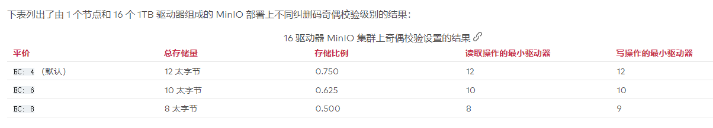

MinIO 是一种高性能对象存储解决方案，原生支持 Kubernetes 部署。MinIO 提供与 Amazon Web Services S3 兼容的 API，并支持所有核心 S3 功能，它的底层原理是纠删码，采用的Reed-Solomon code（纠删码中的一种）将对象拆分成m份数据和n份奇偶校验块。

#### 基本概念：

Drive：即存储数据的磁盘，在 MinIO 启动时，以参数的方式传入。

Erasure Set：即一组 Drive 的集合，分布式部署根据集群规模自动划分一个或多个 Erasure Set（每个Erasure Set包含4到16个Drive），每个 Erasure Set 中的 Drive 分布在不同位置。一个对象存储在一个 Erasure Set 上。

数据块：

奇偶校验块：

#### 纠删码：

MinIO 擦除编码是一种数据冗余和可用性功能，它允许 MinIO 部署在集群中丢失多个驱动器或节点的情况下自动即时重建对象。擦除编码提供对象级修复，其开销比相邻的技术（如 RAID 或复制）更少。

MinIO 将每个新对象拆分为数据块和奇偶校验块，其中奇偶校验块支持丢失或损坏的数据块的重建。MinIO 将这些块写入部署中的单个擦除集。由于擦除集驱动器是跨部署条带化的，因此给定节点通常只包含每个对象的一部分数据或奇偶校验块。因此，根据配置的奇偶校验和部署拓扑，MinIO 可以容忍部署中多个驱动器或节点的丢失。

在最大奇偶校验时，MinIO 可以容忍每个擦除集 ( `N/2-1`)丢失多达一半的驱动器，并且仍然执行读写操作。MinIO 默认为每个对象 4 个奇偶校验块，每个擦除集可以容忍 4 个驱动器的丢失

### 擦除集

### 纠删码奇偶校验 ( EC:N)

MinIO 使用 Reed-Solomon 算法根据部署中的[擦除集](https://docs.min.io/minio/baremetal/concepts/erasure-coding.html#minio-ec-erasure-set)大小将对象拆分为数据块和奇偶校验块。对于给定大小的擦除集`M`，MinIO 将对象拆分为`N`奇偶校验块和`M-N`数据块。

MinIO 使用该`EC:N`符号来表示`N`部署中的奇偶校验块 ( )的数量。MinIO 默认为`EC:4`每个对象 4 个奇偶校验块。MinIO对部署中的`EC:N`所有擦除集和[服务器池](https://docs.min.io/minio/baremetal/introduction/minio-overview.html#minio-intro-server-pool)使用相同的值 。

MinIO 可以容忍`N`每个擦除集丢失多达驱动器并继续执行读写操作（“仲裁”）。如果`N`恰好等于擦除集中驱动器的 1/2，则 MinIO 写入仲裁要求 `N+1`驱动器避免数据不一致（“裂脑”）。

为部署设置奇偶校验是可用性和总可用存储之间的平衡。较高的奇偶校验值以可用存储为代价增加了对驱动器或节点故障的弹性，而较低的奇偶校验值可提供最大存储量，同时降低对驱动器/节点故障的容忍度

### 存储类

MinIO 支持带有擦除编码的存储类，以允许应用程序指定每个对象的[奇偶校验](https://docs.min.io/minio/baremetal/concepts/erasure-coding.html#minio-ec-parity)。每个存储类指定一个`EC:N`奇偶校验设置以应用于使用该类创建的对象

MinIO 提供以下两种存储类：

- STANDARD

  该`STANDARD`存储类是所有对象的默认类。

- REDUCED_REDUNDANCY

参考：https://docs.min.io/minio/baremetal/concepts/erasure-coding.html