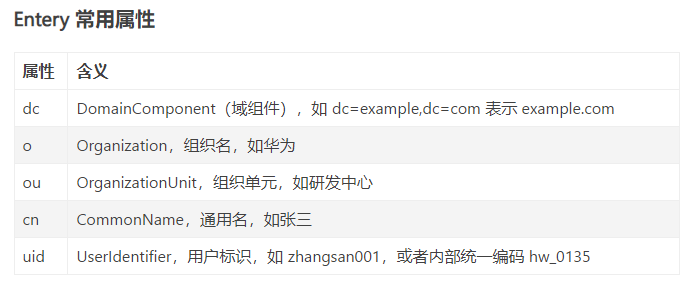

### LDAP

LDAP（轻量级目录访问协议）是用户、设备和客户端与目录服务器通信的标准协议。

LDAP 协议帮助用户对 IT 资源进行身份验证和授权，这些资源包括服务器、应用程序、网络、文件服务器等

### X.500协议

X.500是计算机目录服务的标准系列。

X.500协议包括：LDAP (Lightweight Directory Access Protocol)

其他协议：...

### OpenLDAP

OpenLDAP 是 LDAP 协议免费、开源的实现，是一个轻量级的 LDAP 目录软件

### AD

Microsoft Active Directory (AD) 是一种目录服务，可将用户和设备帐户数据存储在中央位置，用于基于 

Windows 的网络、设备、应用程序和文件实现访问。

OpenLDAP 和 微软的 Active Directory （AD）是目前最流行的两大 LDAP 目录服务，OpenLDAP 是开源的，AD 是需要授权的。

AD 比 OpenLDAP 功能更丰富，它包括一个 GUI （图形用户界面） 和更强大的配置功能，例如 Windows 设备的

组策略对象。OpenLDAP 仅使用 LDAP 协议，而 AD 还用了除 LDAP 之外的其他协议。事实上，LDAP 并不是 

AD 的主要协议；相反，它利用 Microsoft 专有的轻量级目录访问协议的实现，并主要使用 Microsoft 的专有身份

验证协议Kerberos

### OpenLADP 基础概念

​                sn surname 姓

### OpenLADP 架构

### OpenLADP 部署配置

它主要包括下述4个部分：

slapd - 独立LDAP守护服务
slurpd - 独立的LDAP更新复制守护服务
实现LDAP协议的库
工具软件和示例客户端

端口

398：Ldap 服务端口

636：LDAPS是LDAP的安全版本，其中LDAP通信通过SSL隧道传输。 另外，TCP和UDP 636可以用于LDAPS安全传输