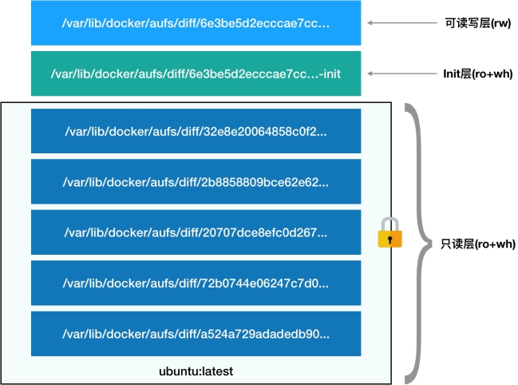
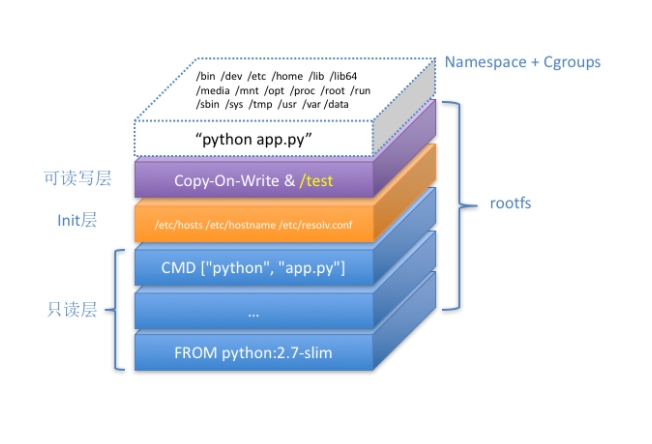

### docker 底层理论

依赖 linux 的 cgroup,namespace 机制来启动特殊的进程

容器的本质是一种特殊的进程

**namespace** 是用来隔离进程的（通过修改视图）；有PID、Mount、UTS、IPC、Network 和 User 6种namespace;

Namespace 技术实际上修改了应用进程看待整个计算机“视图”，即它的“视线”被操作系统做了限制，只能“看到”某些指定的内容。但对于宿主机来说，这些被“隔离”了的进程跟其他进程并没有太大区别。

**cgroup** 是用进行资源限制；

Linux Cgroups 的全称是 Linux Control Group。它最主要的作用，就是限制一个进程组能够使用的资源上限，包括 CPU、内存、磁盘、网络带宽等等。

容器是一个“单进程”模型 

这是刚开始最理想的情况，但是实际过程中也有多进程的，依赖于健康检查来保证应用的可用性；（只要把这个单进程<容器内进程号为1的进程>kill掉了，容器就挂掉了，也就是单进程是被控制的）

Mount Namespace 跟其他 Namespace 的使用略有不同的地方：它对容器进程视图的改变，一定是伴随着挂载操作（mount）才能生效。

chroot：将一个目录变成某个进程的根目录； 
对 Docker 项目来说，它最核心的原理实际上就是为待创建的用户进程：

1) 启用 Linux Namespace 配置；

2) 设置指定的 Cgroups 参数；

3) 切换进程的根目录（Change Root）

同一台机器上的所有容器，都共享宿主机操作系统的内核

这种深入到操作系统级别的运行环境一致性，打通了应用在本地开发和远端执行环境之间难以逾越的鸿沟。

容器进程 "，是 Docker 创建的一个容器初始化进程 (dockerinit)，而不是应用进程 (ENTRYPOINT + CMD)。

dockerinit 会负责完成根目录的准备、挂载设备和目录、配置 hostname 等一系列需要在容器内进行的初始化操

作。最后，它通过 execv() 系统调用，让应用进程取代自己，成为容器里的 PID=1 的进程。

除了cgroup和namespace，还有容器的文件系统即rootfs

容器的 rootfs 由如下图所示的三部分组成：

第一部分，只读层。
它是这个容器的 rootfs 最下面的五层，对应的正是 ubuntu:latest 镜像的五层。可以看到，它们的挂载方式都是只读的（ro+wh，即 readonly+whiteout）

第二部分，可读写层。
它是这个容器的 rootfs 最上面的一层（6e3be5d2ecccae7cc），它的挂载方式为：rw，即 read write。在没有写入文件之前，这个目录是空的。而一旦在容器里做了写操作，你修改产生的内容就会以增量的方式出现在这个层中。
可是，你有没有想到这样一个问题：如果我现在要做的，是删除只读层里的一个文件呢？
为了实现这样的删除操作，AuFS 会在可读写层创建一个 whiteout 文件，把只读层里的文件“遮挡”起来。
比如，你要删除只读层里一个名叫 foo 的文件，那么这个删除操作实际上是在可读写层创建了一个名叫.wh.foo 的文件。这样，当这两个层被联合挂载之后，foo 文件就会被.wh.foo 文件“遮挡”起来，“消失”了。这个功能，就是“ro+wh”的挂载方式，即只读 +whiteout 的含义。我喜欢把 whiteout 形象地翻译为：“白障”。
所以，最上面这个可读写层的作用，就是专门用来存放你修改 rootfs 后产生的增量，无论是增、删、改，都发生在这里。而当我们使用完了这个被修改过的容器之后，还可以使用 docker commit 和 push 指令，保存这个被修改过的可读写层，并上传到 Docker Hub 上，供其他人使用；而与此同时，原先的只读层里的内容则不会有任何变化。这，就是增量 rootfs 的好处。

第三部分，Init 层。
它是一个以“-init”结尾的层，夹在只读层和读写层之间。Init 层是 Docker 项目单独生成的一个内部层，专门用来存放 /etc/hosts、/etc/resolv.conf 等信息。
需要这样一层的原因是，这些文件本来属于只读的 Ubuntu 镜像的一部分，但是用户往往需要在启动容器时写入一些指定的值比如 hostname，所以就需要在可读写层对它们进行修改。
可是，这些修改往往只对当前的容器有效，我们并不希望执行 docker commit 时，把这些信息连同可读写层一起提交掉。
所以，Docker 做法是，在修改了这些文件之后，以一个单独的层挂载了出来。而用户执行 docker commit 只会提交可读写层，所以是不包含这些内容的。
最终，这 7 个层都被联合挂载到 /var/lib/docker/aufs/mnt 目录下，表现为一个完整的 Ubuntu 操作系统供容器使用

容器

疑惑：ubuntu 的镜像是如何运行在 centos 系统上的？
答疑：容器技术是依赖的linux内核使用的也是宿主机的内核，这些系统都是在内核之上的文件系统决定即文件系统决定系统；但是docker容器中运行的应用程序需要的内核版本与宿主机内核版本兼容才能正常运行；

#### 关于 cgroups 和namespace 详解

#### 参考

https://juejin.cn/post/7096115284875935781

https://zhuanlan.zhihu.com/p/81668069

https://yuanjava.com/linux-namespace-cgroups/

https://www.cnblogs.com/wjoyxt/p/9935098.html