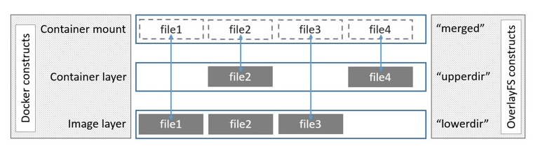

​         从register服务器拉image的过程：
• 首先获取image的manifests

• 根据manifests文件中config的sha256码，得到image config文件

• 遍历manifests里面的所有layer，根据其sha256码在本地找，如果找到对应的layer，则跳过，否则从服务器取相应layer的压缩包

• 等上面的所有步骤完成后，就会拼出完整的image

registry目录结构分析：
    /blbos:存放每层数据以及一个镜像的manifests信息的具体文件,其中data中存放的是真实的数据信息
    /repositories:存放镜像仓库中的镜像的组织信息
    
目录树状图：

​    /blbos/
​        sha256/
​            xx/
​                xxxxxxxxxxxxxxxxxxxxxx/
​                    /data
   
​    /repositories/
​        project_name/
​            images_name/
​                _layers/
​                    sha256/
​                        xxxxxxxxxxxxxxxxxxx/
​                            link  ：以link文件保存每个layer的sha256编码；
​                _manifests/
​                    revisions/
​                        sha256/
​                            xxxxxxxxxxxxxxxxxx/
​                                link ：存放了改镜像仓库历史上上传的所有sha256编码信息；
​                    tags/
​                        images_tag/
​                            current/
​                                link ：存放了该tag目前的manifest文件的sha256编码；
​                            index/
​                                sha256/
​                                    xxxxxxxxxxxxxxx/
​                                        link ：保存了该tag历史上传的所有版本的sha256信息；
​                _uploads/ :该目录是镜像上传时的临时目录，当镜像上传完成后，该目录下的内容会被删除；

docker image overlay2存储引擎目录分析：
    
    LowerDir:镜像的只读层或者容器的所有层；
    MergedDir:所有镜像层得统一视图；
    UpperDir:可读可写层
    WorkDir:
    
    
    3层镜像目录分析：
        LowerDir:/overlay2/只读层idxxx2/diff/
                     /overlay2/只读层idxx1/diff/                     ：1 2 都是普通的只读层
       MergedDir:只读idxxx3/merged                               :3层的merged是所有镜像曾的统一视图；也是只读的
       UpperDir:只读层idxxx3/diff
       WorkDir: 只读层idxxx3/work
     3层镜像启动的容器目录分析：
         LowerDir:/overlay2/只读层idxxx4-init/diff              ：启动容器后，会在最上层的可读层，增加一个可读可写层 4层，同样merged是统一视图；
                        /overlay2/只读层idxxx3/diff                    diff是存放数据；work暂时还不清楚
                      /overlay2/只读层idxxx2/diff                     docker还会增加一层xxx-init只读层；
                     /overlay2/只读层idxx1/diff                         删除掉容器后，可读可写层和xxx-init层会被删除，其他不变；
         MergedDir:可读可写层idxxx4/merged
         UpperDir:可读可写层idxxx4/diff
         WorkDir:可读可写层idxxx4/work
         

​       
​       
registry目录结构分析：
/blbos:存放每层数据以及一个镜像的manifests信息的具体文件,其中data中存放的是真实的数据信息
/repositories:存放镜像仓库中的镜像的组织信息

目录树状图：

/blbos/
sha256/
xx/
xxxxxxxxxxxxxxxxxxxxxx/
/data

/repositories/
project_name/
images_name/
_layers/
sha256/
xxxxxxxxxxxxxxxxxxx/
link ：以link文件保存每个layer的sha256编码；
_manifests/
revisions/
sha256/
xxxxxxxxxxxxxxxxxx/
link ：存放了改镜像仓库历史上上传的所有sha256编码信息；
tags/
images_tag/
current/
link ：存放了该tag目前的manifest文件的sha256编码；
index/
sha256/
xxxxxxxxxxxxxxx/
link ：保存了该tag历史上传的所有版本的sha256信息；
_uploads/ :该目录是镜像上传时的临时目录，当镜像上传完成后，该目录下的内容会被删除；

docker image overlay2存储引擎目录分析：

LowerDir:镜像的只读层或者容器的所有层；
MergedDir:所有镜像层得统一视图；
UpperDir:可读可写层
WorkDir:

3层镜像目录分析：
LowerDir:/overlay2/只读层idxxx2/diff/
/overlay2/只读层idxx1/diff/ ：1 2 都是普通的只读层
MergedDir:只读idxxx3/merged :3层的merged是所有镜像曾的统一视图；也是只读的
UpperDir:只读层idxxx3/diff
WorkDir: 只读层idxxx3/work
3层镜像启动的容器目录分析：
LowerDir:/overlay2/只读层idxxx4-init/diff ：启动容器后，会在最上层的可读层，增加一个可读可写层 4层，同样merged是统一视图；
/overlay2/只读层idxxx3/diff diff是存放数据；work暂时还不清楚
/overlay2/只读层idxxx2/diff docker还会增加一层xxx-init只读层；
/overlay2/只读层idxx1/diff 删除掉容器后，可读可写层和xxx-init层会被删除，其他不变；
MergedDir:可读可写层idxxx4/merged
UpperDir:可读可写层idxxx4/diff
WorkDir:可读可写层idxxx4/work

docker images docker overlay2进阶：
目前理解：
镜像和容器的真实数据存放在overlay2中，各种元数据放在images和overlay2下
[root@ali-byg docker]# pwd
/var/lib/docker
[root@ali-byg docker]# ll
total 56
drwx------ 2 root root 4096 Jul 15 16:03 builder
drwx------ 4 root root 4096 Jul 15 16:03 buildkit
drwx------ 3 root root 4096 Sep 24 00:18 containers
drwx------ 3 root root 4096 Jul 15 16:03 image
drwxr-x--- 3 root root 4096 Jul 15 16:03 network
drwx------ 11 root root 12288 Sep 24 00:18 overlay2
drwx------ 4 root root 4096 Jul 15 16:03 plugins
drwx------ 2 root root 4096 Sep 1 22:56 runtimes
drwx------ 2 root root 4096 Jul 15 16:03 swarm
drwx------ 2 root root 4096 Sep 23 16:22 tmp
drwx------ 2 root root 4096 Jul 15 16:03 trust
drwx------ 12 root root 4096 Aug 20 16:00 volumes

真实数据
[root@ali-byg overlay2]# ll
total 36
drwx------ 5 root root 4096 Sep 24 00:18 027070e3403dfd1f5a79021ec5b1fd4d5a6685e6f57db894e98ad39b1ed4468b
drwx------ 4 root root 4096 Sep 24 00:18 027070e3403dfd1f5a79021ec5b1fd4d5a6685e6f57db894e98ad39b1ed4468b-init
drwx------ 4 root root 4096 Aug 24 13:51 0cc131e84bff98c08b89466c94e491f28cb9d75fdc230173202fda31850e3444
drwx------ 4 root root 4096 Aug 24 13:51 2b257a891b88f84fd18ede03111803edc0ba0f62701572f8fcc42a10873b9af6
drwx------ 4 root root 4096 Aug 24 13:51 489b2bf10b95d9ed63ee2999f240c8505d8ac30aa41ce3dc821d593169e7d1a5
drwx------ 4 root root 4096 Aug 24 13:51 4ada68d38e211edb95219e8934744c4e63d583afeb83df2aeef312cc13073bca
drwx------ 4 root root 4096 Aug 24 13:51 4c487322894c2899ca62a8f282c7eb27d5a2e2b036ead1197270636687ef5fec
drwx------ 3 root root 4096 Aug 24 13:51 85844882dc4006129b232c6d0e68d5c93c03725681e4dbd1f880e3bcb120c9f8
drwx------ 2 root root 4096 Sep 24 00:18 l
[root@ali-byg overlay2]# pwd
/var/lib/docker/overlay2

image id，id为镜像元数据下面前12字符；
[root@ali-byg sha256]# docker images
REPOSITORY TAG IMAGE ID CREATED SIZE
grafana/grafana latest b71c098643ff 4 weeks ago 180MB
镜像元数据
[root@ali-byg sha256]# cd /var/lib/docker/image/overlay2/imagedb/content/sha256
[root@ali-byg sha256]# ll
total 8
-rw------- 1 root root 4741 Aug 24 13:51 b71c098643ff16d37422137a8c6f85b49e8d99e11605d8a57225056652830967
查看镜像id 内容
[root@ali-byg sha256]# cat b71c098643ff16d37422137a8c6f85b49e8d99e11605d8a57225056652830967 |python -m json.tool
"rootfs": {
"diff_ids": [
"sha256:50644c29ef5a27c9a40c393a73ece2479de78325cae7d762ef3cdc19bf42dd0a",
"sha256:0bc52f8ff636162d3f679f7eea9b6946cac8fa539ccbdf71d0b4f88c9fb5bddd",
"sha256:503e3c79866dab81fc07eacc49ae83b66eb74e6f4c301ec7dd6ba8a78a3e358e",
"sha256:13bad0f12c5a402bca756f1c6535e8ead32efd13953dc1ed5d195a14189972b3",
"sha256:d51cc870a743a251f19b59ef0ec30595317939ff48db6f60e53e0ccd6185709d",
"sha256:715f68b821a5565ea85307fc8081d155432a255410c3535b635381fcdd82c552"
],
"type": "layers"
上面这些即镜像lay id
有个问题上面的image 中描述的lay id 和layerdb中的id 不一致（除了第一层之外），应该是安装某种累加算法计算的；这里先忽略
镜像lay id
[root@ali-byg sha256]# ll
total 24
drwx------ 2 root root 4096 Aug 24 13:51 50644c29ef5a27c9a40c393a73ece2479de78325cae7d762ef3cdc19bf42dd0a
drwx------ 2 root root 4096 Aug 24 13:51 555daf21f178d8a494fd107c333f182aa7fa6e79c70d9a49ea0af1c8d6937c39
drwx------ 2 root root 4096 Aug 24 13:51 7e44c22d47a7bef8b6a409cf549731834d9017dba998e87b5a05b9341709a6f9
drwx------ 2 root root 4096 Aug 24 13:51 a2e693d8059dba36ad9bf322281c4d482ab7a903455869ba11501fd83d85e90b
drwx------ 2 root root 4096 Aug 24 13:51 df25d74a8b3f1c40cfb0041514d68a98286e52e8d9dc7077419837c721f3196a
drwx------ 2 root root 4096 Aug 24 13:51 e95725c5fc5135418c391f1b7ae1955466189d04d7af67815d2122c393da5142
[root@ali-byg sha256]# pwd
/var/lib/docker/image/overlay2/layerdb/sha256
随便进入一层
[root@ali-byg 7e44c22d47a7bef8b6a409cf549731834d9017dba998e87b5a05b9341709a6f9]# pwd
/var/lib/docker/image/overlay2/layerdb/sha256/7e44c22d47a7bef8b6a409cf549731834d9017dba998e87b5a05b9341709a6f9
[root@ali-byg 7e44c22d47a7bef8b6a409cf549731834d9017dba998e87b5a05b9341709a6f9]# ll
total 20
-rw-r--r-- 1 root root 64 Aug 24 13:51 cache-id
-rw-r--r-- 1 root root 71 Aug 24 13:51 diff
-rw-r--r-- 1 root root 71 Aug 24 13:51 parent
-rw-r--r-- 1 root root 5 Aug 24 13:51 size
-rw-r--r-- 1 root root 1525 Aug 24 13:51 tar-split.json.gz
[root@ali-byg 7e44c22d47a7bef8b6a409cf549731834d9017dba998e87b5a05b9341709a6f9]# cat cache-id 
4ada68d38e211edb95219e8934744c4e63d583afeb83df2aeef312cc13073bca

cache-id的内容即/var/lib/docker/overlay2/下某一目录的名字即某一lay;
到目前为止 imgage id → imagedb → laydb →真正的数据
共享层的逻辑应该是发生在imagedb到laydb之间，多个iamgesdb指向同一个laydb就可以了；
这是overlay2的图

再就是容器和镜像
接着看
查看镜像详情
[root@ali-byg ~]# docker inspect b71c098643ff

"Id": "sha256:b71c098643ff16d37422137a8c6f85b49e8d99e11605d8a57225056652830967",
"GraphDriver": {
"Data": {
"LowerDir": "
/var/lib/docker/overlay2/4ada68d38e211edb95219e8934744c4e63d583afeb83df2aeef312cc13073bca/diff:
/var/lib/docker/overlay2/489b2bf10b95d9ed63ee2999f240c8505d8ac30aa41ce3dc821d593169e7d1a5/diff:
/var/lib/docker/overlay2/0cc131e84bff98c08b89466c94e491f28cb9d75fdc230173202fda31850e3444/diff:
/var/lib/docker/overlay2/4c487322894c2899ca62a8f282c7eb27d5a2e2b036ead1197270636687ef5fec/diff:
/var/lib/docker/overlay2/85844882dc4006129b232c6d0e68d5c93c03725681e4dbd1f880e3bcb120c9f8/diff",

"MergedDir": "/var/lib/docker/overlay2/2b257a891b88f84fd18ede03111803edc0ba0f62701572f8fcc42a10873b9af6/merged",
"UpperDir": "/var/lib/docker/overlay2/2b257a891b88f84fd18ede03111803edc0ba0f62701572f8fcc42a10873b9af6/diff",
"WorkDir": "/var/lib/docker/overlay2/2b257a891b88f84fd18ede03111803edc0ba0f62701572f8fcc42a10873b9af6/work"
},

"RootFS": {
"Type": "layers",
"Layers": [
"sha256:50644c29ef5a27c9a40c393a73ece2479de78325cae7d762ef3cdc19bf42dd0a",
"sha256:0bc52f8ff636162d3f679f7eea9b6946cac8fa539ccbdf71d0b4f88c9fb5bddd",
"sha256:503e3c79866dab81fc07eacc49ae83b66eb74e6f4c301ec7dd6ba8a78a3e358e",
"sha256:13bad0f12c5a402bca756f1c6535e8ead32efd13953dc1ed5d195a14189972b3",
"sha256:d51cc870a743a251f19b59ef0ec30595317939ff48db6f60e53e0ccd6185709d",
"sha256:715f68b821a5565ea85307fc8081d155432a255410c3535b635381fcdd82c552"
]

以上是关键的部分 
其中镜像id就是最新一层sha256的前12位
overlay2存储引擎将镜像分成4个目录 lower,merged,upper,work; 实际上merger是没有的（不清楚为什么？？？？
这个镜像有6层

用此镜像启动的容器详情如下
[root@ali-byg ~]# docker inspect 3254c18ab8e2
"Id": "3254c18ab8e2de16be9600a15e4d0734c4d2b2dbb9811d3632a54f26f5880478",

"Image": "sha256:b71c098643ff16d37422137a8c6f85b49e8d99e11605d8a57225056652830967",

"ResolvConfPath": "/var/lib/docker/containers/3254c18ab8e2de16be9600a15e4d0734c4d2b2dbb9811d3632a54f26f5880478/resolv.conf",
"HostnamePath": "/var/lib/docker/containers/3254c18ab8e2de16be9600a15e4d0734c4d2b2dbb9811d3632a54f26f5880478/hostname",
"HostsPath": "/var/lib/docker/containers/3254c18ab8e2de16be9600a15e4d0734c4d2b2dbb9811d3632a54f26f5880478/hosts",
"LogPath": "/var/lib/docker/containers/3254c18ab8e2de16be9600a15e4d0734c4d2b2dbb9811d3632a54f26f5880478/3254c18ab8e2de16be9600a15e4d0734c4d2b2dbb9811d3632a54f26f5880478-json.log",

GraphDriver": {
"Data": {
"LowerDir": "
/var/lib/docker/overlay2/027070e3403dfd1f5a79021ec5b1fd4d5a6685e6f57db894e98ad39b1ed4468b-init/diff:

/var/lib/docker/overlay2/2b257a891b88f84fd18ede03111803edc0ba0f62701572f8fcc42a10873b9af6/diff:
/var/lib/docker/overlay2/4ada68d38e211edb95219e8934744c4e63d583afeb83df2aeef312cc13073bca/diff:
/var/lib/docker/overlay2/489b2bf10b95d9ed63ee2999f240c8505d8ac30aa41ce3dc821d593169e7d1a5/diff:
/var/lib/docker/overlay2/0cc131e84bff98c08b89466c94e491f28cb9d75fdc230173202fda31850e3444/diff:
/var/lib/docker/overlay2/4c487322894c2899ca62a8f282c7eb27d5a2e2b036ead1197270636687ef5fec/diff:
/var/lib/docker/overlay2/85844882dc4006129b232c6d0e68d5c93c03725681e4dbd1f880e3bcb120c9f8/diff",

"MergedDir": "/var/lib/docker/overlay2/027070e3403dfd1f5a79021ec5b1fd4d5a6685e6f57db894e98ad39b1ed4468b/merged",
"UpperDir": "/var/lib/docker/overlay2/027070e3403dfd1f5a79021ec5b1fd4d5a6685e6f57db894e98ad39b1ed4468b/diff",
"WorkDir": "/var/lib/docker/overlay2/027070e3403dfd1f5a79021ec5b1fd4d5a6685e6f57db894e98ad39b1ed4468b/work"
对比一下发现
6层只读镜像lay+init lay 组成lowerdir
可读可写lay mergerd，work,upper;
再看下containers的元数据；
root@ali-byg containers]# ll
total 4
drwx------ 4 root root 4096 Sep 24 00:18 3254c18ab8e2de16be9600a15e4d0734c4d2b2dbb9811d3632a54f26f5880478
[root@ali-byg containers]# pwd
/var/lib/docker/containers

containers下的目录名即容器id;
内容是
[root@ali-byg 3254c18ab8e2de16be9600a15e4d0734c4d2b2dbb9811d3632a54f26f5880478]# ll
total 84
-rw-r----- 1 root root 50884 Sep 24 00:18 3254c18ab8e2de16be9600a15e4d0734c4d2b2dbb9811d3632a54f26f5880478-json.log
drwx------ 2 root root 4096 Sep 24 00:18 checkpoints
-rw------- 1 root root 2973 Sep 24 00:18 config.v2.json
-rw-r--r-- 1 root root 1421 Sep 24 00:18 hostconfig.json
-rw-r--r-- 1 root root 13 Sep 24 00:18 hostname
-rw-r--r-- 1 root root 175 Sep 24 00:18 hosts
drwx------ 3 root root 4096 Sep 24 00:18 mounts
-rw-r--r-- 1 root root 108 Sep 24 00:18 resolv.conf
-rw-r--r-- 1 root root 71 Sep 24 00:18 resolv.conf.hash

先研究到这，感觉还有好多东西没有弄明白；             