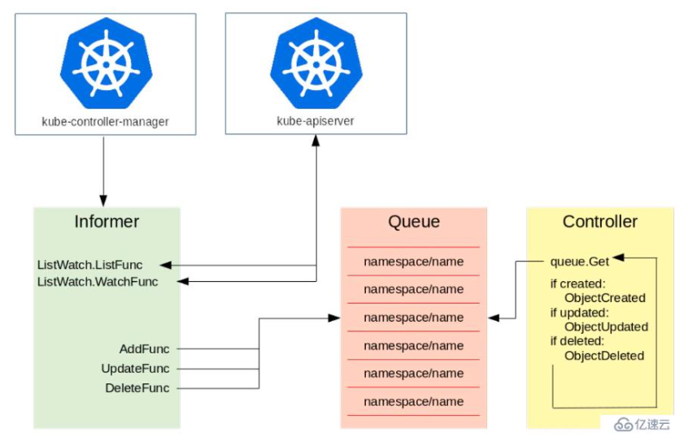

#### 控制器工作流程概览

如上图所示，左侧是一个 Informer，它的机制就是通过去 watch kube-apiserver，而 kube-apiserver 会去监督所有 etcd 中资源的创建、更新与删除。

Informer 主要有两个方法：一个是 ListFunc；一个是 WatchFunc。

​	• ListFunc 就是像 "kuberctl get pods" 这类操作，把当前所有的资源都列出来；

​	• WatchFunc 会和 apiserver 建立一个长链接，一旦有一个新的对象提交上去之后，apiserver 就会反向推送回来，告诉 Informer 有一个新的对象创建或者更新等操作。

Informer 接收到了对象的需求之后，就会调用对应的函数（比如图中的三个函数 AddFunc, UpdateFunc 以及 

DeleteFunc），并将其按照 key 值的格式放到一个队列中去，key 值的命名规则就是 "namespace/name"，

name 就是对应的资源的名字。比如我们刚才所说的在 default 的 namespace 中创建一个 foo 类型的资源，那

么它的 key 值就是 "default/example-foo"。Controller 从队列中拿到一个对象之后，就会去做相应的操作。

用另一个方法来理解控制器的工作流程

1. 初始化和列表

初始化阶段，Informer 首先会向 API Server 发出一个 "list" 请求，以获取当前所有对象的列表。这些对象会被缓存到本地内存中。

2. 开始监听

之后，Informer 会发出一个 "watch" 请求。这个请求将会订阅从该时间点起目标资源对象的所有变化事件。

3. 处理事件

当 API Server 检测到某个资源对象发生变化时，这些变化（Add、Update、Delete 事件）会通过 watch 机制推送给订阅这些变化的控制器。Informer 将变化事件分发给注册的事件处理器（Event Handler），控制器通过这些事件处理器来处理资源对象的变化。

4. 周期性同步（Resync）

虽然 watch 机制非常高效，但为了确保数据一致性，Informer 也会在配置好的时间间隔内进行周期性同步（Resync）。通过再次向 API Server 发出 "list" 请求，确保本地缓存没有错过任何变化。

#### 参考

https://www.yisu.com/zixun/22252.html