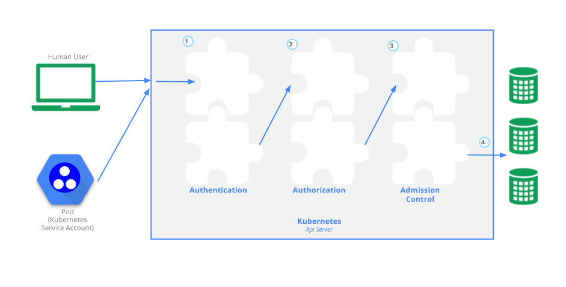

# Kubernetes 访问控制



## 认证


## 鉴权

### RBAC


#### 操作

#### cluster-admin 权限的 config 生成 

1、创建sa 账号，并与默认的 cluster-admin clusterrole 绑定，生成 cluster-admin-sa 的clusterrolebinding

```
apiVersion: v1
kind: ServiceAccount
metadata:
  name: super-admin-x
  namespace: default
---
apiVersion: rbac.authorization.k8s.io/v1
kind: ClusterRoleBinding
metadata:
  name: super-admin-x
roleRef:
  apiGroup: ""
  kind: ClusterRole
  name: cluster-admin
subjects:
- apiGroup: ""
  kind: ServiceAccount
  name: super-admin-x
  namespace: default
```


#### 某个/多个 namespace 所有权限的 config 的生成

1、编辑 yaml ,包括 sa 账号，role rolebinding, clusterrole,clusterbinding

```
apiVersion: v1
kind: ServiceAccount
metadata:
  name: ops
  namespace: default
---
kind: ClusterRole
apiVersion: rbac.authorization.k8s.io/v1
metadata:
  name: ops
rules:
  - apiGroups: ["", "extensions", "apps", "networking.k8s.io"]
    resources: ["*"]
    verbs: ["*"]
  - apiGroups: ["batch"]
    resources: ["*"]
    verbs: ["*"]
---
# 这里需要注意下，如果只需要一个ns 的权限那创建一个 RoleBinding ，就可以了
# 如果多个就创建多个 RoleBinding,指定不同的 ns 就可以 
kind: RoleBinding
apiVersion: rbac.authorization.k8s.io/v1
metadata:
  name: ops-default
  namespace: default          # 这里 如果只给 default ns权限就建这一个 RoleBinding 就可以了
subjects:
  - kind: ServiceAccount
    name: ops
    namespace: default
roleRef:
  apiGroup: rbac.authorization.k8s.io
  kind: ClusterRole
---
kind: RoleBinding
apiVersion: rbac.authorization.k8s.io/v1
metadata:
  name: ops-db
  namespace: db          # 这里 如果也给 db ns权限就新加这样一个 RoleBinding 就可以了
subjects:
  - kind: ServiceAccount
    name: ops
    namespace: default
roleRef:
  apiGroup: rbac.authorization.k8s.io
  kind: ClusterRole
---
apiVersion: rbac.authorization.k8s.io/v1
kind: ClusterRole
metadata:
  name: ns-view
rules:
- apiGroups: ["", "storage.k8s.io"]
  resources: ["namespaces", "storageclasses"]
  verbs: ["get","list","watch"]
---
kind: ClusterRoleBinding
apiVersion: rbac.authorization.k8s.io/v1
metadata:
 name: ns-view
subjects:
- kind: ServiceAccount
  name: ops
  namespace: default
  apiGroup: ""
roleRef:
 kind: ClusterRole
 name: ns-view
 apiGroup: ""
```

2、设置变量

```
# kube master
server=https://10.133.38.191:8443
# sa 对应的 secret
name=supervision-token-66zbx
# namespace 名称 
namespace=supervision
# ca
ca=$(kubectl get secret/$name -n $namespace -o jsonpath='{.data.ca\.crt}')
# token
token=$(kubectl get secret/$name -n $namespace -o jsonpath='{.data.token}' | base64 --decode)
```

3、生成 config

```
cat > supervision.kubeconfig << EOF
apiVersion: v1
kind: Config
clusters:
- name: supervision
  cluster:
    certificate-authority-data: ${ca}
    server: ${server}
contexts:
- name: supervision
  context:
    cluster: supervision
    user: supervision
current-context: supervision
users:
- name: supervision
  user:
    token: ${token}
EOF
```


## 准入控制

准入控制器是一段代码，它会在请求通过认证和授权之后、对象被持久化之前拦截到达 API 服务器的请求。

有很多现成的准入控制器，已经被内置在kube-api-server 中了，只是有的可能没有被加载而已

当部署 kube-api-server 时，会加载一些默认加载的准入控制器，当然也有很多准入控制器是没有被加载，你可以使用参数 

​	--enable-admission-plugins 来加载指定的准入控制器

也可以使用参数

--disable-admission-plugins strings 来禁用指定的准入控制器（包括默认被加载的）

可以通过命令 kube-apiserver -h | grep enable-admission-plugins 来查看默认加载的准入控制器


在诸多的控制器中有两个准入控制器比较特殊

**MutatingAdmissionWebhook 和 ValidatingAdmissionWebhook**

它们根据 API 中的配置，分别执行变更和验证 **admission wehhook**

准入控制器可以执行 “验证（Validating）” 和/或 “变更（Mutating）” 操作。 变更（mutating）控制器可以根据

被其接受的请求修改相关对象；验证（validating）控制器则不行。

准入控制器限制创建、删除、修改对象或连接到代理的请求，不限制读取对象的请求。

准入控制过程分为两个阶段。第一阶段，运行变更准入控制器。第二阶段，运行验证准入控制器。 再次提醒，某

些控制器既是变更准入控制器又是验证准入控制器。

如果任何一个阶段的任何控制器拒绝了该请求，则整个请求将立即被拒绝，并向终端用户返回一个错误。


## 动态准入控制

除了内置的 admission webhooke 之外，准入插件可以作为扩展独立开发，并以运行时所配置的 Webhook 的形式运行。 

准入 Webhook 是一种用于接收准入请求并对其进行处理的 HTTP 回调机制。 

可以定义两种类型的准入 webhook，即 验证性质的准入 Webhook 和 修改性质的准入 Webhook。 

修改性质的准入 Webhook 会先被调用。它们可以更改发送到 API 服务器的对象以执行自定义的设置默认值操作。

在完成了所有对象修改并且 API 服务器也验证了所传入的对象之后， 验证性质的 Webhook 会被调用，并通过拒绝请求的方式来强制实施自定义的策略。

需要注意的是 kubernetes 支持动态准入控制器也就是 admission webhooke，但是需要自己实现 gatekeeper 就是一种 admission webhooke.
